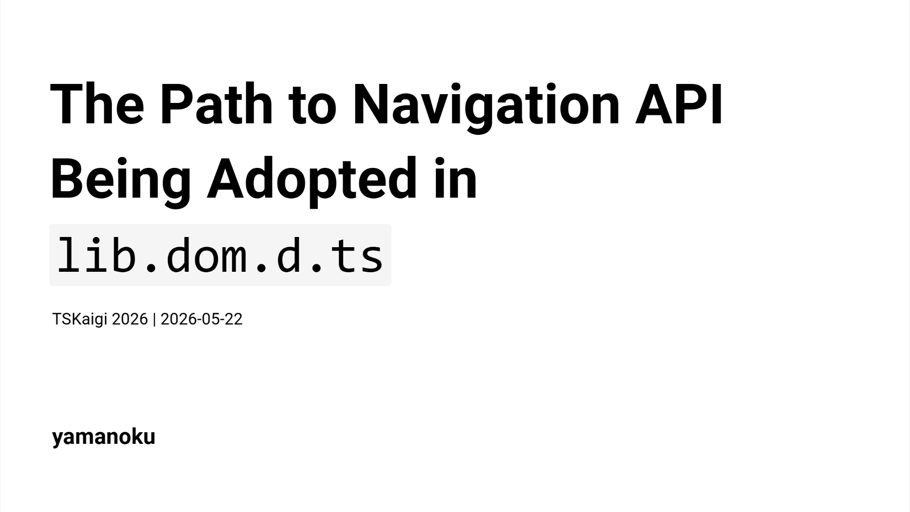

## Slide

[Presentation slides (Japanese Only)](https://yamanoku.net/tskaigi-2026/slide/)

## Translation Articles

[English page](https://yamanoku.net/tskaigi-2026/en/) / [日本語ページ](https://yamanoku.net/tskaigi-2026/ja/) / [한국어 페이지](https://yamanoku.net/tskaigi-2026/ko/)

## Presentation Summary

Are you familiar with the "Navigation API"?

It is a Web API that succeeds the History API, used for implementing client-side routing in SPAs. Following its adoption in the Interop project last year, it became available in all major browsers starting January of this year.

Have you ever tried to use a cutting-edge Web API like this, only to find that the types were undefined, forcing you to extend `interface Window` yourself?

In this session, I will introduce an overview of the Navigation API while explaining the flow by which DOM APIs we use every day get adopted as TypeScript type definitions (lib.dom.d.ts).

Through this talk, I aim to help you understand the behind-the-scenes process of how Web standard technologies are delivered as "types," enabling you to work with the latest technologies more safely and with deeper understanding.

## Slide Content

Today, I will talk about the path to Navigation API being adopted in TypeScript's type definitions. I will introduce how Web standard technologies are delivered to us as TypeScript "types."

First of all, are you familiar with the Navigation API?

The Navigation API is a new DOM API that serves as the successor to the History API, designed to enable client-side routing in SPAs. The History API lacked flexibility and was difficult to work with due to OS-specific constraints. The Navigation API resolves these issues and provides more flexible client-side routing. It became available in all major browsers in January 2026.

<baseline-status style="border: 1px solid" featureId="navigation"></baseline-status>

The challenges with the History API include the inflexibility of `pushState` / `replaceState`, the difficulty of intercepting page navigations (cumbersome form submission handling, unstable beforeunload confirmations), and the lack of established methods for saving and restoring focus positions.

The Navigation API has three key features. First is clearer history management. You can retrieve a list of history entries with `navigation.entries()`, and each entry is assigned a unique `key` and `id`.

Second is intercept handling. Using the `navigate` event, you can explicitly inject processing before page navigations or form submissions.

```typescript
navigation.addEventListener('navigate', (event) => {
  if (!event.canIntercept) return;

  event.intercept({
    handler: async () => {
      // Inject processing before page navigation
      await loadPageContent(event.destination.url);
    },
  });
});
```

Third, restoring focus position has become much easier. You can save the focus position as state and restore it when the event fires.

```typescript
// Save focus position before navigation
navigation.updateCurrentEntry({
  state: { focusedId: document.activeElement?.id },
});

// Restoration process
navigation.addEventListener('currententrychange', () => {
  const state = navigation.currentEntry.getState();
  if (state?.focusedId) {
    document.getElementById(state.focusedId)?.focus();
  }
});
```

The Navigation API has become very convenient, but when trying to use it in a TypeScript environment, a certain problem arose.

That is, until TypeScript 5.9, the type definitions for the Navigation API did not exist in TypeScript itself. Some of you may have encountered this wall when trying out new DOM APIs.

When DOM API type definitions are not available, there are several approaches you can take.

The first is to use DefinitelyTyped. In the case of the Navigation API, a package called [`@types/dom-navigation`](https://www.npmjs.com/package/@types/dom-navigation) existed.

```sh
npm i -D @types/dom-navigation
yarn add -D @types/dom-navigation
pnpm add -D @types/dom-navigation
bun add -d @types/dom-navigation
```

However, depending on the API, a DefinitelyTyped package may not exist. In that case, you have no choice but to extend the `Window` interface yourself while referencing the spec, or temporarily suppress errors with `@ts-ignore`.

So how are DOM API type definitions in TypeScript actually created?

`lib.dom.d.ts` is not handwritten but is auto-generated by a tool called [TypeScript-DOM-lib-generator](https://github.com/microsoft/TypeScript-DOM-lib-generator). It checks [Browser-Compat-Data](https://github.com/mdn/browser-compat-data) as compatibility conditions, generates type definitions from Web specifications, and is run periodically in the TypeScript repository.

The condition for a DOM API to be adopted as a TypeScript type definition is "being supported by two or more browser engines." Chrome and Edge use the same Chromium engine, so they count as one. The condition is only met when either Firefox or Safari also implements it.

| Browser | Engine |
|--------|--------|
| Chrome | Blink (Chromium) |
| Edge | Blink (Chromium) |
| Firefox | Gecko |
| Safari | WebKit |

The source needed for generating type definitions is obtained from Web IDL. This is a description language for defining Web API interfaces.

Rather than fetching directly from specification documents, a machine-readable set of packages called `@webref`, extracted from Web browser specifications, is used as a data source for type generation.

| Package | Purpose |
|--------|-----|
| `@webref/idl` | Fetching WebIDL specifications |
| `@webref/css` | Fetching CSS specifications |
| `@webref/events` | Fetching event specifications |
| `@webref/elements` | Fetching HTML elements |

The generated type information is then published to npm for each execution context. Starting with `@types/web` for the main thread, type definitions are provided for each context, including `@types/serviceworker`, `@types/audioworklet`, `@types/sharedworker`, and `@types/webworker`.

| Package | Description | Context |
|-----------|-----|-----|
| `@types/web` | Types for DOM and Web technologies | Window / Main thread |
| `@types/serviceworker` | Types for Service Worker global scope | Service Worker |
| `@types/audioworklet` | Types for Audio Worklet global scope | Audio Worklet |
| `@types/sharedworker` | Types for Shared Worker global scope | Shared Worker |
| `@types/webworker` | Types for Web Worker global scope | Web Worker |

By leveraging TypeScript's lib replacement feature to install `@types/web`, you can use newer DOM API types than those included in TypeScript's standard type definitions. If type definitions are not available in TypeScript itself, installing `@types/web` may also resolve the issue.

```sh
npm i -D @typescript/lib-dom@npm:@types/web
yarn add -D @typescript/lib-dom@npm:@types/web
pnpm add -D @typescript/lib-dom@npm:@types/web
bun add -d @typescript/lib-dom@npm:@types/web
```

Now that we understand how TypeScript type definitions are adopted, let us look back at the timeline of the Navigation API.

| Year | Event |
|---|---|
| May 2022 | Implementation completed in Chrome / Edge |
| October 2022 | Application to Interop 2023 not accepted |
| March 2023 | Issue requesting support filed in TypeScript repository |
| September 2023 | Application to Interop 2024 not accepted |
| February 2025 | Adopted as a focus area for Interop 2025 |
| December 2025 | Navigation API implemented in Safari |
| January 2026 | Navigation API implemented in Firefox |
| January 2026 | Navigation API becomes Baseline Newly Available |
| February 2026 | Adopted as a focus area for Interop 2026 |
| March 2026 | Navigation API type definitions added in TypeScript 6.0 |
| July 2028 | Navigation API expected to become Baseline Widely Available |

After the specification was proposed, the implementation was first completed in Chrome / Edge in May 2022. Subsequently, applications were submitted to Interop, a cross-browser interoperability improvement project that ensures Web APIs work consistently across browsers. However, the applications in 2023 and 2024 were not accepted. In March 2023, an [Issue requesting Navigation API support](https://github.com/microsoft/TypeScript-DOM-lib-generator/issues/1531) was filed in the TypeScript repository.

The turning point came in 2025, when the Navigation API was [finally adopted as a focus area for Interop 2025](https://github.com/web-platform-tests/interop/issues/709#issuecomment-2657325194) in February. Subsequently, it was implemented in Safari in December 2025 and in Firefox in January 2026, achieving support across all major browsers. Furthermore, to address parts that were not completed in Interop 2025, it was also adopted as a focus area for Interop 2026 in February 2026.

With the release of TypeScript 6.0 in March 2026, Navigation API type definitions became available as part of the TypeScript standard.

<blockquote class="bluesky-embed" data-bluesky-uri="at://did:plc:frnie37ggus7uztcldk3hxxf/app.bsky.feed.post/3mghnwiit6c2b" data-bluesky-cid="bafyreibxwf23xghf2twffwzvljnpb6e4hc6udtq7ps2yjigla2k2zzqz3i" data-bluesky-embed-color-mode="system"><p lang="en">With TypeScript 6.0 moving toward keeping the DOM API definitions up to date, the type definitions for the Navigation API are now officially available in TypeScript 6.0 🥳
I hope this will encourage more client-side routing libraries to adopt the Navigation API 🙌<br><br><a href="https://bsky.app/profile/did:plc:frnie37ggus7uztcldk3hxxf/post/3mghnwiit6c2b?ref_src=embed">[image or embed]</a></p>&mdash; yamanoku (<a href="https://bsky.app/profile/did:plc:frnie37ggus7uztcldk3hxxf?ref_src=embed">@yamanoku.net</a>) <a href="https://bsky.app/profile/did:plc:frnie37ggus7uztcldk3hxxf/post/3mghnwiit6c2b?ref_src=embed">2026年3月7日 19:52</a></blockquote><script async src="https://embed.bsky.app/static/embed.js" charset="utf-8"></script>

Web APIs have their cross-browser support status indicated by a metric called "[Baseline](https://web.dev/baseline)". Currently it is Baseline Newly Available, supported only in the latest browser versions, but by July 2028 it is expected to become Baseline Widely Available, meaning it will be considered generally stable for widespread use.

Now that the Navigation API is stably available in the latest browsers and its types are available in TypeScript, I personally hope to see it adopted more widely going forward.

The ecosystem leveraging the Navigation API is already growing, with [FUNSTACK Router](https://github.com/uhyo/funstack-router/) by uhyo, experimental features and in-progress support in some router libraries like [Angular](https://angular.jp/api/router/withExperimentalPlatformNavigation) and [Vue Router](https://github.com/vuejs/router/pull/2551), and more. Combining it with the View Transitions API for page transition expressions also seems promising, which I believe will expand the range of transition animation possibilities.

In summary: `lib.dom.d.ts` is generated by TypeScript-DOM-lib-generator. The adoption criteria for DOM API type definitions is "support by two or more browser engines." The Navigation API became a standard type definition starting with TypeScript 6.0. You can check the status of APIs you want to use via Browser-Compat-Data, and for more detailed progress, it may be worth looking into Interop and Web Platform Tests.

## References

- [Navigation API - Web APIs | MDN](https://developer.mozilla.org/en-US/docs/Web/API/Navigation_API)
- [Web platform features explorer - Navigation API](https://web-platform-dx.github.io/web-features-explorer/features/navigation/)
- [Navigation *API.*](https://shoken3207.github.io/slides/2026-05-navigation-api/)
- [ひとりNavigation API Advent Calendar](https://scrapbox.io/yamanoku/%E3%81%B2%E3%81%A8%E3%82%8ANavigation_API_Advent_Calendar)
- [TypeScript-DOM-lib-generator](https://github.com/microsoft/TypeScript-DOM-lib-generator)
- [Browser-Compat-Data](https://github.com/mdn/browser-compat-data)
- [lib.dom.d.tsがどのように更新されるか調べてみた](https://zenn.dev/keita_hino/articles/2f6c2a19978fa8)
- [TypeScript で Web API の利用を検知したい](https://zenn.dev/odan/scraps/d43356fdae48a2)
