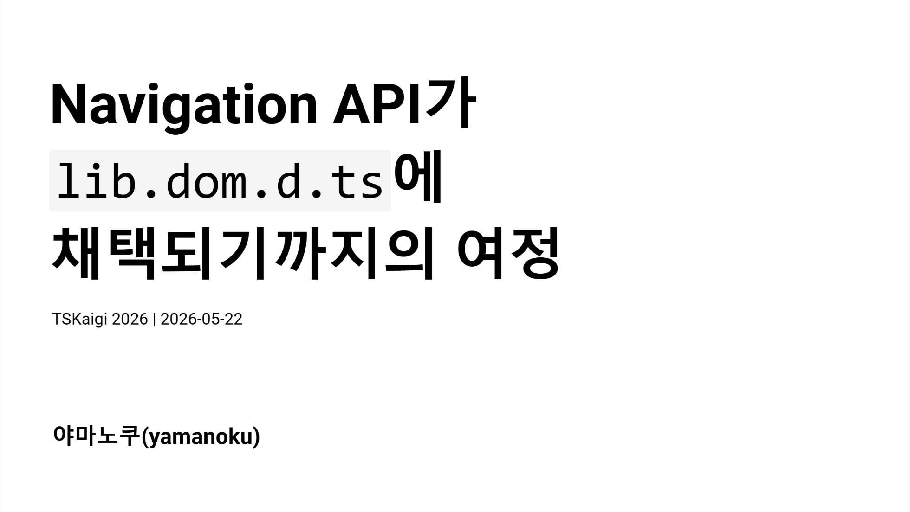

## 슬라이드

[발표 슬라이드 (일본어만 제공)](https://yamanoku.net/tskaigi-2026/slide/)

## 번역 기사 목록

[한국어 페이지](https://yamanoku.net/tskaigi-2026/ko/) / [English page](https://yamanoku.net/tskaigi-2026/en/) / [日本語ページ](https://yamanoku.net/tskaigi-2026/ja/)

## 발표 개요

여러분은 "Navigation API"를 알고 계신가요?

SPA의 클라이언트 사이드 라우팅을 구현하기 위해 사용되는 History API의 후속 Web API입니다. 지난해 Interop 프로젝트에서의 채택을 거쳐 올해 1월부터 모든 주요 브라우저에서 사용할 수 있게 되었습니다.

이처럼 최신 Web API를 사용하려는데 타입이 정의되어 있지 않아, 직접 `interface Window`를 확장해 본 경험이 있으신가요?

본 세션에서는 Navigation API의 개요를 소개하면서, 우리가 평소에 사용하는 DOM API가 어떤 과정을 거쳐 TypeScript의 타입 정의(lib.dom.d.ts)에 채택되는지를 설명합니다.

이번 발표를 통해 Web 표준 기술이 "타입"으로 전달되기까지의 이면을 이해하고, 최신 기술을 보다 안전하고 깊이 있게 다룰 수 있게 되기를 바랍니다.

## 슬라이드 내용

오늘은 Navigation API가 TypeScript의 타입 정의에 채택되기까지의 여정에 대해 이야기하겠습니다. Web 표준 기술이 어떻게 TypeScript의 '타입'으로 우리에게 전달되는지를 소개합니다.

먼저, 여러분은 Navigation API를 알고 계신가요?

Navigation API는 SPA의 클라이언트 사이드 라우팅을 구현하기 위한 History API의 후속 DOM API입니다. 기존 History API는 유연성이 부족하고 OS 고유의 제약으로 다루기 어려운 면이 있었습니다. Navigation API는 이러한 문제를 해결하고 더 유연한 클라이언트 사이드 라우팅을 실현합니다. 2026년 1월을 기점으로 모든 주요 브라우저에서 사용 가능하게 되었습니다.

<baseline-status style="border: 1px solid" featureId="navigation"></baseline-status>

History API의 과제로는 `pushState` / `replaceState`의 유연성 부족, 페이지 전환 인터셉트의 어려움(폼 전송 핸들링이 번거로움, 이탈 확인 구현이 불안정), 그리고 포커스 위치의 저장 및 복원 방법이 확립되어 있지 않다는 점을 들 수 있습니다.

Navigation API에는 세 가지 주요 특징이 있습니다. 첫 번째는 히스토리 관리의 명확화입니다. `navigation.entries()`로 히스토리 엔트리 목록을 가져올 수 있으며, 각 엔트리에는 고유한 `key`와 `id`가 부여됩니다.

두 번째는 인터셉트 처리입니다. `navigate` 이벤트를 사용하여 페이지 전환이나 폼 전송 시에 명시적으로 처리를 삽입할 수 있습니다.

```typescript
navigation.addEventListener('navigate', (event) => {
  if (!event.canIntercept) return;

  event.intercept({
    handler: async () => {
      // 페이지 전환 전에 처리를 삽입
      await loadPageContent(event.destination.url);
    },
  });
});
```

세 번째는 포커스 위치 복원이 용이해졌다는 점입니다. 포커스 위치를 상태로 저장하고, 이벤트가 발생할 때 복원할 수 있습니다.

```typescript
// 전환 전에 포커스 위치를 저장
navigation.updateCurrentEntry({
  state: { focusedId: document.activeElement?.id },
});

// 복원 처리
navigation.addEventListener('currententrychange', () => {
  const state = navigation.currentEntry.getState();
  if (state?.focusedId) {
    document.getElementById(state.focusedId)?.focus();
  }
});
```

이토록 편리해진 Navigation API를 TypeScript 환경에서 사용하려고 했을 때 한 가지 문제가 발생했습니다.

바로 TypeScript 5.9까지 Navigation API의 타입 정의가 TypeScript 자체에 존재하지 않았다는 것입니다. 새로운 DOM API를 시도하려다 이 벽에 부딪힌 경험이 있으신 분도 계실 것입니다.

DOM API의 타입 정의가 없는 경우, 몇 가지 접근 방법이 있습니다.

가장 먼저 DefinitelyTyped를 이용하는 것입니다. Navigation API의 경우 [`@types/dom-navigation`](https://www.npmjs.com/package/@types/dom-navigation)이라는 패키지가 존재했습니다.

```sh
npm i -D @types/dom-navigation
yarn add -D @types/dom-navigation
pnpm add -D @types/dom-navigation
bun add -d @types/dom-navigation
```

하지만 API에 따라서는 DefinitelyTyped에 패키지가 없을 수도 있습니다. 그 경우에는 스펙을 참조하면서 직접 `Window` 인터페이스를 확장하거나, 일시적으로 `@ts-ignore`로 오류를 억제할 수밖에 없습니다.

그렇다면 TypeScript에서 DOM API의 타입 정의는 어떻게 만들어지는 걸까요?

`lib.dom.d.ts`는 수작업으로 작성되는 것이 아니라 [TypeScript-DOM-lib-generator](https://github.com/microsoft/TypeScript-DOM-lib-generator)라는 도구에 의해 자동 생성됩니다. [Browser-Compat-Data](https://github.com/mdn/browser-compat-data)를 호환성 데이터 조건으로 사용하여 Web 사양에서 타입 정의를 생성하며, TypeScript 리포지토리에서 정기적으로 실행됩니다.

DOM API가 TypeScript의 타입 정의로 채택되기 위한 조건은 "2개 이상의 브라우저 엔진에서 지원되는 것"입니다. Chrome과 Edge는 같은 Chromium 엔진이므로 1개로 카운트됩니다. 여기에 Firefox 또는 Safari 중 하나에서 구현되어야 비로소 조건이 충족됩니다.

| 브라우저 | 엔진 |
|--------|--------|
| Chrome | Blink (Chromium) |
| Edge | Blink (Chromium) |
| Firefox | Gecko |
| Safari | WebKit |

타입 정의 생성에 필요한 소스는 Web IDL에서 가져옵니다. 이것은 Web API의 인터페이스를 정의하기 위한 기술 언어입니다.

사양서에서 직접 가져오는 것이 아니라, `@webref`라는 웹 브라우저 사양에서 추출한 기계 판독 가능한 패키지 모음이 데이터 소스로 활용되어 타입 생성이 이루어집니다.

| 패키지 | 용도 |
|--------|-----|
| `@webref/idl` | WebIDL 사양 가져오기 |
| `@webref/css` | CSS 사양 가져오기 |
| `@webref/events` | 이벤트 사양 가져오기 |
| `@webref/elements` | HTML 요소 가져오기 |

이후 생성된 타입 정보는 실행 환경의 컨텍스트별로 npm에 공개됩니다. 메인 스레드용 `@types/web`을 시작으로 `@types/serviceworker`, `@types/audioworklet`, `@types/sharedworker`, `@types/webworker` 등 각 컨텍스트별 타입 정의가 제공됩니다.

| 패키지 | 설명 | 컨텍스트 |
|-----------|-----|-----|
| `@types/web` | DOM 및 Web 기술의 타입 | Window / 메인 스레드 |
| `@types/serviceworker` | Service Worker 글로벌 스코프의 타입 | Service Worker |
| `@types/audioworklet` | Audio Worklet 글로벌 스코프의 타입 | Audio Worklet |
| `@types/sharedworker` | Shared Worker 글로벌 스코프의 타입 | Shared Worker |
| `@types/webworker` | Web Worker 글로벌 스코프의 타입 | Web Worker |

TypeScript의 lib replacement 기능을 활용하여 `@types/web`을 도입하면 TypeScript 표준 타입 정의보다 더 최신의 DOM API 타입을 사용할 수 있습니다. 본체에 타입 정의가 없는 경우 `@types/web`을 도입하면 해결될 수도 있습니다.

```sh
npm i -D @typescript/lib-dom@npm:@types/web
yarn add -D @typescript/lib-dom@npm:@types/web
pnpm add -D @typescript/lib-dom@npm:@types/web
bun add -d @typescript/lib-dom@npm:@types/web
```

TypeScript의 타입 정의가 어떻게 채택되는지 이해하셨나요? 마지막으로 Navigation API의 타임라인을 돌아보겠습니다.

| 연도 | 사건 |
|---|---|
| 2022년 5월 | Chrome / Edge에서 구현 완료 |
| 2022년 10월 | Interop 2023 신청 불채택 |
| 2023년 3월 | TypeScript 리포지토리에 지원 요청 Issue 등장 |
| 2023년 9월 | Interop 2024 신청 불채택 |
| 2025년 2월 | Interop 2025의 포커스 대상으로 채택 |
| 2025년 12월 | Safari에서 Navigation API 구현 |
| 2026년 1월 | Firefox에서 Navigation API 구현 |
| 2026년 1월 | Navigation API가 Baseline Newly Available 등재 |
| 2026년 2월 | Interop 2026의 포커스 대상으로 채택 |
| 2026년 3월 | TypeScript 6.0에서 Navigation API 타입 정의 추가 |
| 2028년 7월 | Navigation API가 Baseline Widely Available이 될 전망 |

사양이 제안된 후, 2022년 5월에 Chrome / Edge에서 구현이 완료되었습니다. 이후 크로스 브라우저에서 Web API가 동작하도록 하는 상호 운용성 향상 프로젝트인 Interop에 이 API를 대상으로 하는 신청이 제출되었습니다. 하지만 2023년과 2024년 모두 채택되지 않았습니다. 2023년 3월에는 [TypeScript 리포지토리에 Navigation API 지원 요청 Issue](https://github.com/microsoft/TypeScript-DOM-lib-generator/issues/1531)가 생성되었습니다.

전환점은 2025년으로, [2월에 Interop 2025의 포커스 대상으로 드디어 채택](https://github.com/web-platform-tests/interop/issues/709#issuecomment-2657325194)되었습니다. 이후 2025년 12월에 Safari, 2026년 1월에 Firefox에서 구현되어 모든 주요 브라우저 지원을 달성했습니다. 또한 Interop 2025에서 구현이 완료되지 않은 부분에 대한 대응으로 2026년 2월에 Interop 2026의 포커스 대상으로도 채택되었습니다.

그리고 2026년 3월 TypeScript 6.0의 릴리스와 함께 TypeScript 표준에서 Navigation API의 타입 정의를 사용할 수 있게 되었습니다.

<blockquote class="bluesky-embed" data-bluesky-uri="at://did:plc:frnie37ggus7uztcldk3hxxf/app.bsky.feed.post/3mghnwiit6c2b" data-bluesky-cid="bafyreibxwf23xghf2twffwzvljnpb6e4hc6udtq7ps2yjigla2k2zzqz3i" data-bluesky-embed-color-mode="system"><p lang="en">With TypeScript 6.0 moving toward keeping the DOM API definitions up to date, the type definitions for the Navigation API are now officially available in TypeScript 6.0 🥳
I hope this will encourage more client-side routing libraries to adopt the Navigation API 🙌<br><br><a href="https://bsky.app/profile/did:plc:frnie37ggus7uztcldk3hxxf/post/3mghnwiit6c2b?ref_src=embed">[image or embed]</a></p>&mdash; yamanoku (<a href="https://bsky.app/profile/did:plc:frnie37ggus7uztcldk3hxxf?ref_src=embed">@yamanoku.net</a>) <a href="https://bsky.app/profile/did:plc:frnie37ggus7uztcldk3hxxf/post/3mghnwiit6c2b?ref_src=embed">2026년 3월 7일 19:52</a></blockquote><script async src="https://embed.bsky.app/static/embed.js" charset="utf-8"></script>

Web API는 "[Baseline](https://web.dev/baseline)"이라는 지표로 크로스 브라우저 지원 상태가 표시됩니다. 현재는 Baseline Newly Available로 최신 버전 브라우저에서만 지원되지만, 2028년 7월에는 Baseline Widely Available이 되어 일반적으로 안정적으로 사용할 수 있게 될 것으로 예상됩니다.

Navigation API가 최신 브라우저에서 안정적으로 사용할 수 있게 되고, TypeScript에서도 타입을 사용할 수 있게 된 지금, 앞으로 더 널리 활용되기를 바랍니다.

uhyo가 만든 [FUNSTACK Router](https://github.com/uhyo/funstack-router/)와 [Angular](https://angular.jp/api/router/withExperimentalPlatformNavigation)나 [Vue Router](https://github.com/vuejs/router/pull/2551) 같은 일부 라우터 라이브러리의 실험적 기능 및 구현 중인 지원 등, 이미 Navigation API를 활용한 에코시스템이 성장하고 있습니다. View Transitions API와 결합한 페이지 전환 표현도 가능할 것으로 보여, 전환 애니메이션 표현의 폭이 넓어질 것으로 기대됩니다.

요약: `lib.dom.d.ts`는 TypeScript-DOM-lib-generator에 의해 생성됩니다. DOM API 타입 정의의 채택 기준은 "2개 이상의 브라우저 엔진에서의 지원"입니다. Navigation API는 TypeScript 6.0부터 표준 타입 정의가 되었습니다. 사용하고 싶은 API의 상태는 Browser-Compat-Data에서 확인할 수 있으며, 보다 상세한 진행 상황은 Interop이나 Web Platform Tests에서 조사해 보는 것도 좋을 것입니다.

## 참고 자료

- [Navigation API - Web APIs | MDN](https://developer.mozilla.org/en-US/docs/Web/API/Navigation_API)
- [Web platform features explorer - Navigation API](https://web-platform-dx.github.io/web-features-explorer/features/navigation/)
- [Navigation *API.*](https://shoken3207.github.io/slides/2026-05-navigation-api/)
- [ひとりNavigation API Advent Calendar](https://scrapbox.io/yamanoku/%E3%81%B2%E3%81%A8%E3%82%8ANavigation_API_Advent_Calendar)
- [TypeScript-DOM-lib-generator](https://github.com/microsoft/TypeScript-DOM-lib-generator)
- [Browser-Compat-Data](https://github.com/mdn/browser-compat-data)
- [lib.dom.d.tsがどのように更新されるか調べてみた](https://zenn.dev/keita_hino/articles/2f6c2a19978fa8)
- [TypeScript で Web API の利用を検知したい](https://zenn.dev/odan/scraps/d43356fdae48a2)
