<h1 mt="28">たかがボタン、されどボタン</h1>
<div class="text-10 font-700">button要素から深ぼるボタンUIの定義について</div>

<div mt="4">
BuriKaigi 2026 Day2 | <time datetime="2026-01-10">2026-01-10</time>
</div>

[ドキュメントページ](https://records.yamanoku.net/burikaigi-2026/)

<div class="absolute bottom-16">
  <span class="text-6 font-700">
    やまのく（yamanoku）
  </span>
</div>

<div class="absolute bottom-12 right-12">
  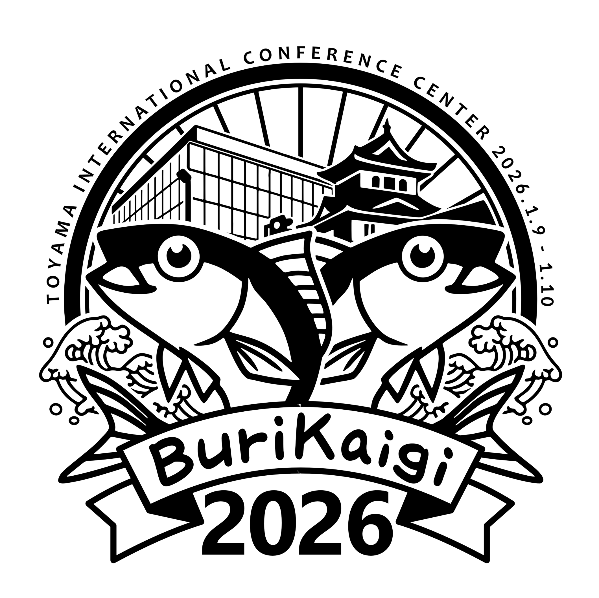
</div>

---
layout: center
---

<h1>今日<br>どんなボタンを<br>押してきましたか？</h1>

---

<v-drag pos="19,93,433,417">
  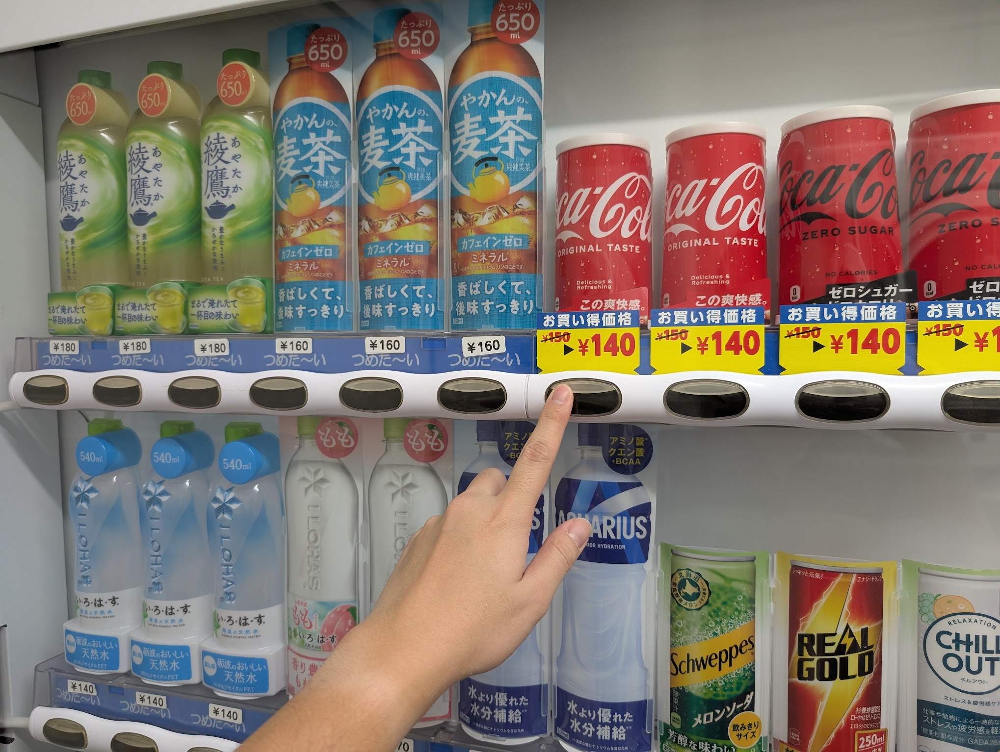
</v-drag>

<v-drag pos="717,94,248,395">
  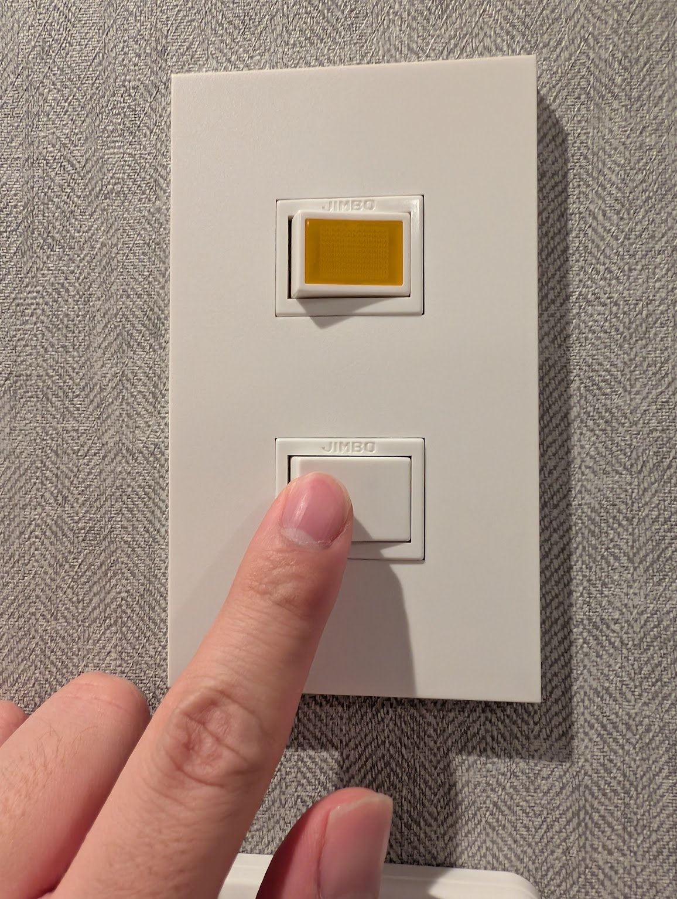
</v-drag>

<v-drag pos="461,93,248,384">
  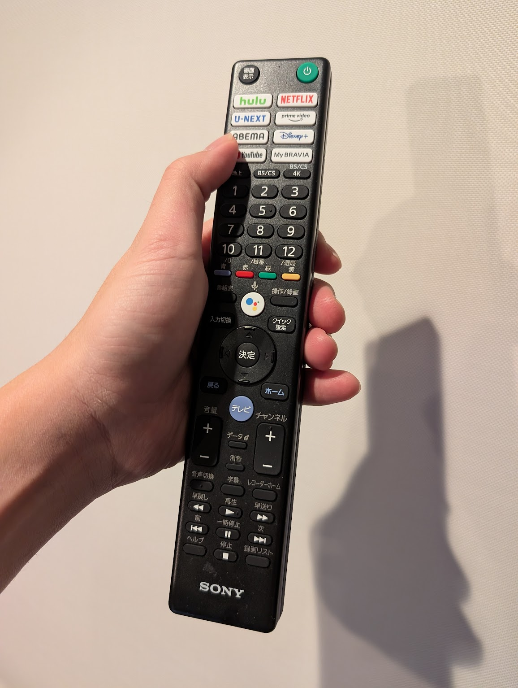
</v-drag>

---
dragPos:
  foo: 463,22,468,277
---

<v-drag pos="foo">
  <div text="6" font="bold" class="text-center">この発表を𝕏へポストしてみよう！</div>
  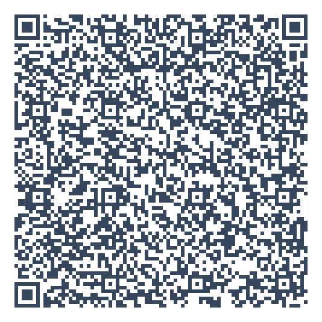
</v-drag>

<v-click> 

## やまのく（yamanoku）

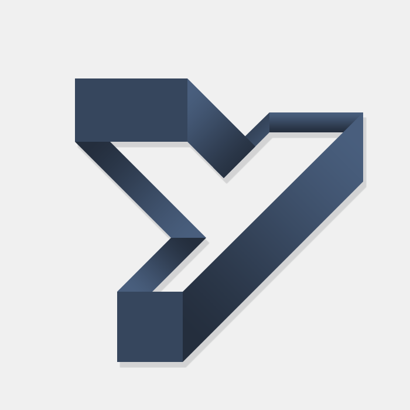

- 一児の父。会社員
- 千葉県在住
- BuriKaigi初参加
- 家族で初富山
  - すし玉行ってきました！

</v-click>

---
layout: center
---

# ボタンとは何か？

---
layout: center
---

<FirstButton />

---

# 様々なボタンたち

<ButtonShowCase />

---

# アフォーダンス

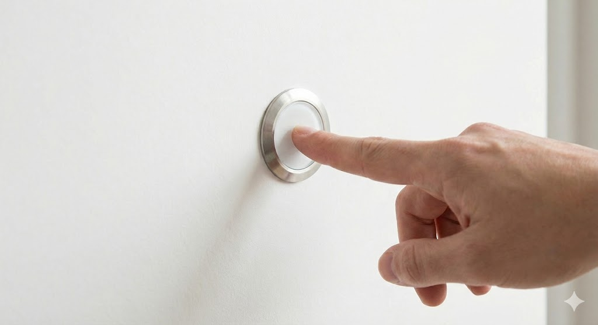

<!--
このモノと人との間に生まれる「押せそうに見える」という感覚をもつこと、これを**アフォーダンス**と呼びます。

アフォーダンスは、心理学者ジェームズ・ギブソンが提唱した概念で、モノの形がその使い方を誘発するというものです。たとえば椅子を見かけたら人は座るかもしれないし、それを台にするかもしれないし、なんらかの置き場にするかもしれません。人とモノの数だけアフォーダンスは生まれます。
-->

---

# シグニファイア

## ボタンが無効であるかどうか

<div>
  <DisabledButton />
</div>

## アイコンで何ができるかを表す

<div mt="10" class="grid auto-cols-max grid-flow-col gap-4">
  <IconButton tooltip="ファイルを開く">
    <twemoji-file-folder />
  </IconButton>

  <IconButton tooltip="追加する">
    <twemoji-plus />
  </IconButton>

  <IconButton tooltip="検索">
    <twemoji-magnifying-glass-tilted-left />
  </IconButton>

  <IconButton tooltip="戻る">
    <twemoji-right-arrow-curving-left />
  </IconButton>
  
  <IconButton tooltip="進む">
    <twemoji-left-arrow-curving-right />
  </IconButton>

  <IconButton tooltip="印刷する">
    <twemoji-printer />
  </IconButton>

  <IconButton tooltip="コメントする">
    <twemoji-left-speech-bubble />
  </IconButton>

  <IconButton tooltip="保存する">
    <twemoji-floppy-disk />
  </IconButton>
</div>

<!--
ここから派生して認知科学者ドナルド・ノーマンは**シグニファイア**という概念を提唱しました。こちらはUIデザインの文脈で使われるもので、モノの使い方を誘発するための「ヒント」とされています。

単なるボタンは押せそうに見えますが、これが`disabled`、つまり非活性になっている場合あれば「押せない」というヒントが提示されていると分かります。

特定のアイコンが書かれたボタンがあればそれに対応したボタンだと分かります。ボタン自体の形を変えることで、どのような操作が可能かを示すことができたりします。
-->

---

# GUI

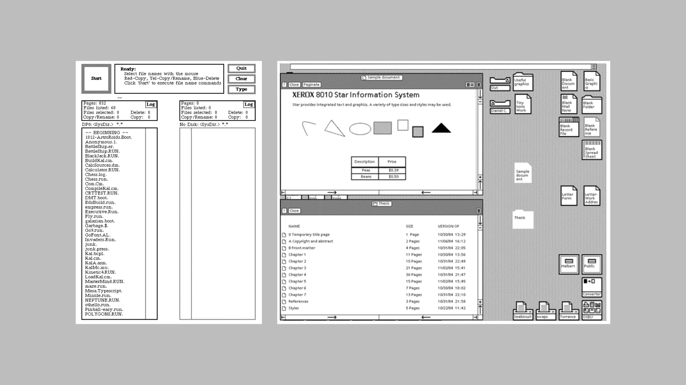
<div>Xerox Alto and Xerox 8010 Star</div>

<!--
ボタンというものは必ずしも現実世界にあるものだけを指すものではありません。ソフトウェアエンジニアであれば毎日見かけるボタン、すなわちOSのGUIにおけるインターフェースも挙げられます。

現在はGUIで操作することに馴染みがありますが、それ以前の時代では黒い画面に緑色の文字を打ち込む「コマンドライン」が主流でした。コマンドを知らなければ、ファイルを開くこともできませんでした。

GUIでは画面にアイコンが並び、マウスでクリックできる。ウィンドウを開いたり閉じたりできる。そして何より、「押せそうに見えるもの」を押せば何かが起こるという直感的な操作が可能になったのです。
-->

---

# スキューモフィズム

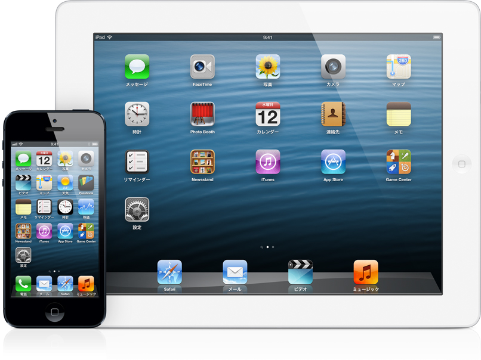
iPhone登場~iOS6

<!--
コンピュータが軍事目的や一部研究の中でしか使われなかったものも、インターネットの発展と共に普及していきました。Windows、Macintoshが発売され、GUIは一般の人々の手に届くようになりました。そして2007年、iPhoneの登場でスマートフォン時代が幕を開けます。

この頃のUIデザインを特徴づけるのが**スキューモーフィズム**です。

スキューモーフィズムとは、デジタル上のオブジェクトを現実世界の物に似せてデザインする手法です。カレンダーアプリは本物の革表紙の手帳のように、メモアプリは黄色い紙のメモ帳のように、そしてボタンは立体的で、光沢があり、押せば凹みそうな見た目でデザインされました。

なぜそんなデザインにしたのでしょうか？

スマートフォンではタップ操作になり、GUIでのクリック操作とは違う体験になります。そんな中でインターフェースを無機質なものとして提供するのではなく「これは押せるもの」というヒントを伝えるためのデザインでした。現実世界で押しボタンを押した経験があれば、画面上のボタンも同じように押せると直感的に理解できる。これがスキューモーフィズムの狙いです。
-->

---

# フラットデザイン

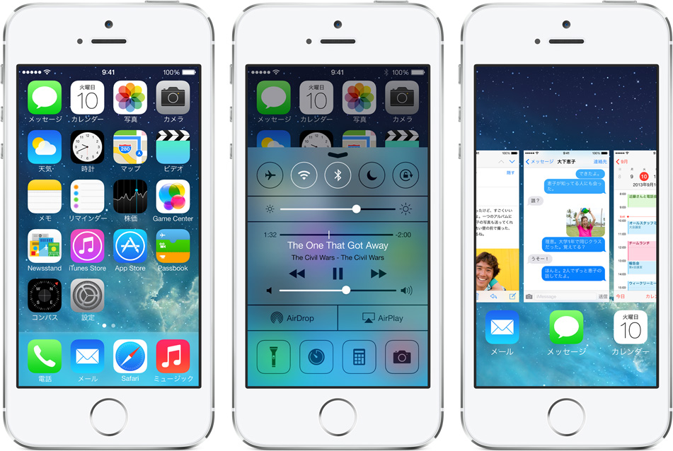
<p>iOS7以降</p>

<!--
しかし2012年、Windows 8が登場し、2013年にはiOS 7がリリースされ、デザインのトレンドは大きく変わりました。**フラットデザイン**の時代です。立体感や光沢は排除され、シンプルで平面的なデザインが主流になりました。

要素の関係性が分かりやすく配置もしやすくなり、見た目はスッキリしましたが、ここで問題が起きます。それは、ユーザーが**ボタンとテキストの区別がつかなくなる**という問題です。
-->

---
layout: center
---

<IsThisButton />

---

# ニューモフィズム・グラスモーフィズム

<div class="grid grid-rows-2 gap-10">
  <div p="10" style="background-color: #e0e5ec;">
    <Neumorphism />
  </div>

  <div p="10" style="background: linear-gradient(135deg, #565656ff 0%, #000000 100%);">
    <GlassMorphism />
  </div>
</div>

<!--
その後もニューモーフィズムやグラスモーフィズムといったデザイントレンドが台頭してきますが、それぞれのデザインにおいてもボタンとしての視認性を損なっているものが散見されています。

これがボタンがボタンに見えなくなるという、ボタンUIの問題です。
-->

---

# マテリアルデザイン

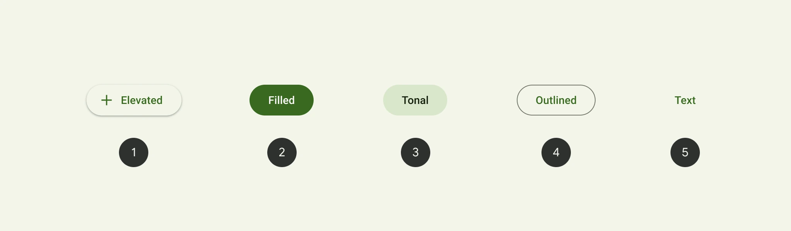

https://github.com/material-components/material-web/blob/main/docs/components/button.md

<!--
ちなみにGoogleはこの問題を解決するためにマテリアルデザインを提唱し、フラットデザインを扱いつつもUIに意味を与えていくガイドラインを制定しています。
-->

---
layout: center
---

# フラットデザインの影響

<v-click>

## <a href="https://ja.wikipedia.org/wiki/%E3%83%8F%E3%82%A4%E3%83%91%E3%83%BC%E3%83%AA%E3%83%B3%E3%82%AF">ハイパーリンク</a>表現によるボタン

</v-click>

<!--
フラットデザインは、Webの世界ではさらに複雑な事象を生み出します。Webには**ボタンによく似た別のもの**が存在するからです。それは**ハイパーリンク**によるボタンです。

これまでリンクテキストというものは文書内に存在するもので通常のテキストと比較して見分けがつくものでした。スマートフォンやタブレットといったタッチデバイスが普及するにつれてリンク自体も押下しやすいものにされる傾向が増え、リンクボタンなるものが生まれてきました。
-->

---
dragPos:
  foo: 149,79,413,158
---

<v-drag pos="foo">
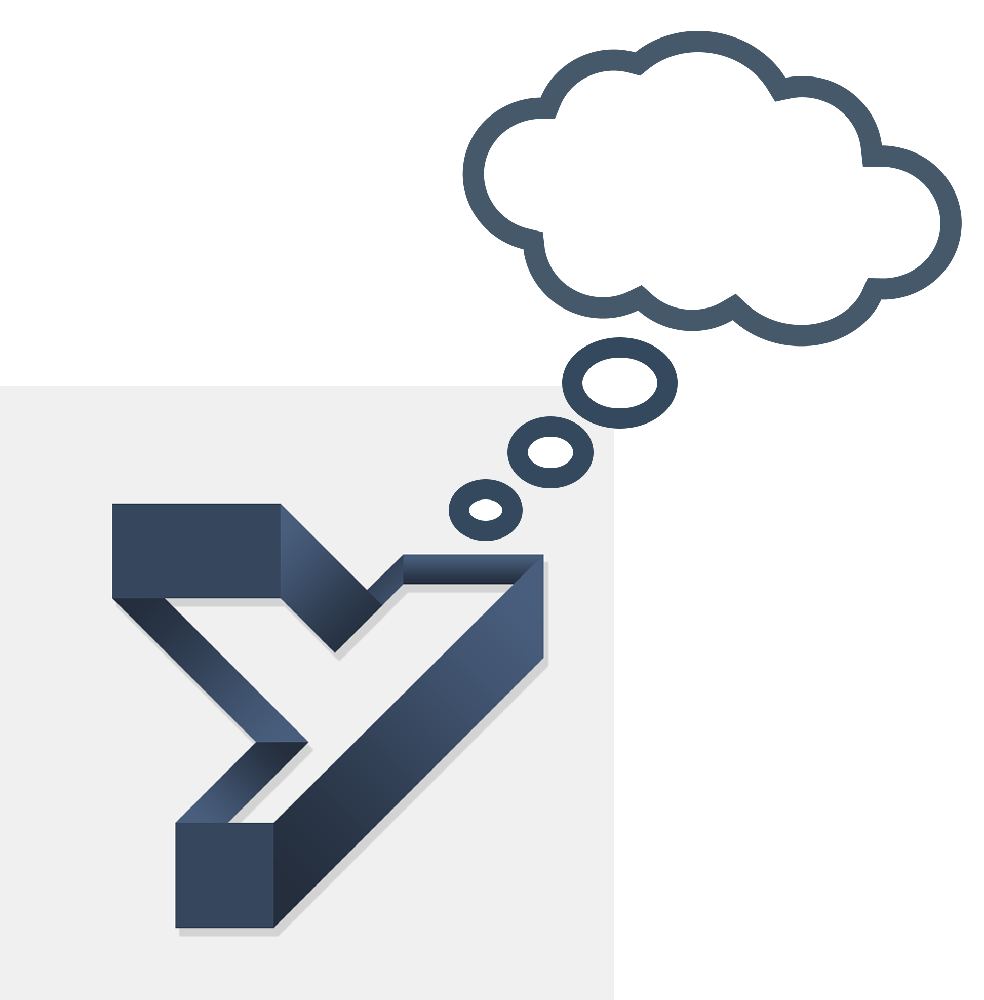
</v-drag>

<!--
この問題にまつわることとして、私自身の経験をお話しさせてください。
-->

---
layout: image
image: "https://records.yamanoku.net/burikaigi-2026/images/link-button-figma.png"
---

<!--
あるプロジェクトで、デザイナーから渡されたUIコンポーネントの中に「〇〇Link」という名前のボタンUIがありました。私はその名前を信じて `<a>` タグで実装しました。
-->

---
layout: image
image: "https://records.yamanoku.net/burikaigi-2026/images/link-button-in-modal.png"
---

<!--
ところが、実際の画面に組み込んでみると、このコンポーネントの用途は「クリックするとモーダルが開く」ためのものでした。

URLは変わりません。ページ遷移もしません。画面上でモーダルが開閉するだけ。これ、本当にLinkってコンポーネント名で良いのでしょうか。

私はその後UIデザインをしたデザイナーと議論しました。「他のLinkコンポーネントと見た目は似ているが、動作としてはボタンのものだから `<button>` にすべきでは？」最終的にこのコンポーネント名の見直しがされ `<button>` で実装されることになりました。

通常ボタンとハイパーリンクとはまったく別の役割をもつものです。ですがボタンのような見た目、すなわちCSSによる装飾によって、リンクとしてのそれなのか、はたまたボタンとしてのものなのかは区別がつきづらくなります。

そこで私はボタンUIというものを「実装」の視点から理解していくことを薦めます。
-->

---
dragPos:
  foo: 87,100,800,305
---

<v-drag pos="foo">
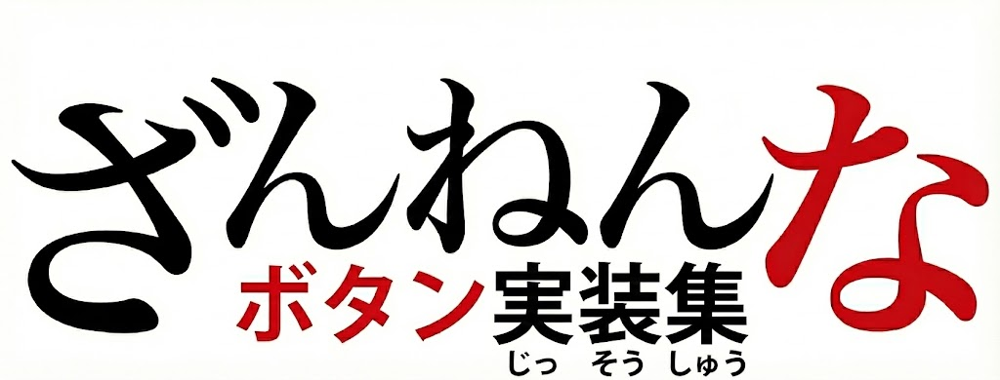
</v-drag>

---
layout: center
---

# 1: type属性を忘れた`<button>`

---
layout: center
---

```html
<form>
  <label><input type="text" name="zipCode">郵便番号</label>
  <button onclick="searchAddress()">住所検索</button>
  <label><input type="text" name="prefecture" autocomplete="address-level1">都道府県</label>
  <label><input type="text" name="city" autocomplete="address-level2">市区町村</label>
  <label><input type="text" name="address" autocomplete="address-line1">番地</label>
  <button>送信する</button>
</form>
```

---
layout: center
---

# HTML Living Standard

---
layout: center
---

| type値 | 挙動 |
|--------|------|
| `submit` | フォームを送信する |
| `reset` | フォームをリセットする |
| `button` | **何もしない（スクリプト用）** |


---
layout: image
image: "https://records.yamanoku.net/burikaigi-2026/images/old-html-form-image.png"
---

---
layout: center
---

<div class="grid grid-columns-2 gap-20">

# HTML 2.0 <br> `<input type="submit">`

# HTML 4.0 <br> `<button>`

</div>

<v-drag-arrow pos="484,239,1,59"/>

---
layout: center
---

```html
<!-- 🔴 危険：フォーム内で意図せず送信が発生 -->
<form>
  <button onclick="searchAddress()">住所検索</button>
  <button>送信する</button>
</form>
```

```html
<!-- 🟢 用途に分けてtype指定 -->
<form>
  <button type="button" onclick="searchAddress()">住所検索</button>
  <button type="submit">送信する</button>
</form>
```

---

# Lintルールで防ぐ

- html-eslint: @html-eslint/require-button-type
- eslint-plugin-react: react/button-has-type
- eslint-plugin-vue: vue/html-button-has-type
- angular-eslint: @angular-eslint/template/button-has-type
- eslint-plugin-svelte: svelte/button-has-type
- Biome: lint/a11y/useButtonType
- Deno lint: jsx-button-has-type

---

# Markuplintで独自設定

```json
{
  "rules": {
    "required-attr": true,
  },
  "nodeRules": [
    {
      "selector": "button",
      "rules": {
        "required-attr": {
          "value": [
          {
            "name": "type",
            "value": ["button", "reset", "submit"]
          }
        ],
      }
    }
  ]
}
```

---

# `type`にまつわる余談

## ①新しい`type`属性が提案されていた・いる

- `type="share"`（未採択）
  - Web Share APIのボタン
- `type="selectlist"`（未採択）
  - `<select>`要素内でリストボックスを開くためのボタンのため
- `type="press"`（提案中）
  - 押下されている状態を表現

---

# `type`にまつわる余談

## ②`type`属性のデフォルト値を変えたい！

[Investigate making the invalid state of `<button type>` _not_ submit · Issue #10462 · whatwg/html](https://github.com/whatwg/html/issues/10462)

- `type`が無効値のときに`submit`扱いになる現在仕様を見直す提案が議論されている
- 互換性リスクや既存サイトへの影響が大きく、仕様変更には慎重な検討が必要とされている
- 代替案として、仕様の明確化やlint的な警告など、破壊的変更を避ける方向性も示されている

---
layout: center
---

# 2: `<a>`で実装されたボタンUI

---
layout: center
---

```html
<a href="#" onclick="doSomething()">処理を実行する</a>
```

```html
<a href="javascript:void(0)" onclick="openModal()">モーダルを開く</a>
```

---
layout: center
---

# 振る舞いに注目

---

# ARIA Authoring Practices Guide

## Button

> "A button is a widget that enables users to trigger an action or event, such as submitting a form, opening a dialog, canceling an action, or performing a delete operation."<br>
> （ボタンは、フォーム送信、ダイアログを開く、アクションのキャンセル、削除操作など、アクションやイベントをトリガーするウィジェットです）

## Link

> "A link widget provides an interactive reference to a resource. The target resource can be either external or local."<br>
> （リンクは、リソースへの対話的な参照を提供します。対象リソースは外部でもローカルでも構いません）

<!--
ボタンとリンクの求められる振る舞いについて、WAI-ARIA Authoring Practices Guide（APG）というW3Cが発行しているアクセシビリティに考慮したUI実装パターン集より引用させていただきます。
-->

---
layout: center
---


|  | ボタン | リンク |
|------|--------------|----------------|
| 目的 | **アクション実行** | **ナビゲーション** |
| 期待される結果 | 何かを実行する | ページ遷移・特定位置に移動する |
| 例 | モーダルを開く、削除する | 別ページへ移動 |

<v-click>
<div text="6" mt="10" style="display: grid; place-content: center;">

**リンクはどこかへ移動する、ボタンは何かをする** ものと定義できる

</div>
</v-click>

---

# キーボード操作

## Button

- <kbd>Space</kbd>: Activates the button.
- <kbd>Enter</kbd>: Activates the button.

## Link

- <kbd>Enter</kbd>: Executes the link and moves focus to the link target.
- <kbd>Shift</kbd> + <kbd>F10</kbd> (Optional): Opens a context menu for the link.

---

# リンクそのものの処理を除外する処理

```javascript
const link = document.getElementById('link');
link.addEventListener('keydown', (e) => {
  if (e.key === 'Enter' || e.key === ' ') {
    e.preventDefault();
    link.click();
  }
});
link.addEventListener('keyup', (e) => {
  if (e.key === ' ') {
    e.preventDefault();
  }
});
link.addEventListener('contextmenu', (e) => {
  e.preventDefault();
});
//...
```

---
layout: center
---

# <twemoji-person-gesturing-no-light-skin-tone /> `<a>`

# <twemoji-person-gesturing-ok-light-skin-tone /> `<button>`

---
layout: center
---

# リンク遷移させるなら<br>`<a>`を使う

---
layout: center
---

# 3: `<div>`で実装されたボタンUI

---
layout: center
---

```html
<div onclick="handleClick()">ボタン</div>
```

---
layout: center
---

<UnlessButton />

<!--
見た目はボタンUIのように実装されたものの、これはボタンとは言えません。単なるクリックできるdiv要素です。

これがなぜボタンと言えないのか。それはHTMLネイティブ要素がもつ暗黙的な役割が関係しています。
-->

---

# 暗黙の役割

<v-click>

- `<button>` ... ボタン
- `<a>` ... リンク
- `` ... 画像
- `<table>` ... テーブル

</v-click>

<v-click>

<hr />

<br />

- `<div>` ... generic
  - 自分自身で意味を持たない名前のない役割

</v-click>

---

# HTMLの役割は支援技術に伝わる

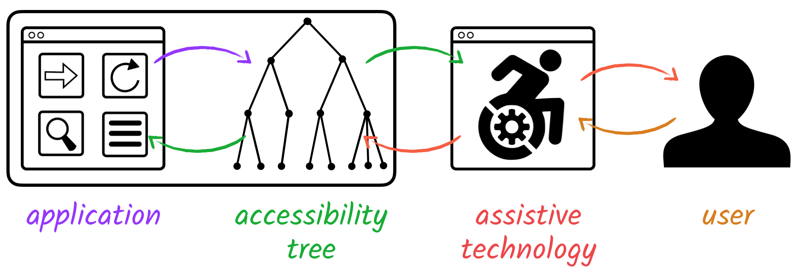

---

# スクリーンリーダーでの違い

## button

```html
<button type="button" onclick="openDialog()">ダイアログを開く</button>
```

- 「ボタン、ダイアログを開く」

## div

```html
<div onclick="openDialog()">ダイアログを開く</div>
```

- 「ダイアログを開く」

---
layout: center
---

# Web Content Accessibility Guidelines <br> (WCAG)

---

# 4.1.2 名前 (name)・役割 (role)・値 (value)

## 達成基準

> すべてのユーザインタフェース コンポーネント (フォームを構成する要素、リンク、スクリプトが生成するコンポーネントなど) では、名前 (name) 及び役割 (role) は、プログラムによる解釈が可能である。

<v-click>

```html
<div role="button" onclick="openDialog()">ダイアログを開く</div>
```

</v-click>

<v-click>

- 役割を上書きすることで「ボタン」と読み上げられる
- しかし`<button>`本来がもつキーボード操作は付与されていない

</v-click>

---

# 2.1.1 キーボード (レベル A)

## 達成基準

> コンテンツのすべての機能は、個々のキーストロークに特定のタイミングを要することなく、キーボードインタフェースを通じて操作可能である。

<v-click>

```html
<div role="button" tabindex="0" onclick="openDialog()">ダイアログを開く</div>
```

</v-click>

<v-click>

- 他にも<kbd>Enter</kbd>や<kbd>Space</kbd>でアクションさせる挙動も必要
  - <kbd>Enter</kbd>は`keydown`で発火し、押しっぱなしだと連続で発火する
  - <kbd>Space</kbd>は`keyup`で発火するが、押しっぱなしのまま<kbd>Tab</kbd>でフォーカス移動すると発火しない

</v-click>

---

# ガイドラインから学ぶ鉄則

## Using ARIA

> If you can use a native HTML element or attribute with the semantics and behavior you require already built in, instead of re-purposing an element and adding an ARIA role, state or property to make it accessible, then do so.<br>
> （必要なセマンティクスと振る舞いを持つネイティブHTML要素が使えるなら、ARIAで無理やり作るのではなく、それを使ってください）

## ARIA Authoring Practices Guide

> No ARIA is better than Bad ARIA<br>
> （悪いARIAより、ARIAを使わない方がマシである）

---

# ざんねんなボタンUI実装への対処方法

## ① type属性を忘れた`<button>`

<v-click>

- `<button>`の挙動を正しく理解し、適切なtype属性を付与する

</v-click>

## ② `<a>`で実装されたボタンUI

<v-click>

- HTML要素がもつ役割を正しく認識し、適切な場面で適切な要素を扱うようにする

</v-click>

## ③ `<div>`で実装されたボタンUI

<v-click>

- 即刻辞めましょう。何もいいことがありません。

</v-click>

---
layout: center
---

# おわりに

<!--
以上が何故残念なボタン実装と言われているかの紹介でした。
ボタンがもつ役割についてを理解できるようになっていれば、残念な実装というものは無くなると思います。
ただ、何が正しいかを知っているだけでも、それでもまた足りない部分はあります。
-->

---
layout: image
image: 'https://records.yamanoku.net/burikaigi-2026/images/ai-create-button.png'
---

<!--
私たちは毎日、当たり前のようにボタンを含めた色々なインターフェースを実装しています。

今ではUIライブラリとAIエージェントを組み合わせて、自らが１からボタンを実装することも減ってきて、ボタンに対して何を今更…と考えているかもしれません。

しかしその「ボタン」というものには、GUIの長い歴史から始まり、HTML仕様書の定義があり、アクセシビリティのガイドラインがあり、そしてそのボタンを押すユーザーがいます。
-->

---
layout: image
image: 'https://records.yamanoku.net/burikaigi-2026/images/good-button.png'
---

<!--
マウスを使う人、キーボードだけで操作する人、スクリーンリーダーを使う人——すべてのユーザーにとって使いやすいボタンを作ること。それがUIを作るものの責任です。

`<button>`の扱い方を誤ったり、リンクとボタンを混同して実装したり、意味を理解せずにWAI-ARIAだけでボタンを作ってしまうことは、特定のユーザーの体験を除外してウェブの普遍性を損なう行為となってしまいます。
-->

---
layout: center
---

# たかがボタン、されどボタン

<!--
「たかがボタン」と侮ることなく、その背後にある技術的背景とユーザー体験への影響を理解し、適切な要素を選択すること。それこそがWebアプリケーション開発者に求められる「されどボタン」の精神です。

今日の発表が、皆さんの「ボタン」に対する見方を変えるきっかけになれば幸いです。
-->

---
layout: end
---

# Thank You For Listening !!
