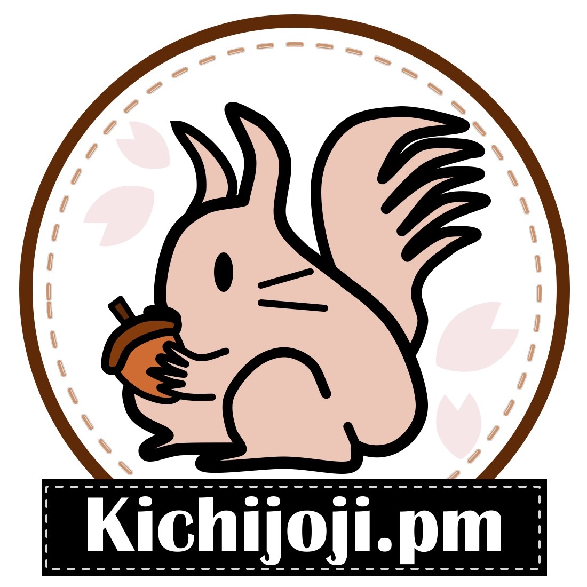

<h1 mt="24">お元気ですかFM</h1>

  5年間の配信で振り返る 
  「かわるもの」と「かわらないもの」

大吉祥寺.pm 2026 | <time datetime="2026-07-25">2026-07-25</time>

[ドキュメントページ](https://records.yamanoku.net/dai-kichijojipm-2026/)

  
    やまのく（yamanoku）
  

  

---

## やまのく（yamanoku）

- 会社員 / 一児の父
- 千葉県流山市在住
  - 東葛.dev、Funabashi.dev 参加中
- Vue Fes Japan 2026 コアスタッフ
- HTML Night in Tokyo 主催
- 大吉祥寺.pm 初登壇！

<v-drag pos="555,102,307,308">
  
</v-drag>

<!--
やまのくと申します。会社員をしつつ、一児の父をやっています。普段はWebフロントエンドまわりの仕事をしていて、記事を書いたりOSSに関わったり登壇したりと、とにかく何かしらアウトプットをしている人間です。

肩書きについては、フロントエンドエンジニアと名乗るのも、デザインエンジニアと名乗るのも、なんだかしっくりこなくて。最終的には「会社員」でいいや、というところに落ち着きました。今日はこの緩さも含めて聞いていただけると嬉しいです。
-->

---
layout: center
---

# どんなポッドキャストを 聴いていますか？

---
layout: center
---

  
  
  
  
  
  
  
  
  
  

---
layout: center
---

# 私もポッドキャストやってます

---
layout: center
---

# お元気ですか？

<!--
はい、ありがとうございます。今この瞬間、皆さんに「お元気ですか？」と問いかけて、心の中ででも「はい」と答えていただけたなら、それだけでこの発表は半分成功したようなものです。

というのも、今日は「お元気ですかFM」という、私が5年間続けているポッドキャストの話をするからです。この5年で「かわったもの」と「かわらなかったもの」を、皆さんと一緒に振り返っていきたいと思います。
-->

---
layout: center
---

  

---

## どんなポッドキャスト？

- [takanorip](https://x.com/takanoripe)の2人でやるポッドキャスト
- 毎回「お互いの近況」を話してからテーマトーク
- 2021年8月に第1回をanchor.fmにて配信
- 月1〜2回ペースで公開し、**46エピソード**が公開中
- 2025年に[公式Xアカウント](https://x.com/ogenkidesuka_fm)を作成
- 2026年には[YouTubeチャンネル](https://www.youtube.com/channel/UCcn63WWRg6wnJAWgRMte6xw)も開設
- 今年で**5周年**

<!--
「お元気ですかFM」は、takanoripという相方と2人でやっている雑談ポッドキャストです。デザインやWeb、キャリアについてゆるく話しています。

2021年の8月に第1回を配信しました。毎回、まずお互いの近況を話してから本題に入る、という形式を最初からずっと続けています。だいたい月に1〜2回のペースで、5年でエピソードは41本になりました。今年の8月で、ついに5周年を迎えます。
-->

---

## これまでのトークテーマ（抜粋）

カラーパレット、日報、Atomic Design、Web Components、デザインシステム、ワークライフバランス、英語学習、複雑GUI、OOUI、アクセシビリティ、JSConf JP、デザインエンジニア、Every Layout、HTML解体新書、統計学、Figma Config、KPI、哲学、Storybook、ダークパターン、デザイン読書日和、Web制作、モダンCSS、ActivityPub、社会人美大生、お金とデザイン、OpenUI、Vue Fes Japan、Tailwind CSS、生成AI、UXデザイナー、Config APAC、デザインの品質、転職後の立ち上がり、肩書き・キャリア、モーション、アウトカムファースト、越境、Design Ship、エターなる、評価制度、Astro、技術同人誌博覧会、カンファレンス、Vite Plus、OSS...

---

## 「お元気ですかFM」の由来

- 発足当時はコロナ禍で気軽に人と話せる状況ではない
- 1ヶ月に1回配信するペースで考えていた
- 最近元気だった？と聞いてスタートする

<v-drag pos="409,301,513,147">
  
</v-drag>

---
layout: two-cols-header
---

## 名前負けしがちなポッドキャスト

::left::

<Tweet id="1668234313270464514" scale="0.95" />

::right::

<Tweet id="1619973346107731968" scale="0.95" />

---

## データで見る「お元気ですかFM」

- 総再生回数: 9,304回
  - Spotify: 3,804回
  - Spotify以外: 5,500回
- 総視聴時間: 1,228時間
  - 平均視聴時間: 2時間44分
- Spotifyフォロワー: 188人
- YouTubeチャンネル登録者数: 14人

※ 2026年7月20日時点

<!--
せっかくなので、5年分の数字も少しだけ紹介させてください。2026年7月20日時点で、ポッドキャストの総再生回数は9,304回（Spotifyが3,804回、それ以外が5,500回）、総視聴時間は1,228時間、いちユーザーあたりの平均視聴時間は2時間44分、そしてフォロワーは188人です。

五年続けていてこの数字はあまり派手なものではないかもしれませんが、ポッドキャストをやっている人たちの参考になれば幸いです。
-->

---

## データで見る「お元気ですかFM」

※ 2026年7月20日時点

<!--
視聴者も男性が七割を占めており、年齢層は二十代から四十代の間でよく聞かれていることが分かります。
-->

---
layout: center
---

# お元気ですかFMと 「かわるもの」

<!--
今回の大吉祥寺.pmのテーマは「かわるもの、かわらないもの」です。お元気ですかFMのこの5年間を振り返り、「かわったもの」についてを触れていきます。
-->

---

## かわるもの

- フロントエンド開発・デザインの変遷
- 役割・場所の変化
- 日々の生活での変化
- 関わってくれる人たち

<!--
まず、かわったものは、「フロントエンド開発・デザインの変遷」「役割・場所の変化」「日々の生活での変化」「関わってくれる人たち」の4つに分けられます。
-->

---

## フロントエンド開発・デザインの変遷

- **Internet Explorer 11**のサポート終了
  - InteropやBaselineなど**Web標準化**の取り組みが前進
- Rust製ツールチェインや新しいJavaScriptのランタイムが続々登場
- デザインは**Figma一強**の時代へ
- デザインシステム運用が定番に
- **生成AI**の台頭

<!--
この5年、技術はとにかくよく動きました。Internet Explorer 11のサポートが終わり、InteropやBaselineといったWeb標準化の取り組みが前進しました。Rust製のツールチェインや新しいJavaScriptランタイムも次々に登場し、開発環境がまるごと組み替わっていったような期間だったと思います。

デザインの世界ではFigmaがほぼ一強になり、デザインシステムをどう運用していくかという話題が定番になりました。そして後半の主役は、やはり生成AIです。プロンプトひとつでコンポーネントができてしまう時代になり、私たちの関心は「コードをどう書くか」から「生成AIを使ってどんなアウトカム（成果）を出すか」へと、はっきりスライドしていきました。この変化は、番組の中でも繰り返し話してきたテーマです。
-->

---

## 役割・場所の変化

- 境界を越える動き（越境）が増えてきた
  - 「フロントエンドエンジニア」「デザインエンジニア」「テックリード」「プロダクトエンジニア」…
  - もう「会社員」でいいんじゃないの？
- お互いが転職をして環境を変える
  - 役割の上での難しさや葛藤
  - 慣れない立場で悪戦苦闘

<!--
動いたのは技術だけではありません。「フロントエンドエンジニア」「デザインエンジニア」「テックリード」「プロダクトエンジニア」……と役割の名前が増え、職種の境界を越えて動くこと、いわゆる越境が当たり前になりました。名前が増えすぎて、いっそ「会社員」でいいんじゃないの、と思ってしまうくらいです。私自身も越境を続けた結果、逆に肩書きにこだわるのをやめて「会社員」に落ち着いたというのも、このポッドキャストをやってきて気付けたことです。

私もtakanoripもこの5年で転職を経験しました。慣れない立場で悪戦苦闘したり、役割の上での難しさや葛藤を抱えたり。そうした30代のキャリアにおける話も、そのまま番組で話してきました。
-->

---

## 日々の生活での変化

- 副業の経験
- 新車を購入
- 大型犬を迎える
- 親知らず抜歯
- ペット介護

<!--
技術やキャリアだけでなく、日々の生活もいろいろと変わりました。副業を経験したり、新車を購入したり、大型犬を家族に迎えたり。かと思えば親知らずを抜いたり、ペットの介護に向き合ったり。近況報告を続けているからこそ、こうした生活の変化も番組にそのまま刻まれています。
-->

---
layout: two-cols-header
---

## 関わってくれる人たちが増えた

::left::

- ゲストの皆さん（総計: 10人）
- ポッドキャストとのコラボ配信
  - [よくわからないデザインと工学](https://creators.spotify.com/pod/show/yowadeko)
- カンファレンスでのゲスト登壇
  - Vue Fes Japan Online 2022
  - Vue Fes Japan 2023 
- 聴いてくれるリスナーの皆さん

::right::

  
  
  
  
  
  
  
  
  
  
  
  

<!--
続けているうちに、関わってくれる人も増えていきました。ゲストに来てくださった方は総計10人になります。

ほかのポッドキャストとのコラボ配信としてよくわからないデザインと工学の皆さんと収録したり、Vue Fes Japan Online 2022やVue Fes Japan 2023ではゲストとして登壇させてもらったりもしました。

そして何より、聴いてくれるリスナーの皆さんがいてくれること。ポッドキャストを通じて広がったつながりは、この五年で得た財産です。
-->

---
layout: center
---

  
  
よわでこの皆さんとポッドキャスト収録

---
layout: center
---

  
  
Vue Fes Japan 2023のパネルディスカッション

---
layout: center
---

# お元気ですかFMと 「かわらないもの」

<!--
さまざまなものがかわってきた一方で「かわらなかったもの」もあります。
-->

---

## かわらないもの

- 二人で話すこと
- 近況報告をする
- ほぼ編集なし
  - 収録したものをそのまま配信するノーガード運営
- 喋りたくなったらやる（体調が悪ければ休む）
- お互いに**期待しすぎない**

<!--
番組のやり方そのものは、驚くほど変わっていません。二人で話すこと、近況報告から始めること、ほぼ編集をしないこと、喋りたくなったらやって体調が悪ければ休むこと、そしてお互いに期待しすぎないこと。この基本姿勢は最初からずっと同じです。
-->

---

## かわらないのは「アウトプットを続ける」こと

- 職場や肩書きが変わっても**発信をする**ことを辞めない
- 常に問いを持ち続け**自分なりの考え**を持つようにする
- 生成AIが来ても**自らの言葉で喋る**ことは変わらない

<!--
そして、もう一つ変わらなかったのが「アウトプットを続けている」ということです。職場や肩書きが変わっても、発信することをやめない。常に問いを持ち続けて、自分なりの考えを持つようにする。生成AIが来ても、自らの言葉で喋ることは変わらなかったです。
-->

---

## ポッドキャストはアウトプットに最適な手段

- 自分の声は誤魔化しが効かない
- 文章を書くよりも整えずにアウトプットできる
- 下手な炎上が起こりづらい
  - 恣意的な切り抜きがしづらい
  - 映像がないので視覚的ノイズはない
  - テキストよりも解釈として誤解されづらい
- もちろん一定の配慮をもった発言をすることを心掛ける

<!--
5年やってきて実感するのは、ポッドキャストはアウトプットの手段としてかなり優秀だ、ということです。

まず、自分の声は誤魔化しが効きません。だからこそ、その時の自分の考えがそのまま残ります。文章のように何度も推敲する必要がなく、整えずにアウトプットできる手軽さもあります。それでいて、下手な炎上は起こりづらい。映像がないので視覚的なノイズはなく、テキストよりも解釈として誤解されにくい。もちろん、一定の配慮をもった発言を心がけることは前提ですが、それを踏まえてもハードルの低いものだと思います。
-->

---

## アウトプットのファーストステップ

<v-clicks>

- 格好つけずに、雑に**思考のログ**を出してみる
- スマホのボイスメモに、**自分の声を録音**してみる
- 気になる人と交流してみて、**感想を持ち帰って**みる

</v-clicks>

続くかどうかは、二の次でいい

まずはやってみて、残してみよう

<!--
ここまで聞いて「自分も何か発信してみようかな」と少しでも思ってもらえたら、今日一番伝えたいことはこれです。どんなに小さな一歩でもいいから、まずやってみる。

気になるコミュニティがあれば参加して、まずは自己紹介とリアクションから。Cosenseのようなツールに、綺麗にまとめようとせず思考のログをそのまま置いてみる。あるいは、スマホのボイスメモを開いて、今日直したバグの話でもなんでも、自分の声を録音してみる。

続くかどうかは二の次でいいんです。その一歩が、想像もしなかった道につながっていくかもしれません。私自身が、そうやってここまで来たので。
-->

---

## 本発表のまとめ

- お元気ですかFMの5年間の振り返り
- かわるもの：技術トレンド、ツール、働き方
- かわらないもの：アウトプットを続ける意志
- アウトプットは小さく、まずやって残してみる

<!--
というわけで今回は、お元気ですか.fmの5年間を振り返りました。かわったものは、技術トレンドやツール、働き方。かわらなかったものは、アウトプットを続ける意志。そして、アウトプットは小さく、まずやって残してみる。今回の発表が皆さまのアウトプットに対するきっかけとなれれば幸いです。
-->

---
layout: center
---

# 宣伝

---

## 5周年記念誌つくりました

- お元気ですかFM 5周年を記念した同人誌
- 技書博13にて頒布
- これまでの5年間を振り返る内容
- Boothにて販売中！

https://ogenkidesukafm.booth.pm/items/8345795

<v-drag pos="559,63,332,449">
  
</v-drag>

<!--
この五周年を記念して本を作りました。技書博（技術書同人誌博覧会）13にて頒布したもので、これまでの五年間を振り返る内容になっています。今回の発表やポッドキャストを聴いてみて、
もっと詳しく知りたくなった方は、ぜひ手に取ってもらえると嬉しいです。現在、Boothにて販売中です。現在私の手元にも数冊ありますので、懇親会等でお声がけいただければお見せすることも可能です。
-->

---
layout: center
---

# 最後に一句

---
layout: center
---

酷暑でも

皆さまどうか

お元気で

