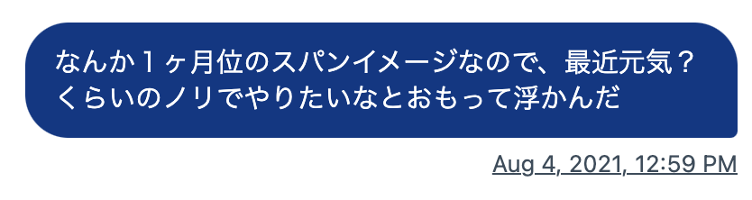
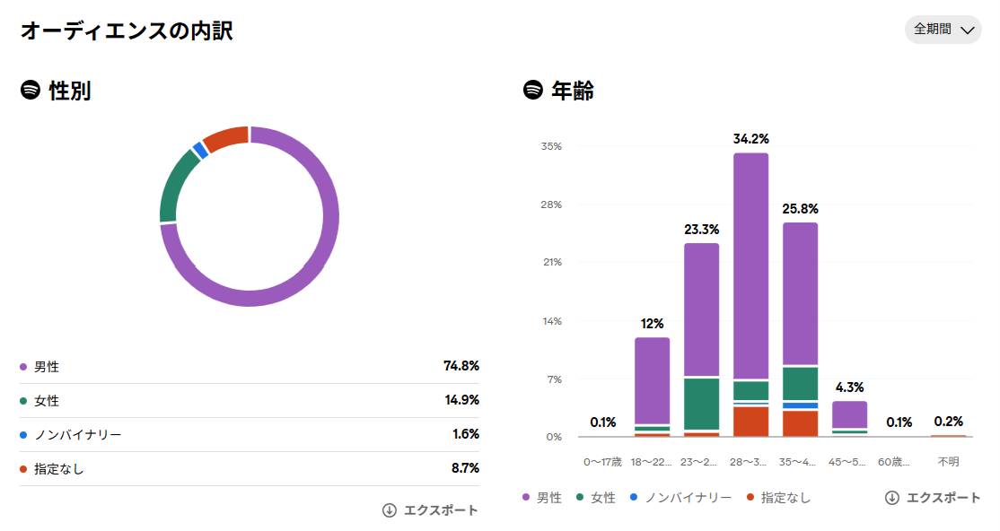
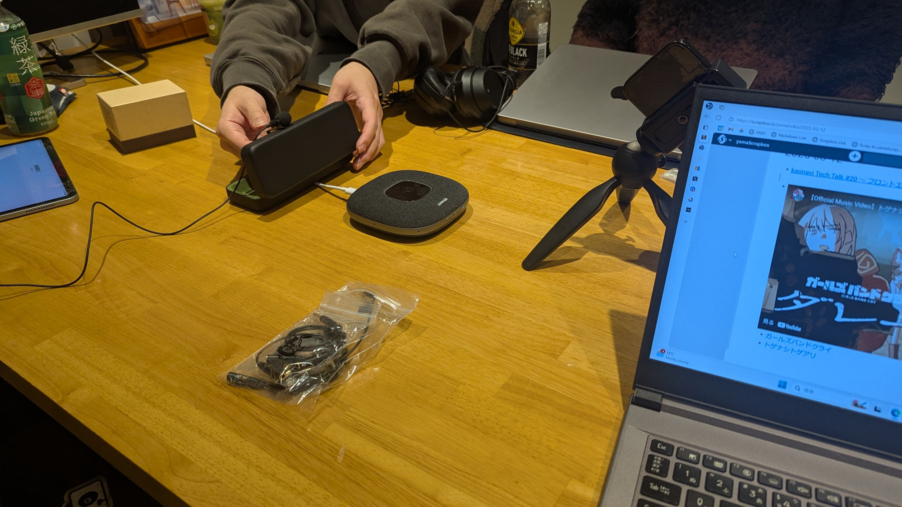
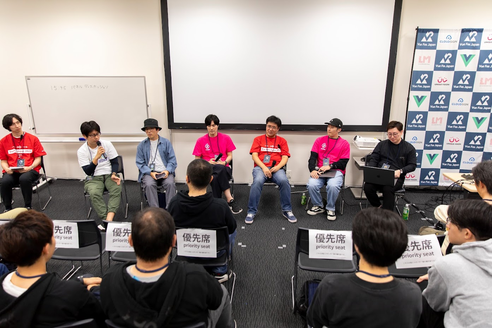
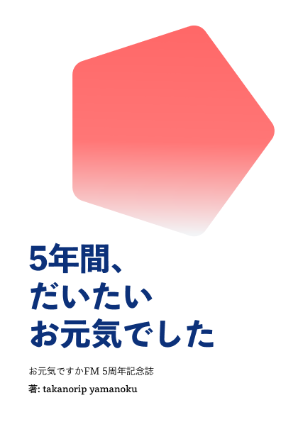

<h1 mt="24">お元気ですか.fm</h1>

  5年間の配信で振り返る 
  「かわるもの」と「かわらないもの」

大吉祥寺.pm 2026 | <time datetime="2026-07-25">2026-07-25</time>

[ドキュメントページ](https://records.yamanoku.net/dai-kichijojipm-2026/)

  
    やまのく（yamanoku）
  

---
layout: center
---

# お元気ですか？

<!--
はい、ありがとうございます。今この瞬間、皆さんに「お元気ですか？」と問いかけて、心の中ででも「はい」と答えていただけたなら、それだけでこの発表は半分成功したようなものです。

というのも、今日は「お元気ですか.fm」という、私が5年間続けているポッドキャストの話をするからです。この5年で「かわったもの」と「かわらなかったもの」を、皆さんと一緒に振り返っていきたいと思います。
-->

---

## やまのく（yamanoku）

- 会社員 / 一児の父
- 千葉県流山市在住
  - 東葛.dev、Funabashi.dev 参加中
- Vue Fes Japan 2026 コアスタッフ
- 大吉祥寺.pm 初登壇！

<v-drag pos="589,109,284,284">
  
</v-drag>

<!--
やまのくと申します。会社員をしつつ、一児の父をやっています。普段はWebフロントエンドまわりの仕事をしていて、記事を書いたりOSSに関わったり登壇したりと、とにかく何かしらアウトプットをしている人間です。

肩書きについては、フロントエンドエンジニアと名乗るのも、デザインエンジニアと名乗るのも、なんだかしっくりこなくて。最終的には「会社員」でいいや、というところに落ち着きました。今日はこの緩さも含めて聞いていただけると嬉しいです。
-->

---
layout: center
---

# どんなポッドキャストを 聴いていますか？

---
layout: center
---

# ポッドキャストやってます

---
layout: center
---

# お元気ですか.fmについて

---

## どんなポッドキャスト？

- [takanorip](https://x.com/takanoripe)の2人でやるポッドキャスト
- 毎回「お互いの近況」を話してからテーマトーク
- フロントエンド、デザイン、組織、キャリア等
- 2021年8月に第1回をanchor.fmにて配信
- 月1〜2回ペースで公開し、**46エピソード**が公開中
- 2026年にはYouTubeチャンネルも開設
- 今年で**5周年**

<v-drag pos="647,130,284,284">
  
</v-drag>

<!--
「お元気ですか.fm」は、takanoripという相方と2人でやっている雑談ポッドキャストです。デザインやWeb、キャリアについてゆるく話しています。

2021年の8月に第1回を配信しました。毎回、まずお互いの近況を話してから本題に入る、という形式を最初からずっと続けています。だいたい月に1〜2回のペースで、5年でエピソードは41本になりました。今年の8月で、ついに5周年を迎えます。
-->

---

## 役割分担

- takanorip
  - 収録、アップロード
- yamanoku
  - 概要編集
  - SNS宣伝

---

## 「お元気ですか.fm」の由来

- 発足当時はコロナ禍で気軽に人と話せる状況ではない
- 1ヶ月に1回配信するペースで考えていた
- 最近元気だった？と聞いてスタートする

---
layout: two-cols-header
---

## 名前負けしがちなポッドキャスト

::left::

<Tweet id="1668234313270464514" scale="0.95" />

::right::

<Tweet id="1619973346107731968" scale="0.95" />

---

## データで見る「お元気ですか.fm」

- 総再生回数: 9,304回
  - Spotify: 3,804回
  - Spotify以外: 5,500回
- 総視聴時間: 1,228時間
  - 平均視聴時間: 2時間44分
- フォロワー: 188人

※ 2026年7月20日時点

---

## データで見る「お元気ですか.fm」

---

## これまでのトークテーマ（抜粋）

カラーパレット、日報、Atomic Design、Web Components、デザインシステム、ワークライフバランス、英語学習、複雑GUI、OOUI、アクセシビリティ、JSConf JP、デザインエンジニア、Every Layout、HTML解体新書、統計学、Figma Config、KPI、哲学、Storybook、ダークパターン、デザイン読書日和、Web制作、モダンCSS、ActivityPub、社会人美大生、お金とデザイン、OpenUI、Vue Fes Japan、Tailwind CSS、生成AI、UXデザイナー、Config APAC、デザインの品質、転職後の立ち上がり、肩書き・キャリア、モーション、アウトカムファースト、越境、Design Ship、エターなる、評価制度、Astro、技術同人誌博覧会、カンファレンス、Vite Plus、OSS...

---
layout: center
---

# お元気ですか.fmと 「かわるもの」

---

## かわるもの

- フロントエンド開発の変遷
- 役割・場所の変化
- 日々の生活での変化
- 関わってくれる人たち

---

## フロントエンド・デザインの変遷

- **Internet Explorer 11**のサポート終了
  - InteropやBaselineなど**Web標準化**の取り組みが前進
- Rust製ツールチェインや新しいJavaScriptのランタイムが続々登場
- デザインは**Figma一強**の時代へ
- デザインシステム運用が定番に
- **生成AI**の台頭

<!--
まずは「かわるもの」から。ポッドキャストは近況を毎回話しているので、いわばこの5年間のフロントエンドの定点観測になっていました。

この5年、技術はとにかくよく動きました。Internet Explorer 11のサポートが終わり、InteropやBaselineといったWeb標準化の取り組みが進みました。Viteが一気に普及して、Rust製のツールチェインや新しいJavaScriptランタイムも次々に出てきました。開発環境がまるごと組み替わっていったような期間でした。

デザインの世界ではFigmaがほぼ一強になり、デザインシステムをどう運用するかという話題が定番になりました。

そして後半の主役はやはり生成AIです。プロンプトひとつでコンポーネントができてしまう時代になって、私たちの関心は「コードをどう書くか」から「生成AIを使ってどんなアウトカム、つまり成果を出すか」へと、はっきりスライドしていきました。この変化は、番組の中でも繰り返し話してきたテーマです。
-->

---

## 役割・場所の変化

- 境界を越える動き（越境）が増えてきた
  - 「フロントエンドエンジニア」「デザインエンジニア」「テックリード」「プロダクトエンジニア」…
  - もう「会社員」でいいんじゃないの？
- お互いが転職をして環境を変える
  - 役割の上での難しさや葛藤
  - 慣れない立場で悪戦苦闘

<!--
動いたのは技術だけではありません。「デザインエンジニア」「テックリード」といった役割の名前が増え、職種の境界を越えて動くことが当たり前になりました。私自身も越境を続けた結果、逆に肩書きにこだわるのをやめて「会社員」に落ち着いた、というのは先ほどお話しした通りです。

コミュニティの居場所も動きました。番組が始まったコロナ禍はオンライン勉強会が全盛でしたが、今は各地のカンファレンスなど、オフラインで顔を合わせる場に戻ってきています。この空気の変化も、そのままエピソードに刻まれています。
-->

---

## 日々の生活での変化

- 副業の経験
- 新車を購入
- 大型犬を迎える
- 親知らず抜歯
- ペット介護

---
layout: two-cols-header
---

## 関わってくれる人たちが増えた

::left::

- ゲストの皆さん（総計: 10人）
- ポッドキャストとのコラボ配信
  - [よくわからないデザインと工学](https://open.spotify.com/show/3PHU1bIB5eqjchCOs0LZfV)
- カンファレンスでのゲスト登壇
  - Vue Fes Japan Online 2022
  - Vue Fes Japan 2023 
- 聴いてくれるリスナーの皆さん

::right::

  
  
  
  
  
  
  
  
  
  
  
  

---
layout: center
---

  
  
よわでこの皆さんとポッドキャスト収録

---
layout: center
---

  
  
Vue Fes Japan 2023のパネルディスカッション

---
layout: center
---

# お元気ですか.fmと 「かわらないもの」

---

## かわらないもの

- 二人で話すこと
- 近況報告をする
- ほぼ編集なし
  - 収録したものをそのまま配信するノーガード運営
- 喋りたくなったらやる（体調が悪ければ休む）
- お互いに**期待しすぎない**

<!--
一方で「かわらないもの」です。改めて第1回を聞き返すと、面白いことに気づきました。2021年の初回で、ポートフォリオサイトをいつ更新するかとか、求人媒体とどう連動させるかといった話をしていたんですが……これ、2026年の今でもまったく同じことで悩んでいるんですね。

技術がどれだけ動いても、現場のエンジニアが抱える等身大の悩みは、そう簡単には変わらない。この「変わらなさ」に気づけるのも、定点観測を続けてきたからこそだと思います。
-->

---

## 変わらないのは「アウトプットを続ける」こと

- 職場や肩書きが変わっても**発信をする**ことを辞めない
- 常に問いを持ち続け**自分なりの考え**を持つようにする
- 生成AIが来ても**自らの言葉で喋る**ことは変わらない

<!--
そしてもう一つ変わらなかったのが、「アウトプットを続けている」ということです。肩書きや役割は変わっても、「良いものを作りたい」という意志は変わらない。無理せず、80点でいいから早く出して、振り返りながら直していく。この進め方は、ノー編集のポッドキャストで身についた感覚そのものです。

記事、OSS、登壇、Cosenseでの日々の記録、そしてポッドキャスト。続けてきた発信が、気づけば5年分の技術トレンドとキャリアの定点観測になっていました。これが、私にとっての一番の「かわらないもの」です。
-->

---

## ポッドキャストはアウトプットに最適な手段

- 自分の声の誤魔化しが効かない
- 下手な炎上が起こりづらい
  - 視覚的なノイズがない
  - テキストよりも誤解されづらい
  - もちろん一定の配慮をもった発言をすることを心掛ける

---
layout: center
---

# アウトプットの ファーストステップ

---

## 小さくていいから、まずやってみる

<v-clicks>

- 格好つけずに、雑に**思考のログ**を出してみる
- スマホのボイスメモに、**自分の声を録音**してみる
- 気になる人と交流してみて、**感想を持ち帰って**みる

</v-clicks>

続くかどうかは、二の次でいい

まずはやってみて、残してみよう

感想ブログを書くまでが大吉祥寺.pmですもんね？

<!--
ここまで聞いて「自分も何か発信してみようかな」と少しでも思ってもらえたら、今日一番伝えたいことはこれです。どんなに小さな一歩でもいいから、まずやってみる。

気になるコミュニティがあれば参加して、まずは自己紹介とリアクションから。Cosenseのようなツールに、綺麗にまとめようとせず思考のログをそのまま置いてみる。あるいは、スマホのボイスメモを開いて、今日直したバグの話でもなんでも、自分の声を録音してみる。

続くかどうかは二の次でいいんです。その一歩が、想像もしなかった道につながっていくかもしれません。私自身が、そうやってここまで来たので。
-->

---

## 本発表のまとめ

- お元気ですか.fmの5年間の振り返り
- 変わるもの：技術トレンド、ツール、働き方
- 変わらないもの：アウトプットを続ける意志
- アウトプットは小さく、まずやってみる

---
layout: center
---

# 宣伝

---

## 5周年記念誌つくりました

- お元気ですか.fm 5周年を記念した同人誌
- 技書博13にて頒布
- これまでの5年間を振り返る内容
- Boothにて販売中！

https://ogenkidesukafm.booth.pm/items/8345795

<v-drag pos="615,67,332,449">
  
</v-drag>

<!--
そして、この5周年を記念して同人誌を作りました。前編は、お元気ですか.fmの5年史とフロントエンドの変化、つまり今日の「かわるもの」の部分。後編は、私自身のキャリアとアウトプットの振り返り、つまり「かわらないもの」の部分です。

今日の発表は、まさにこの本のエッセンスを20分に詰め込んだものになっています。もっと詳しく知りたくなった方は、ぜひ手に取ってもらえると嬉しいです。
-->

---
layout: center
---

# 最後に一句

---
layout: center
---

酷暑でも

体調崩さず

お元気で

