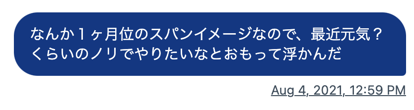
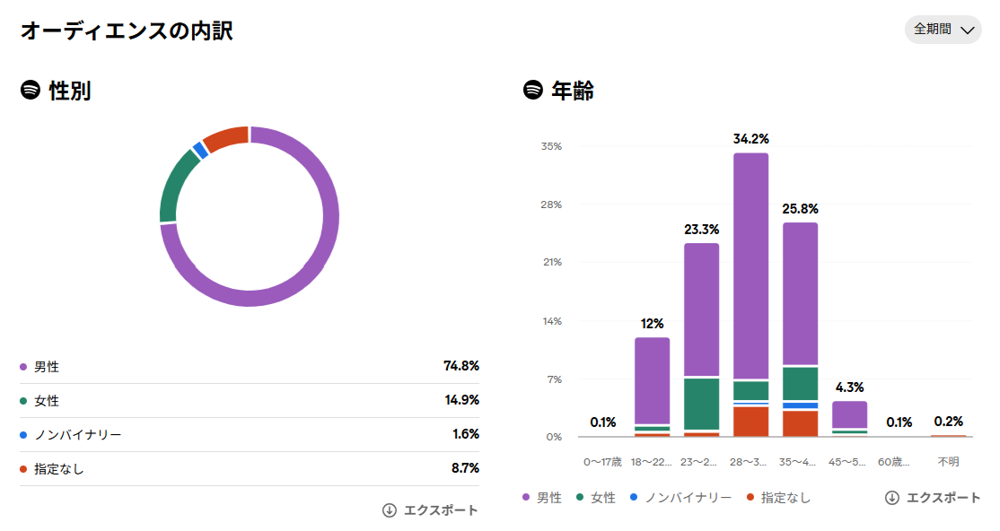
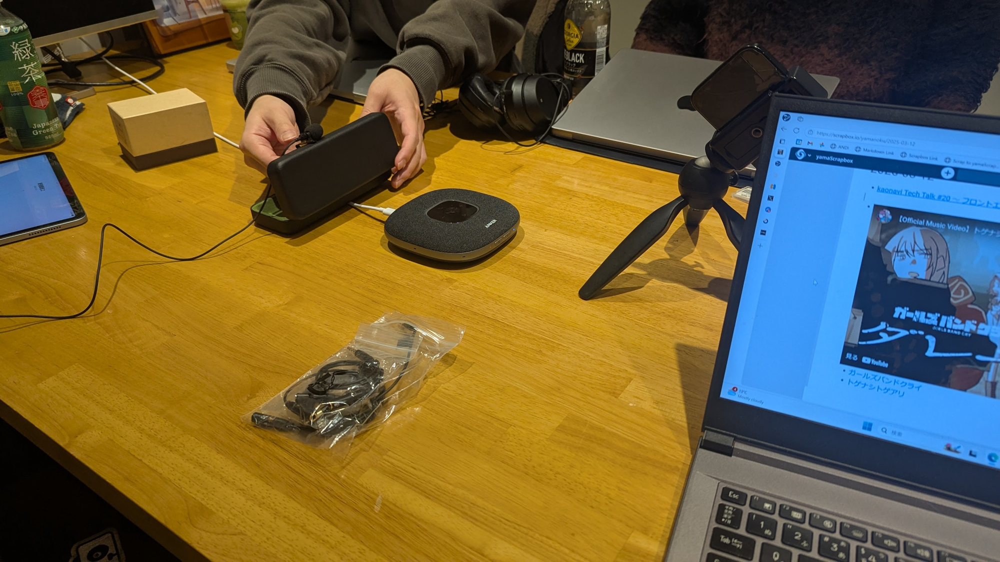
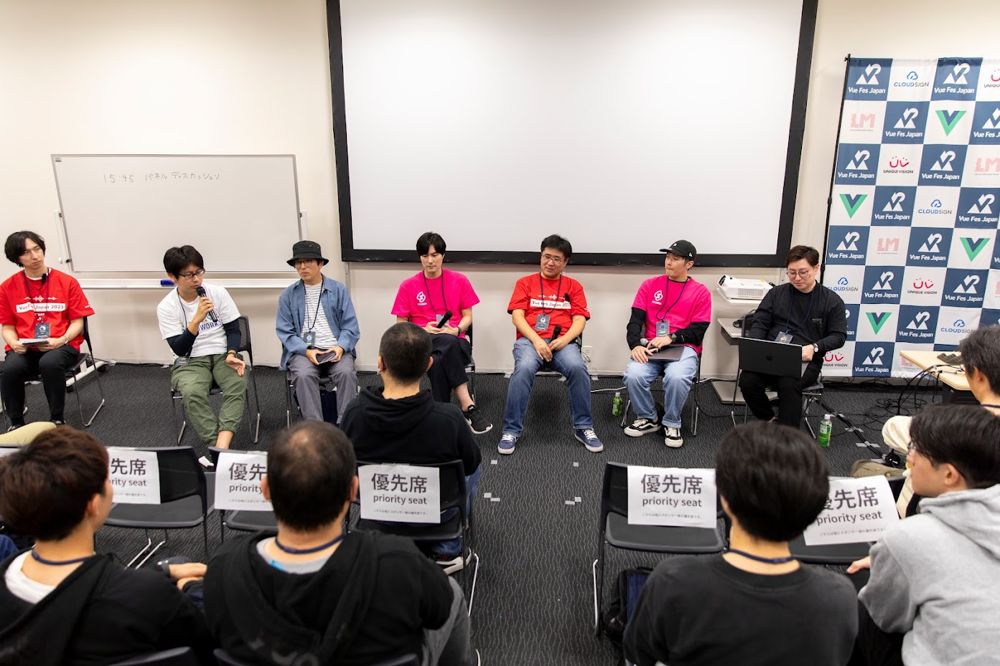
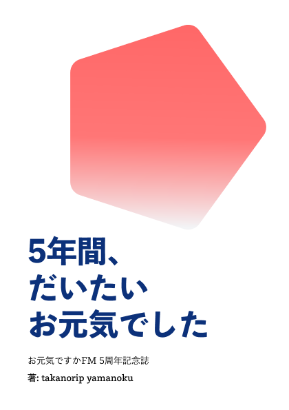

<h1 mt="24">お元気ですか.fm</h1>

  5年間の配信で振り返る 
  「かわるもの」と「かわらないもの」

大吉祥寺.pm 2026 | <time datetime="2026-07-25">2026-07-25</time>

[ドキュメントページ](https://records.yamanoku.net/dai-kichijojipm-2026/)

  
    やまのく（yamanoku）
  

  

---

## やまのく（yamanoku）

- 会社員 / 一児の父
- 千葉県流山市在住
  - 東葛.dev、Funabashi.dev 参加中
- Vue Fes Japan 2026 コアスタッフ
- HTML Night in Tokyo 主催
- 大吉祥寺.pm 初参加＆初登壇！

<v-drag pos="555,102,307,308">
  
</v-drag>

<!--
最初に自己紹介をさせていただきます。
やまのくと申します。会社員で一児の父です。千葉県流山市に住んでおり、昨年の登壇者でもあるkounoさんが主催される東葛.devや、ちゃまほりさんが主催されるFunabashi.devといった千葉の技術者コミュニティに参加させていただいております。

また、Vue.jsとViteのエコシステムにまつわるカンファレンス「Vue Fes Japan」の今年のコアスタッフや、8月7日にアララ株式会社さんで開催されるHTML限定のイベント「HTML Night in Tokyo」の主催も務めております。

そして今回、大吉祥寺.pmには初参加かつ初登壇となります。実は過去2年連続でプロポーザルを出して落ちていたのですが、今年3度目の正直でようやく登壇の夢が叶いました。ありがとうございます。
-->

---
layout: center
---

# どんなポッドキャストを 聴いていますか？

---
layout: center
---

  
  
  
  
  
  
  
  
  
  

<!--
こちらが自分が最近聴いているポッドキャストです。

有名どころから知り合いがやっているもの、そしてMagnoliaさんがやられている「縁側テックトーク」などです。

仕事中だったり都内への移動時や散歩している時などにそれぞれ聞かせてもらっています。
-->

---
layout: center
---

# 私もポッドキャストやってます

<!--
ここでポッドキャストの話題に触れたのは、私自身もポッドキャストを配信しているからです。

どんなポッドキャストかと言うと、
-->

---
layout: center
---

# お元気ですか？

<!--
「お元気ですか？」と相手に投げかけてから始めるポッドキャスト
-->

---
layout: center
---

  

---

## どんなポッドキャスト？

- [takanorip](https://x.com/takanoripe)の2人でやるポッドキャスト
- 毎回「お互いの近況」を話してからトークテーマ
- 2021年8月に第1回をanchor.fmにて配信
- 月1〜2回ペースで公開し、**46エピソード**が公開中
- 2025年に[公式Xアカウント](https://x.com/ogenkidesuka_fm)を作成
- 2026年には[YouTubeチャンネル](https://www.youtube.com/channel/UCcn63WWRg6wnJAWgRMte6xw)も開設
- 今年で**5周年**

<!--
私とtakanoripの2人で、「お元気ですか.fm」という雑談系のポッドキャストをやらせてもらっています。毎回お互いの近況を報告し、「お元気ですか？」と尋ねてからトークテーマに入るというスタイルです。

2021年8月にanchor.fmで第1回を配信して以降、月に1、2回のペースで配信し、現在までで46エピソードを公開しています。

2025年には公式のXアカウントを作成し、今年はYouTubeチャンネルも開設しました。この年になって初めて「チャンネル登録と高評価よろしくお願いします」と言えるようになり、大変感慨深く思っています。

そして今年で5周年を迎えます。
-->

---

## これまでのトークテーマ（抜粋）

カラーパレット、日報、Atomic Design、Web Components、デザインシステム、ワークライフバランス、英語学習、複雑GUI、OOUI、アクセシビリティ、JSConf JP、デザインエンジニア、Every Layout、HTML解体新書、統計学、Figma Config、KPI、哲学、Storybook、ダークパターン、デザイン読書日和、Web制作、モダンCSS、ActivityPub、社会人美大生、お金とデザイン、OpenUI、Vue Fes Japan、Tailwind CSS、生成AI、UXデザイナー、Config APAC、デザインの品質、転職後の立ち上がり、肩書き・キャリア、モーション、アウトカムファースト、越境、Design Ship、エターなる、評価制度、Astro、技術同人誌博覧会、カンファレンス、Vite Plus、OSS...

<!--
これまで扱ってきたトークテーマは、フロントエンドやソフトウェアのUIデザインといった技術的な話から、英語学習、統計学、哲学、KPI、生成AI、社会人の美大生、キャリアや評価、カンファレンスの話題など、自分たちの生活に関わる幅広い事柄をざっくばらんに取り上げてきました。
-->

---

## 「お元気ですか.fm」の由来

- 発足当時はコロナ禍で気軽に人と話せる状況ではない
- 1ヶ月に1回配信するペースで考えていた
- 最近元気だった？と聞いてスタートする

<v-drag pos="409,301,513,147">
  
</v-drag>

<!--
そもそもなぜ「お元気ですか.fm」という名前なのかについて触れていきます。

事の始まりでもある2021年頃は日本にコロナウィルスがやってきて1年経った頃でリモートがデフォルトであり直接人と会えない状況が続いていました。そんな閉塞感を打破するためにポッドキャストという形で発信するのが流行っていた頃と記憶しています。

そしてtakanoripから一緒にポッドキャストをやろうと誘われて二つ返事でOKをして初めて見ました。

月に1回程度の配信を目指していましたが、私たちはそれぞれ別の会社で働いているため、直接話す機会がなく間が空いてしまいます。

そこでお互いの状態を確認するために「最近元気？」と聞き合うところから始めるのが良いのではないかと考え、私がこの名前を提案しました。
-->

---
layout: two-cols-header
---

## 名前負けしがちなポッドキャスト

::left::

<Tweet id="1668234313270464514" scale="0.95" />

::right::

<Tweet id="1619973346107731968" scale="0.95" />

<!--
タイトルに「お元気ですか」と入っているため元気な番組だと思われがちなのですが、リスナーの方からは「名前の割に元気がないよね」とよく突っ込まれていました。これには理由がありまして、お互いの仕事や家事が終わった夜の8時や9時過ぎに収録をしているためです。ただでさえ疲れている上に私の声も低いため、立ち上がりのテンションがどうしても低くなってしまい、名前負けしがちなポッドキャストと言われておりました。最近は以前より少し元気になってきたかなとは思っております。
-->

---

## データで見る「お元気ですか.fm」

- 総再生回数: 9,304回
  - Spotify: 3,804回
  - Spotify以外: 5,500回
- 総視聴時間: 1,228時間
  - 平均視聴時間: 2時間44分
- Spotifyフォロワー: 188人
- YouTubeチャンネル登録者数: 14人

※ 2026年7月20日時点

<!--
5年間の配信データについても少し触れさせていただきます。現在はSpotify for Creatorsを中心に配信しており、再生数やフォロワー数、YouTubeの登録者数などは、5年間の積み重ねとしては正直そこまで派手な数字ではありません。これからポッドキャストを始める方の参考程度に見ていただければと思います。
-->

---

## データで見る「お元気ですか.fm」

※ 2026年7月20日時点

<!--
リスナーの層としては男性が7割近くを占めており、年齢層は20代から40代と、パーソナリティである自分たちの年齢に近いボリュームゾーンの方々に一番多く聴いていただいております。
-->

---
layout: center
---

# お元気ですか.fmと 「かわるもの」

<!--
今回の大吉祥寺.pmのテーマは「かわるもの、かわらないもの」です。お元気ですか.fmのこの5年間を振り返り、「かわったもの」についてを触れていきます。
-->

---

## かわるもの

- フロントエンド開発・デザインの変遷
- 役割・場所の変化
- 日々の生活での変化
- 関わってくれる人たち

<!--
まず、かわったものは、「フロントエンド開発・デザインの変遷」「役割・場所の変化」「日々の生活での変化」「関わってくれる人たち」の4つに分けられます。
-->

---

## フロントエンド開発・デザインの変遷

- **Internet Explorer 11**のサポート終了
  - InteropやBaselineなど**Web標準化**の取り組みが前進
- Rust製ツールチェインや新しいJavaScriptのランタイムが続々登場
- デザインは**Figma一強**の時代へ
- デザインシステム運用が定番に
- **生成AI**の台頭

<!--
まず、フロントエンド開発やデザインの変化についてです。大きなトピックとしてはInternet Explorer 11のサポート終了が挙げられます。それに伴い、InteropやBaselineといったWeb標準化に向けた取り組みが進み、クロスブラウザでの実装が以前より容易になってきたと感じます。また開発ツールに関しても、Rustによるツールチェーンの高速化が進んだり、DenoやBunといった新しいJavaScriptランタイムが登場したりしました。

デザインツールにおいては、Figmaが一強の時代になったと感じています。各社でデザインシステムの運用も定番化し、どのようなコンポーネントライブラリにするか、UXライティングやブランディングをどう設計するかといった議論が盛んに行われるようになりました。

さらに、現在のソフトウェア開発に欠かせなくなった生成AIの台頭もあり、「フロントエンドエンジニアの仕事が真っ先になくなるのでは」といった話がされつつも、徐々に私たちの生活や開発現場に馴染んできています。

これらの変化についても追い続けてポッドキャストが１つの定点観測となっていました。
-->

---

## 役割・場所の変化

- 境界を越える動き（越境）が増えてきた
  - 「フロントエンドエンジニア」「デザインエンジニア」「テックリード」「プロダクトエンジニア」…
  - もう「会社員」でいいんじゃないの？
- お互いが転職をして環境を変える
  - 役割の上での難しさや葛藤
  - 慣れない立場で悪戦苦闘

<!--
技術やツールだけでなく、自分たちの役割や置かれた場所の変化も大きくありました。

特に「境界を超える動き」が増えたと感じています。私自身、元々はフロントエンドエンジニアでしたが、デザイナーとの橋渡しをするデザインエンジニアを務めたり、フロントエンドのテックリードとして全体を俯瞰した技術選定を行ったり、職種の垣根を超えたプロダクトエンジニアとして活動したりと、多様な領域に携わってきました。

このように様々な役割を横断していく中で、自分が何者なのかが分からなくなったり、特定の役職に縛られることに違和感を覚えるようになりました。
そこで「肩書きはもうシンプルに『会社員』でいいのではないか」と考えるようになり、これが最初の自己紹介にもつながっています。

また、この5年の間で2人がそれぞれ転職したことも大きな出来事でした。これまでプレイヤーとして関わってきた状態から、マネジメントや全体を統括する立場へと変わり、未経験の領域で悪戦苦闘した経験についてもポッドキャストでリアルに語ってきました。
-->

---

## 日々の生活での変化

- 副業の経験
- 新車を購入
- 大型犬を迎える
- 甥っ子・姪っ子が生まれる
- 家族の入院
- ペット介護

<!--
仕事以外のプライベートや日々の生活も変化しています。私自身、これまで経験のなかった副業を2度ほど経験させていただき、そこで得た収入で新車を購入したり、長年の夢だった大型犬を迎えることができました。また、妻のきょうだいに甥っ子や姪っ子が生まれ、新しい家族のつながりができたことも嬉しい変化でした。一方で、家族が入院したり、20歳になる愛猫が慢性腎不全のため1年近く自宅で皮下輸液のケアを続けたりと、身の回りで大きな試練や変化があったのも事実です。
-->

---
layout: two-cols-header
---

## 関わってくれる人たちが増えた

::left::

- ゲストの皆さん（総計: 11人）
- ポッドキャストとのコラボ配信
  - [よくわからないデザインと工学](https://creators.spotify.com/pod/show/yowadeko)
- カンファレンスでのゲスト登壇
  - Vue Fes Japan Online 2022
  - Vue Fes Japan 2023 
- 聴いてくれるリスナーの皆さん

::right::

  
  
  
  
  
  
  
  
  
  
  

<!--
そして最後に、ポッドキャストを通じて関わる人とその関係性が大きく広がったことも大きな変化です。これまでゲストとして出演してくださった総勢11名の方々をはじめ、他番組とのコラボ配信や、カンファレンスへのゲスト登壇など、活動の幅が広がりました。何より、番組を聴いてくださるリスナーの皆さんから反応をいただけることが本当に励みになっています。
-->

---
layout: center
---

  
  
よわでこの皆さんとポッドキャスト収録

<!--
スライドでお見せしている写真は、ポッドキャスト「よわでこ」さんとのコラボ配信をしたときのものです。
実は今までリモートで収録することしかしていなかったので初めて対面での収録となりました。
-->

---
layout: center
---

  
  
Vue Fes Japan 2023のパネルディスカッション

<!--
「Vue Fes Japan」のパネルディスカッションに2人で登壇したときの一コマです。
-->

---
layout: center
---

# お元気ですか.fmと 「かわらないもの」

<!--
一方で、変わらなかったことも見えてきました。
-->

---

## シンプルにすること

- 二人で話すこと
- 近況報告をする
- **編集は一切なし**
  - 収録したものをそのまま配信するノーガード運営
- 喋りたくなったらやる
  - 体調が悪ければ無理せず休む
- お互いに期待しすぎない

<!--
まず「お元気ですか？」とシンプルに声を掛け合い、二人で近況を語り合う基本スタイルは今も昔も変わりません。一切の編集を行わず、Discordのボイスチャンネルでつないで録音した音声をそのまま配信する、いわば「ノーガード運営」を続けてきました。どちらかが喋りたくなったら収録し、体調が悪ければ無理なく休む、そしてお互いに過度な期待や議論を求めず好きなことを語り合うという関係性をシンプルに保ってきたことも、この番組ならではの変わらない特長です。
-->

---

## 答えを求めないこと

- 喋っているうちに自分の考えが整理されてくる
- ただそれは**明確な答え**ではない
- 答えが出ないことを受け入れる

<!--
また、このポッドキャストでは「答えを求めない」という姿勢を一貫して大切にしてきました。雑談を通じて自分の思っていることを言葉にしていくと、思考そのものは次第に整理されていきます。しかし、それはあくまで自分なりの考えが整理されただけであり、そのテーマに対する絶対的な答えではありません。

安易にAIに答えを求めがちな現代において、現実の課題や私たちが直面する問題には簡単に答えが出ないことの方が普通です。

答えが出ないこと自体を当たり前として受け止め、自分たちの思考を整理し続けていくことを続けているのもかわらないことの１つです。
-->

---

## アウトプットし続けること

- 職場や肩書きが変わっても発信し続けてきた
- 常に問いを持ち続け自分なりの考えを持つ
- 生成AIが来ても**自らの言葉で喋る**ことが大事

<!--
そしてアウトプットし続けていることもかわらないことです。

5年間続けてきている中で職場や肩書が変わってもそれぞれが発信をし続けてきました。役割がより会社にとって重要なポジションになってくると喋れないことも増えていきますが、だからといって委縮せずに発信してきました。

先ほどの内容にも関連しますが、答えのない状態だからこそ常に問いを持ち続け自分なりの考えをもち続けていることもアウトプットをするためには必要なことかと思っています。

こうしたかわらなさがあったからこそ、生成AI時代でも自身の言葉で語り続けることができたのかなと思います。
-->

---

## ポッドキャストはアウトプットに最適な手段

- 自分の声は誤魔化しが効かない
- 文章を書くよりも整えずにアウトプットできる
- 下手な炎上が起こりづらい
  - 恣意的な切り抜きがしづらい
  - 映像がないので視覚的ノイズはない
  - テキストよりも解釈として誤解されづらい
- もちろん一定の配慮をもった発言を心がける

<!--
改めて考えてみると、ポッドキャストはこうしたアウトプットの手段として非常に優れていると感じます。

声というものは取り繕うことが難しく誤魔化しが効かないため、喋り手の等身大の感情や思考がストレートに伝わります。文章のようにかしこまって整える必要もなく、気軽に表現できる手軽さもあります。さらに、視覚的なノイズが入る動画や切り取りによって意図が歪みやすいテキストに比べ、声のニュアンスごと伝わるポッドキャストは、過度に炎上を恐れることなく伝えたい本質を届けやすいというメリットもあります。
-->

---

## アウトプットのファーストステップ

- シンプルであることを維持する
- 答えではなく自分の考えをもつ
- 反応を求めずに発信をしてみる

たとえば、大吉祥寺.pmの感想とか、いかがでしょう…？

<!--
これまでの活動から見えてきたアウトプットの秘訣は、スタイルをシンプルに保つこと、絶対的な答えではなく自分の考えを提示すること、そして周囲の反応を求めすぎずにまずは発信してみるという点に集約されます。「アウトプットは難しい」と感じる方もいるかもしれませんが、難しく考える必要はありません。身近なイベントやコンテンツの感想など、自分が感じたことを文章や声として形にしてみることが第一歩になります。
-->

---

## 本発表のまとめ

- お元気ですか.fmの5年間の振り返り
- かわるもの
  - 技術トレンド、ツール、働き方、キャリア、日々の生活
- かわらないもの
  - 自分の考えをシンプルにアウトプットすること

まずはやってみて、残してみよう それが何らかの形で繋がるかもしれないから。

<!--
技術トレンドや働き方、生活環境など、時代の変化とともに変わるものはたくさんあります。しかし、「自分の考えをシンプルにアウトプットする」という本質は変わりません。生成AIが普及する今だからこそ、生身の自分自身の言葉で等身大の思考を伝えていくことが、自分らしさを支える大切な軸になります。まずは行動を起こし、言葉として残してみることで、巡り巡って新たなつながりや展開が生まれていくはずです。
-->

---
layout: center
---

# 宣伝

<!--
最後に一つ宣伝させてください。
-->

---

## 5周年記念誌つくりました

- お元気ですか.fm 5周年を記念した同人誌
- 技書博13にて頒布
- これまでの5年間を振り返る内容
- Boothにて販売中！

https://ogenkidesukafm.booth.pm/items/8345795

  #お元気ですかFM
  にて感想お待ちしております！

<v-drag pos="559,63,332,449">
  
</v-drag>

<!--
『お元気ですか.fm』は今年で5年目を迎え、これを記念して5周年記念誌を制作いたしました。これまでの5年間の歩みを振り返る内容となっており、相方のtakanoripによるデザイナー視点での振り返りなど、異なる立場からのコンテンツも収められています。

BOOTHにて販売しておりますが、今回サンプルとして何冊か持ってきたので気になった方はぜひ手に取っていただければ幸いです。

あわせて、SNS上でハッシュタグ「#お元気ですか.fm」をつけて本誌や配信の感想を投稿していただけると大変嬉しく思います
-->

---
layout: center
---

# 最後に一句

---
layout: center
---

酷暑にも

負けじとお体

お元気で

