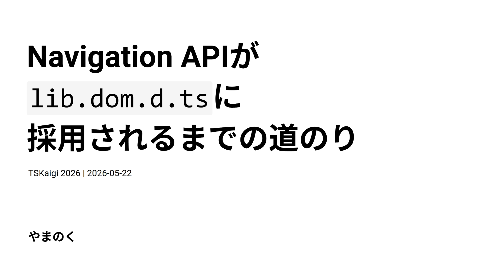

## スライド

[発表スライド](https://records.yamanoku.net/tskaigi-2026/slide/)

## 翻訳記事一覧

[日本語ページ](https://records.yamanoku.net/tskaigi-2026/ja/) / [English page](https://records.yamanoku.net/tskaigi-2026/en/) / [한국어 페이지](https://records.yamanoku.net/tskaigi-2026/ko/)

## 発表概要

皆さんは「Navigation API」をご存じでしょうか？

SPAのクライアントサイドルーティングを実現するために使われるHistory APIの後継のWeb APIです。昨年のInteropプロジェクトでの採用を経て、今年1月よりすべての主要ブラウザにて利用可能になりました。

しかしこのような最新のWeb APIを使おうとしたら型が未定義で、自ら`interface Window`を拡張した経験は皆さんはありませんか？

本セッションでは、Navigation APIの概要を紹介しつつ、普段何気なく利用しているDOM APIがどのようなフローでTypeScriptでの型定義（lib.dom.d.ts）に採用されるのかを解説します。

この発表を通じて、Web標準の技術が「型」として届けられるまでの裏側を知り、最新技術をより安全かつ深く理解して扱えるようになることを目指します。

## スライド内容

本日はNavigation APIがTypeScriptの型定義に採用されるまでの道のりについてをお話しします。Web標準の技術が、どのようにしてTypeScriptの『型』として私たちの手元に届くのかをご紹介します。

まずはじめに、皆さんはNavigation APIをご存じでしょうか？

Navigation APIはSPAのクライアントサイドルーティングを実現するための、History APIの後継となる新しいDOM APIです。これまでのHistory APIは柔軟性に欠け、OS固有の制約から扱いづらい面がありました。Navigation APIはその問題点を解消し、より柔軟なクライアントサイドルーティングを実現します。2026年1月にすべての主要ブラウザで利用可能になっています。

<baseline-status style="border: 1px solid" featureId="navigation"></baseline-status>

History APIの課題としては、`pushState` / `replaceState` の柔軟性の欠如、ページ遷移のインターセプトの困難さ（フォーム送信のハンドリングが煩雑、離脱確認の実装が不安定）、そしてフォーカス位置の保存・復元の手法が確立されていないことが挙げられます。

Navigation APIには3つの主要な特徴があります。まず履歴管理の明確化です。`navigation.entries()`で履歴エントリの一覧を取得でき、各エントリに一意の`key`と`id`が付与されます。

次にインターセプト処理です。`navigate`イベントを使って、ページ遷移前やフォーム送信時に明示的に処理を差し込むことができます。

```typescript
navigation.addEventListener('navigate', (event) => {
  if (!event.canIntercept) return;

  event.intercept({
    handler: async () => {
      // ページ遷移前に処理を差し込める
      await loadPageContent(event.destination.url);
    },
  });
});
```

そして3つ目として、フォーカス位置の復元が容易になったことも特徴として挙げられます。フォーカス位置を状態として保存し、イベントが発火したときに復元する実装が可能になりました。

```typescript
// 遷移前にフォーカス位置を保存
navigation.updateCurrentEntry({
  state: { focusedId: document.activeElement?.id },
});

// 復元処理
navigation.addEventListener('currententrychange', () => {
  const state = navigation.currentEntry.getState();
  if (state?.focusedId) {
    document.getElementById(state.focusedId)?.focus();
  }
});
```

非常に便利になったNavigation API、これをTypeScript環境で使おうとしたときにある問題が発生しました。

それは、TypeScript 5.9までNavigation APIの型定義はTypeScript本体には存在していませんでした。新たなDOM APIを試してみようとしたとき、壁にぶつかった経験がある方もいるのではないでしょうか。

DOM APIの型定義がない場合、いくつかのアプローチがあります。

まずはDefinitelyTypedを利用することです。Navigation APIの場合は[`@types/dom-navigation`](https://www.npmjs.com/package/@types/dom-navigation)というパッケージが存在していました。

```sh
npm i -D @types/dom-navigation
yarn add -D @types/dom-navigation
pnpm add -D @types/dom-navigation
bun add -d @types/dom-navigation
```

しかしAPIによってはDefinitelyTypedにパッケージが存在しない場合もあります。その場合は仕様を見つつ自前で`Window`インターフェースを拡張するか、一時的に`@ts-ignore`でエラーを握りつぶすしかありません。

そもそもTypeScriptにおけるDOM APIの型定義はどうやって作られているのでしょうか。

`lib.dom.d.ts`は手書きではなく、[TypeScript-DOM-lib-generator](https://github.com/microsoft/TypeScript-DOM-lib-generator)というツールによって自動生成されています。[Browser-Compat-Data](https://github.com/mdn/browser-compat-data)を互換性データを条件とし、Web仕様から型定義を生成し、TypeScriptリポジトリで定期的に実行されます。

DOM APIがTypeScriptの型定義として採用される条件は「2つ以上のブラウザエンジンでサポートされていること」です。ChromeとEdgeは同じChromiumエンジンのためカウントは1です。ここにFirefoxかSafariのどちらかで実装されて初めて条件がクリアされます。

| ブラウザ | エンジン |
|--------|--------|
| Chrome | Blink (Chromium) |
| Edge | Blink (Chromium) |
| Firefox | Gecko |
| Safari | WebKit |

型定義の生成に必要になるソースはWeb IDLから取得してきます。これはWeb APIのインターフェースを定義するための記述言語です。

仕様書から直接取得するのではなく、`@webref`というWebブラウザ仕様から抽出した機械可読なパッケージ群がデータソースとして活用されて、型生成が行われます。

| パッケージ | 用途 |
|--------|-----|
| `@webref/idl` | WebIDL仕様の取得 |
| `@webref/css` | CSS仕様の取得 |
| `@webref/events` | イベント仕様の取得 |
| `@webref/elements` | HTML要素の取得 |

そのあと生成された型情報は実行環境のコンテキストごとにnpmへ公開されます。メインスレッド向けの`@types/web`をはじめ、`@types/serviceworker`・`@types/audioworklet`・`@types/sharedworker`・`@types/webworker`など、各コンテキスト向けの型定義が提供されています。

| パッケージ | 説明 | コンテキスト |
|-----------|-----|-----|
| `@types/web` | DOMおよびWeb技術の型 | Window/メインスレッド |
| `@types/serviceworker` | Service Workerのグローバルスコープの型 | Service Worker |
| `@types/audioworklet` | Audio Workletのグローバルスコープの型 | Audio Worklet |
| `@types/sharedworker` | Shared Workerのグローバルスコープの型 | Shared Worker |
| `@types/webworker` | Web Workerのグローバルスコープの型 | Web Worker |

これらはTypeScriptのlib replacement機能を活用して`@types/web`を導入することで、TypeScriptの標準型定義よりも新しいDOM APIの型を利用できます。もし本体側に型定義がない場合は、`@types/web`を導入することで解決できる場合もあります。

```sh
npm i -D @typescript/lib-dom@npm:@types/web
yarn add -D @typescript/lib-dom@npm:@types/web
pnpm add -D @typescript/lib-dom@npm:@types/web
bun add -d @typescript/lib-dom@npm:@types/web
```

どのようにTypeScriptの型定義として採用されるかが分かりましたでしょうか。最後にNavigation APIのこれまでのタイムラインを振り返ってみましょう。

| 年 | 出来事 |
|---|---|
| 2022年5月 | Chrome / Edgeで実装完了 |
| 2022年10月 | Interop 2023 への申請も採用ならず |
| 2023年3月 | TypeScript側のリポジトリにサポート要望のIssueが登場 |
| 2023年9月 | Interop 2024 への申請も採用ならず |
| 2025年2月 | Interop 2025のフォーカス対象として採用 |
| 2025年12月 | Safari で Navigation API が実装 |
| 2026年1月 | Firefox で Navigation API が実装 |
| 2026年1月 | Navigation APIがBaseline Newly Availableに |
| 2026年2月 | Interop 2026のフォーカス対象として採用 |
| 2026年3月 | TypeScript 6.0でNavigation APIの型定義が追加 |
| 2028年7月 | Navigation APIがBaseline Widely Availableになる見込み |

仕様が提案され、最初に2022年5月にChrome / Edgeで実装が完了しました。その後InteropというクロスブラウザにてWeb APIが動作できるようにする相互運用性向上プロジェクトにて、このAPIを対象とする申請されました。ですが、2023年・2024年はいずれも採択されませんでした。2023年3月には[TypeScript側のリポジトリにNavigation APIサポート要望のIssue](https://github.com/microsoft/TypeScript-DOM-lib-generator/issues/1531)が立ち上がっています。

転機となったのは2025年で、[2月でにInterop 2025のフォーカス対象としてようやく採用](https://github.com/web-platform-tests/interop/issues/709#issuecomment-2657325194)されました。その後、2025年12月にSafari、2026年1月にFirefoxで実装され、全主要ブラウザ対応を果たしました。さらにInterop 2025で実装が完了しなかった部分の対応として、2026年2月にInterop 2026のフォーカス対象としても採用されています。

そして2026年3月のTypeScript 6.0のリリースより、TypeScript標準でNavigation APIの型定義が使用可能になりました。

<blockquote class="twitter-tweet"><p lang="ja" dir="ltr">TypeScript 6.0からDOM APIを最新の情報に追従していく流れで、Navigation APIの型定義がTypeScript 6.0から正式に使えるようになっています🥳<br>クライアントルーティングライブラリのNavigation API採用の足掛けになるといいなと思っています🙌 <a href="https://t.co/I2SzGllTjv">https://t.co/I2SzGllTjv</a> <a href="https://t.co/gVRV0FkoXh">pic.twitter.com/gVRV0FkoXh</a></p>&mdash; やまのく🐶 (@yamanoku) <a href="https://twitter.com/yamanoku/status/2030231197813751963?ref_src=twsrc%5Etfw">March 7, 2026</a></blockquote> <script async src="https://platform.twitter.com/widgets.js" charset="utf-8"></script>

Web APIは「[Baseline](https://web.dev/baseline?hl=ja)」という指標でクロスブラウザ対応状況が示されます。現在はBaseline Newly Avaibaleで最新版ブラウザのみの対応となっていますが、2028年7月にはBaseline Widely Availableとなり一般的に安定して使えるようになっている状況とされています。

というわけでNavigation APIが最新版ブラウザで安定的に使えるようになり、TypeScriptでも型が使えるようになった現在、私としては今後使われて行ってほしいなと思っております。

uhyoさん作の[FUNSTACK Router](https://github.com/uhyo/funstack-router/)や、[Angular](https://angular.jp/api/router/withExperimentalPlatformNavigation)や[Vue Router](https://github.com/vuejs/router/pull/2551)といった一部ルーターライブラリの実験的機能・実装中のサポートなど、すでにNavigation APIを活用したエコシステムも育ってきています。View Transitions APIと組み合わせたページ遷移表現も考えられそうなので遷移アニメーションの表現の幅も広がるのではないかと思っております。

まとめです。`lib.dom.d.ts`はTypeScript-DOM-lib-generatorによって生成されています。DOM APIでの型定義の採用基準は「2つ以上のブラウザエンジンでのサポート」です。Navigation APIはTypeScript 6.0より標準の型定義となりました。使いたいAPIの状況はBrowser-Compat-Dataで確認でき、より詳細な進捗はInteropやWeb Platform Testsで状況を調べてみるとよいかもしれません。

## 参考情報

- [Navigation API - Web APIs | MDN](https://developer.mozilla.org/en-US/docs/Web/API/Navigation_API)
- [Web platform features explorer - Navigation API](https://web-platform-dx.github.io/web-features-explorer/features/navigation/)
- [Navigation *API.*](https://shoken3207.github.io/slides/2026-05-navigation-api/)
- [ひとりNavigation API Advent Calendar](https://scrapbox.io/yamanoku/%E3%81%B2%E3%81%A8%E3%82%8ANavigation_API_Advent_Calendar)
- [TypeScript-DOM-lib-generator](https://github.com/microsoft/TypeScript-DOM-lib-generator)
- [Browser-Compat-Data](https://github.com/mdn/browser-compat-data)
- [lib.dom.d.tsがどのように更新されるか調べてみた](https://zenn.dev/keita_hino/articles/2f6c2a19978fa8)
- [TypeScript で Web API の利用を検知したい](https://zenn.dev/odan/scraps/d43356fdae48a2)