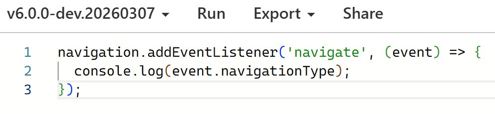

<h1 mt="8">Navigation APIが<br><code>lib.dom.d.ts</code>に<br>採用されるまでの道のり</h1>

<div mt="4" mb="4">
TSKaigi 2026 | <time datetime="2026-05-22">2026-05-22</time>
</div>

[ドキュメントページ版（日本語）](https://records.yamanoku.net/tskaigi-2026/ja/) | [Document Page Version（English）](https://records.yamanoku.net/tskaigi-2026/en/) | [문서 페이지 버전（한국어）](https://records.yamanoku.net/tskaigi-2026/ko/)

<div class="absolute bottom-16">
  <span class="text-6 font-700">
    やまのく（yamanoku）
  </span>
</div>

<!--
本日はNavigation APIがTypeScriptの型定義に採用されるまでの道のりについてをお話しします。Web標準の技術が、どのようにしてTypeScriptの『型』として私たちの手元に届くのかをご紹介します。
-->

---
layout: section
---

# Navigation APIについて

<!--
まずはじめに、皆さんはNavigation APIをご存じでしょうか？
-->

---

## Navigation API

- **History APIの後継**となる新しいWeb API
- History APIは柔軟性に欠け、OS固有の制約から扱いづらい面があった
- その問題点を解消し、より柔軟なクライアントサイドルーティングを実現する
- **2026年1月に全主要ブラウザで利用可能**

<baseline-status style="border: 1px solid" featureId="navigation"></baseline-status>

---

## History APIの課題

- `pushState` / `replaceState` の柔軟性の欠如
- ページ遷移のインターセプトが困難
  - フォーム送信のハンドリングが煩雑
  - 離脱確認の実装が不安定
- フォーカス位置の保存・復元の手法が確立されていない

---


## Navigation APIの特徴１：明確な履歴管理

- `navigation.entries()` で履歴エントリの一覧を取得できる
- 各エントリに一意の `key` と `id` が付与される
- `navigation.currentEntry` で現在のエントリを取得
- SPAにおけるルーティング管理が格段にシンプルに

---

## Navigation APIの特徴２：インターセプト処理

ページ遷移前やフォーム送信時に**明示的に処理を差し込む**ことができる

```typescript
navigation.addEventListener('navigate', (event) => {
  if (!event.canIntercept) return;

  event.intercept({
    handler: async () => {
      // ページ遷移前に処理を差し込める
      await loadPageContent(event.destination.url);
    },
  });
});
```

---

## Navigation APIの特徴３：フォーカス位置の復元が容易に

```typescript
// 遷移前にフォーカス位置を保存
navigation.updateCurrentEntry({
  state: { focusedId: document.activeElement?.id },
});

// 復元処理
navigation.addEventListener('currententrychange', () => {
  const state = navigation.currentEntry.getState();
  if (state?.focusedId) {
    document.getElementById(state.focusedId)?.focus();
  }
});
```

---
layout: section
---

# TypeScript環境での問題

<!--
非常に便利になったNavigation API、これをTypeScript環境で使おうとしたときにある問題が発生しました。
-->

---

## 型定義がない！

Navigation API を TypeScript 5.9で使おうとすると...

```typescript
// TypeScript 5.9 までは型エラー
window.navigation.navigate('/new-page');
//     ^^^^^^^^^^
// Property 'navigation' does not exist on type 'Window & typeof globalThis'.
// Did you mean 'navigator'?
```
Navigation API の型定義が存在しなかった。

---
layout: section
---

# DOM APIの型定義がない場合

---
comark: true
---

## 対策１：DefinitelyTypedを利用する

`@types/` パッケージとして型定義が提供されている場合


::code-group

```sh [npm]
npm i -D @types/dom-navigation
```

```sh [yarn]
yarn add -D @types/dom-navigation
```

```sh [pnpm]
pnpm add -D @types/dom-navigation
```

```sh [bun]
bun add -d @types/dom-navigation
```

::

<!--
まずはディフィニトリータイプを利用することです
-->

---

## 対策２：自前で型拡張

```typescript
interface Navigation extends EventTarget {
  navigate(url: string, options?: NavigationNavigateOptions): NavigationResult;
  entries(): NavigationHistoryEntry[];
  readonly currentEntry: NavigationHistoryEntry | null;
  back(options?: NavigationOptions): NavigationResult;
  forward(options?: NavigationOptions): NavigationResult;
}

interface Window {
  readonly navigation: Navigation;
}
```

仕様書を確認し、必要な箇所だけを拡張して使う方法

---

## 対策３：`@ts-ignore`で無視する

```typescript
// @ts-ignore
window.navigation.navigate('/new-page');

// または
(window as any).navigation.navigate('/new-page');
```

型安全性が失われるため、一時的な対処法として活用する

---
layout: section
---

# そもそもDOM APIの型定義は<br>どうやって作られているのか

---

## DOM APIの型定義の生成

`lib.dom.d.ts` は手書きではなく、**自動生成**されている

```
Web仕様 (Web IDL + MDN互換性データ)
  ↓
TypeScript-DOM-lib-generator
  ↓
lib.dom.d.ts
```

---

## TypeScript-DOM-lib-generator

[microsoft/TypeScript-DOM-lib-generator](https://github.com/microsoft/TypeScript-DOM-lib-generator)

- Web IDL と MDN互換性データを入力として型を生成するツール
- TypeScript リポジトリで定期的に実行される
- 生成された型が `lib.dom.d.ts` として配布される

---

## 型定義の採用基準：2つ以上のブラウザエンジン

| ブラウザ | エンジン |
|--------|--------|
| Chrome | Blink (Chromium) |
| Edge | Blink (Chromium) |
| Firefox | Gecko |
| Safari | WebKit |

Chrome と Edge は**同じ Chromium エンジン** → カウント1

ここからFirefoxかSafariのどちらかで実装されて初めて条件がクリアされる

---

## Web IDLを型生成の入力データソースとして扱う

```md
// Web IDL の例（Navigation API より抜粋）
[Exposed=Window]
interface Navigation : EventTarget {
  sequence<NavigationHistoryEntry> entries();
  readonly attribute NavigationHistoryEntry? currentEntry;
  undefined updateCurrentEntry(NavigationUpdateCurrentEntryOptions options);
  readonly attribute NavigationTransition? transition;
  readonly attribute NavigationActivation? activation;
  ...
};
```

https://html.spec.whatwg.org/multipage/nav-history-apis.html#navigation-interface


---

## @webref データソース

`@webref` — Webブラウザ仕様から抽出した機械可読なパッケージ群

| パッケージ | 用途 |
|--------|-----|
| `@webref/idl` | WebIDL仕様の取得 |
| `@webref/css` | CSS仕様の取得 |
| `@webref/events` | イベント仕様の取得 |
| `@webref/elements` | HTML要素の取得 |

---

## npmへの公開

| パッケージ | 説明 | コンテキスト |
|-----------|-----|-----|
| `@types/web` | DOMおよびWeb技術の型 | Window/メインスレッド |
| `@types/serviceworker` | Service Workerのグローバルスコープの型 | Service Worker |
| `@types/audioworklet` | Audio Workletのグローバルスコープの型 | Audio Worklet |
| `@types/sharedworker` | Shared Workerのグローバルスコープの型 | Shared Worker |
| `@types/webworker` | Web Workerのグローバルスコープの型 | Web Worker |

---
comark: true
---

## `@types/web`を使用

TypeScript 4.5 以降の **lib replacement 機能**を活用

::code-group

```sh [npm]
npm i -D @typescript/lib-dom@npm:@types/web
```

```sh [yarn]
yarn add -D @typescript/lib-dom@npm:@types/web
```

```sh [pnpm]
pnpm add -D @typescript/lib-dom@npm:@types/web
```

```sh [bun]
bun add -d @typescript/lib-dom@npm:@types/web
```

::

<div class="mt-5">

```json
{
  "devDependencies": {
    "@typescript/lib-dom": "npm:@types/web@0.0.349"
  }
}
```

</div>

---
layout: section
---

# Navigation APIの<br>タイムライン

---

## 2022年〜2023年

- **2022年5月** — Chrome / Edgeで実装完了
- **2023年10月** — Interop 2023 への申請も採用ならず
- **2023年3月** — TypeScript側のリポジトリにサポート要望の[Issue](https://github.com/microsoft/TypeScript-DOM-lib-generator/issues/1531)が登場
- **2023年9月** — Interop 2024 への申請も採用ならず

Interop ... クロスブラウザにてWeb APIが等しく動作するための相互運用性向上プロジェクト

---

## 2025年〜2026年

- **2025年2月** — Interop 2025のフォーカス対象として採用
- **2025年12月** — Safari で Navigation API が実装
- **2026年1月** — Firefox で Navigation API が実装
- **2026年2月** — Interop 2026のフォーカス対象として採用
  - Interop 2025で実装が完了しなかった部分の対応

---

## 2026年3月：TypeScript 6.0

TypeScript標準で **Navigation API の型定義**が使用可能に



---

## 2028年：Baseline Widely Availableへ

- Baseline は Web 機能の相互運用性を示す指標
  - **Newly Available**は最新安定版ブラウザで利用可能
  - **Widely Available**はクロスブラウザで広く普及している状態
- **2028年7月** — Baseline Widely Available になる見込み

---

## Navigation APIを活用していきたい

Widely Available になるまで待てない！<br>画面遷移にまつわるより具体的なユースケースや活用方法を考えたい！

- [FUNSTACK Router](https://github.com/uhyo/funstack-router): uhyoさん作
- 一部ルーターライブラリの実験的機能・実装中
  - [Angular](https://angular.jp/api/router/withExperimentalPlatformNavigation)
  - [Vue Router](https://github.com/vuejs/router/pull/2551)
- View Transitions APIと組み合わせたページ遷移表現の探求 など

---

## まとめ

- `lib.dom.d.ts`は**TypeScript-DOM-lib-generator**によって生成
- DOM APIでの型定義の採用基準は「**2つ以上のブラウザエンジン**でのサポート」
- Navigation API は **TypeScript 6.0**（2026年3月）より標準の型定義となった
- 使いたいAPIの状況は**Browser-Compat-Data**で確認できる
  - より詳細な進捗はInteropやWeb Platform Testsで状況を調べてみよう
