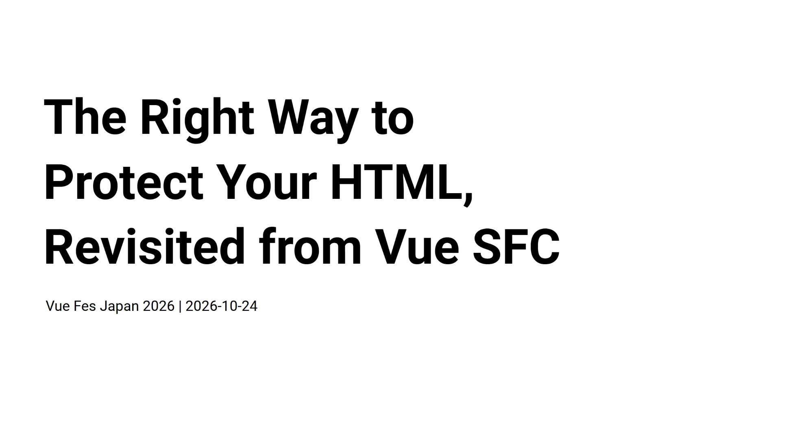

[English page](../en/) / [日本語ページ](../ja/)

## Slides

[Slide version](https://records.yamanoku.net/vuefes-japan-2026/slide/)

## Presentation Summary

I think it's common knowledge that Vue SFC come with syntax that lets you write HTML in the template block. But can you actually explain how you verify "HTML correctness" when developing with Vue.js?

Within the template of a Vue SFC, nesting violations between HTML elements will trigger a warning during development, but they won't clearly result in a compile error. Lexical and syntactic HTML rules are detected, but the compiler doesn't concern itself with the correct usage of specific HTML elements.

In this session, I'll unpack, from first principles, how the compiler interprets the HTML content written in a Vue SFC's template block, and introduce how the aspects of HTML correctness that a DOM compiler alone can't guarantee are currently being protected by the static analysis ecosystem of linters (ESLint, Markuplint, Biome, OxC, Vize, and others).

The HTML spec continues to be updated even now, as a Living Standard. By engaging correctly with HTML in that spirit, this talk aims to give you insights for achieving robust markup and accessible output through HTML in Vue.js.
