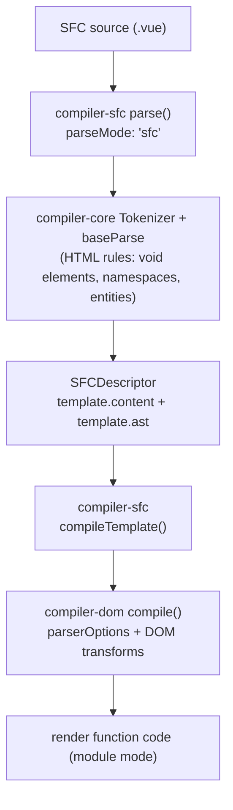

[English page](../en/) / [日本語ページ](../ja/)

## Slides

[Slide version](https://records.yamanoku.net/vuefes-japan-2026/slide/)

## Presentation Summary

I think it's common knowledge that Vue SFC come with syntax that lets you write HTML in the template block. But can you actually explain how you verify "HTML correctness" when developing with Vue?

Within the template of a Vue SFC, nesting violations between HTML elements will trigger a warning during development, but they won't clearly result in a compile error. Lexical and syntactic HTML rules are detected, but the compiler doesn't concern itself with the correct usage of specific HTML elements.

In this session, I'll unpack, from first principles, how the compiler interprets the HTML content written in a Vue SFC's template block, and introduce how the aspects of HTML correctness that a DOM compiler alone can't guarantee are currently being protected by the static analysis ecosystem of linters (ESLint, Markuplint, Biome, OxC, Vize, and others).

The HTML spec continues to be updated even now, as a Living Standard. By engaging correctly with HTML in that spirit, this talk aims to give you insights for achieving robust markup and accessible output through HTML in Vue.

## Intended audience

- Intermediate and above Vue developers
- People who want to understand the Vue compiler and SFC internals
- People interested in the HTML linter ecosystem
- People who want to use HTML more correctly

## Outline (~10 minutes each)

1. HTML history and the current specification (thicker content; many attendees may be less familiar with the spec)
2. How HTML is used in Vue
3. Tools for verifying HTML correctness in Vue

Time is split evenly, but Part 1 uses more slides and a slower pace. Parts 2 and 3 stay focused so they still fit in about 10 minutes each.

---

## How do you verify HTML "correctness" in Vue development?

This talk answers that question in three parts.

## 1. HTML history and the current specification

Where do you usually encounter HTML? Websites, admin UIs, component libraries, SSR diffing — HTML shows up all over frontend development.

HTML is about 37 years old. It began in the early 1990s as markup for documents, then became a foundation for application UI and DOM comparison. It is not a legacy technology; it continues to evolve.

### From document language to application foundation

Early HTML described document structure such as headings, paragraphs, and links. Later it gained forms and richer interaction. Today, SPA / SSR / design-system output is still often HTML. Even when you write Vue templates, the browser receives HTML — so understanding the spec is shared ground before the framework.

### How the specification evolved

| Period | Event |
| --- | --- |
| 1997 | HTML 4 |
| Around 2000 | XHTML 1.0 (a turn toward XML) |
| 2004 | WHATWG founded (compatibility-first evolution) |
| 2014 | W3C HTML5 Recommendation |
| 2019– | Agreement to treat the WHATWG Living Standard as the single source of truth |

XHTML leaned toward "be strict and fail," while HTML leaned toward "recover and keep displaying." What we mostly use in practice is the HTML syntax, which means incorrect markup can still look like it works.

### HTML today is a Living Standard

The authoritative text is the [HTML Standard (WHATWG)](https://html.spec.whatwg.org/). Continuously updated prose matters more than a frozen version name. Since 2019, W3C has also coordinated around this Living Standard. Efforts such as OpenUI / Interop / HTML Day keep implementations and community work moving.

Because the Standard is alive, element and attribute handling can change with implementation reality. Old habits may now be deprecated or non-conforming, and [non-conforming features](https://html.spec.whatwg.org/#non-conforming-features) are listed explicitly. That is why machine checks matter more than memory alone.

### "HTML that works" is not the same as "correct HTML"

If you put a `div` inside a `p`, the parser may repair the tree into something you did not intend. HTML syntax keeps parsing through errors, so the page can render while structure, CSS, and accessibility still suffer.

There is no single correct markup, but quality differences and clear errors do exist. Conditions for "good HTML" include being semantic, accessible, free of errors, and maintainable. Eliminating errors is the starting point.

Errors fall into three kinds of rules:

### Lexical rules

Closing tags, attribute syntax, and so on. Violations cause parser errors and prevent a correct DOM tree. In the HTML syntax they may be corrected so the page still appears to "work."

### Vocabulary rules

Allowed elements and attributes, plus the **content model** for nesting. The parser often does not stop; it builds an undesirable DOM instead.

| Parent | Invalid examples | Why it matters |
| --- | --- | --- |
| `p` | `div`, `p`, `ul` | Blocks cannot nest inside a paragraph |
| `label` | `div`, `p` | Outside the label content model |
| `a` | `a` | Nested links are invalid |
| `ul` / `ol` | a direct `div` | Children should generally be `li` |

### Semantic rules

Meaning and intended use of elements, including accessibility. Markup can be grammatically valid yet convey the wrong meaning. Tools cannot fully detect this; review and experience are required.

### Part 1 takeaway

HTML remains a Living Standard. "Works" is not the same as "correct." Split correctness into lexical / vocabulary / semantic layers, then revisit Vue templates on that foundation.

## 2. How HTML is used in Vue

Frameworks treat HTML differently:

| Approach | Examples | Treatment |
| --- | --- | --- |
| HTML as a DSL | Vue / Svelte / Ripple | Declarative UI via templates |
| HTML-like JSX | React / SolidJS / Preact | Expressions in JS (closer to XHTML?) |
| HTML-first | Alpine.js / htmx | Behavior layered onto HTML |

Other frameworks appear here for context; the rest of the talk focuses on Vue. A Vue template is an "HTML-like DSL." It looks like HTML, but it is ultimately transformed into virtual DOM factory functions.

### Compile pipeline

Compilation roughly has three stages:

1. **Parse** — HTML string → AST
2. **Transform** — transform the AST
3. **Generate** — AST → JS code string

<figure>


```mermaid
flowchart TD
  A["SFC source (.vue)"] --> B["compiler-sfc parse()<br/>parseMode: 'sfc'"]
  B --> C["compiler-core Tokenizer + baseParse<br/>(HTML rules: void elements, namespaces, entities)"]
  C --> D["SFCDescriptor<br/>template.content + template.ast"]
  D --> E["compiler-sfc<br/>compileTemplate()"]
  E --> F["compiler-dom compile()<br/>parserOptions + DOM transforms"]
  F --> G["render function code (module mode)"]
```

<figcaption>Flow from SFC source through parse / compileTemplate / compiler-dom to render function code</figcaption>
</figure>

`compiler-sfc` splits a file into an `SFCDescriptor` via `parse()`, then `compileScript` and `compileTemplate` handle `<script>` and `<template>`.

### Templates become hyperscript

Even invalid nesting like the following can compile into valid function calls:

```html
<template>
  <p>
    <div>block</div>
  </p>
</template>
```

Virtual DOM creation builds elements programmatically, so browser HTML parser re-parenting does not happen the same way.

### Nesting violations stop at warnings

Since Vue 3.4, `compiler-dom`'s `validateHtmlNesting` warns about invalid nesting in development:

> `<h1>` cannot be child of `<p>`, according to HTML specifications. This can cause hydration errors or potentially disrupt future functionality.

<figure>


<figcaption>Example development nesting warning. Helpful DX, but ignoring it still lets the code run</figcaption>
</figure>

This is a development **warning** via `onWarn`, not a hard compile error.

What the Vue compiler covers:

| Rule | Vue compiler |
| --- | --- |
| Lexical | partial–yes (within parse coverage) |
| Vocabulary (content model) | some cases as dev-time warnings |
| Semantic | no |

In short, Vue itself does not finally guarantee HTML semantics.

### Gaps a compiler alone cannot cover

| Layer | Examples | Limits |
| --- | --- | --- |
| Runtime | Hydration mismatch warnings | Not a correctness guarantee |
| Types | TypeScript (`HTMLElement`, etc.) | DOM API types, not conformance |
| `<head>` and similar | Markup outside the template | Hard to cover with the Vue compiler alone |
| Artifacts | Static analysis of output HTML | Only after build |

### Supplement: Vapor Mode / Pug

- **Vapor Mode** — Invalid nesting has historically "worked" under VDOM, but Vapor leans on `innerHTML`-based template instantiation, so browser HTML parser repairs apply directly. Invalid nesting can then cause compiled code / real DOM mismatches or runtime crashes (e.g. [vuejs/core#15256](https://github.com/vuejs/core/issues/15256)).
- **Pug** (`<template lang="pug">`) — `eslint-plugin-vue` alone may not apply; community plugins such as `eslint-plugin-vue-pug` may be needed.

In both cases the conclusion is the same: changing the compile target or DSL still requires an explicit design for who guarantees correctness.

## 3. Tools for verifying HTML correctness in Vue

Because Vue templates become hyperscript, invalid nesting can still pass as functions. Compiler and runtime Vue do not control or verify HTML semantics. Static analysis must fill that gap before the browser silently repairs the DOM.

### Tools around Vue

- [eslint-plugin-vue](https://eslint.vuejs.org/) — mainly lexical / syntactic coverage
- [Markuplint](https://markuplint.dev/) — **the deepest inheritance of HTML markup rules among the linters covered here**
- [Vize](https://vizejs.dev/) — Vue-oriented; HTML rules separated from accessibility
- [Biome](https://biomejs.dev/) / [OxLint (OxC)](https://oxc.rs/) — HTML support still maturing (supplementary)

Accessibility linting has a different starting point. Here we focus on HTML conformance. Markuplint is not grouped with Biome / OxC; it is covered individually, like eslint-plugin-vue and Vize.

### eslint-plugin-vue

`vue/no-parsing-error` reports syntax errors in templates, including many WHATWG HTML lexical syntax errors, and is included in essential presets. It does not fully cover vocabulary rules or semantics.

### Markuplint — a linter that inherits the HTML specification

Among the linters in this talk, Markuplint is specialized for **HTML Living Standard conformance** and inherits markup rules most thoroughly. With `@markuplint/vue-parser` and `@markuplint/vue-spec`, it can handle `.vue` files.

Representative rules:

- [`permitted-contents`](https://markuplint.dev/docs/rules/permitted-contents) — content models (vocabulary)
- [`no-obsolete-element`](https://markuplint.dev/docs/rules/no-obsolete-element) — obsolete elements
- [`require-accessible-name`](https://markuplint.dev/docs/rules/require-accessible-name) — accessible names (more semantic)

Its strength is validating vocabulary rules — especially content models — from specification data.

### Biome / OxC — a supplementary, still-maturing tier

| Tool | HTML-related status |
| --- | --- |
| Biome | Growing HTML rules (duplicate attributes, some content-model checks, accessibility, and more) |
| OxLint | HTML linting is out of scope; Vue template linting is not available yet |

They are promising for speed and unified toolchains, but they do not match Markuplint's depth on HTML markup rules. The main line here is eslint-plugin-vue / Markuplint / Vize.

### Vize HTML Rules

[Vize](https://vizejs.dev/rules/html/index.html) separates HTML conformance from Vue-specific and accessibility rules. `html/cross-component-nesting` is especially important.

```html
<!-- App.vue -->
<template>
  <p>Summary <InfoCard /></p>
</template>

<!-- InfoCard.vue -->
<template>
  <div class="card"><slot /></div>
</template>
```

Each file is valid alone, but composition becomes `<p><div>…</div></p>`. Cross-file checks such as `vize lint --cross-file` catch gaps a compiler alone cannot.

### What tools see and miss

| Concern | Compiler | ESLint-vue | Markuplint | Biome/OxC | Vize |
| --- | --- | --- | --- | --- | --- |
| Lexical | partial–yes | yes | yes | partial | yes |
| Vocabulary / nesting (single file) | warning | limited | yes | partial | yes |
| Vocabulary / nesting (cross-file) | no | no | some via Pretenders etc. | mostly no | yes |
| Deprecated / obsolete elements | no | mostly no | yes | partial | yes |
| Semantics / accessibility | no | other plugins | mostly yes | partial–yes | separate rules |

The point is not to trust one tool for everything, but to combine tools with clear responsibility boundaries. Markuplint stands out for HTML-spec depth. Include `<head>`, TypeScript types, and post-build analysis when designing who checks what.

## Closing

1. **Specification** — Living Standard plus lexical / vocabulary / semantic rules (thicker within the equal ~10-minute parts)
2. **Usage in Vue** — templates are an HTML-like DSL; the compiler is not a final guarantee
3. **Verification tools** — fill the gaps mainly with eslint-plugin-vue / Markuplint / Vize (Biome and OxC as supplements)

In practice:

1. **Understand the compiler's coverage** (warning ≠ guarantee)
2. **Fill "Vue gaps" with linters** (syntax: eslint-plugin-vue / HTML conformance: Markuplint / cross-file: Vize)
3. **Also check correctness across component boundaries**
4. Follow HTML as a Living Standard
5. Move from robust markup to accessible output

Engage correctly with HTML, and build robust markup with Vue.

## References

- [Session page](https://vuefes.jp/2026/en/speaker/yamanoku)
- [HTML Standard](https://html.spec.whatwg.org/)
- [Vue: validateHtmlNesting](https://github.com/vuejs/core/blob/main/packages/compiler-dom/src/transforms/validateHtmlNesting.ts)
- [eslint-plugin-vue: no-parsing-error](https://eslint.vuejs.org/rules/no-parsing-error.html)
- [Markuplint](https://markuplint.dev/) / [permitted-contents](https://markuplint.dev/docs/rules/permitted-contents)
- [Vize HTML Rules](https://vizejs.dev/rules/html/index.html)
- [WHATWG: Non-conforming features](https://html.spec.whatwg.org/#non-conforming-features)
- [Bengo4.com new-grad HTML/CSS training 2025 (Yoshinori Ohta)](https://speakerdeck.com/bengo4com/20250405-bengo4com-htmlcss)
- [We held an HTML/CSS training for new graduate engineers (Creators’ blog)](https://creators.bengo4.com/entry/2025/08/01/080000)
