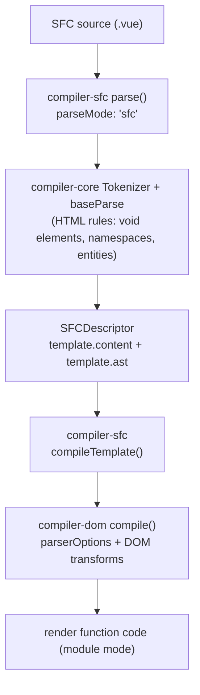

[日本語ページ](../ja/) / [English page](../en/)

## Slides

[Slide deck](https://records.yamanoku.net/vuefes-japan-2026/slide/)

---

## Introduction

I'm yamanoku. I'm a company employee and a parent of one child. I like web accessibility and HTML. At Vue Fes Japan 2025 about [Improving Web Application Accessibility in the Generative AI Era](https://records.yamanoku.net/vuefes-japan-2025/en/).

This time, as a continuation of that series, I focus on HTML itself inside Vue SFCs.

When you develop with Vue, can you clearly explain how you verify HTML "correctness"?

Vue SFCs let you write HTML in `<template>`. That is well known. Nesting violations, though, usually stop at development-time warnings and do not become hard compile errors. Lexical and syntactic rules are checked to some extent, but concrete HTML element usage is largely out of scope.

Today I will unpack how the compiler interprets templates, and how static analysis — ESLint, Markuplint, Biome, OxC, Vize, and similar tools — can protect HTML correctness that the compiler alone cannot.

Let's get into the main topic.

## HTML history and the current specification

Where do you usually encounter HTML? Sites, admin screens, component libraries, SSR diff comparison — it shows up all over frontend work.

HTML is about 37 years old. It spread in the early 1990s as markup for documents, then became a target for app UI and DOM diffing. It is not a legacy leftover; it is a foundation that is still being updated.

Early on it described document structure — headings, paragraphs, links. Later came forms and interaction. Today, even with SPA / SSR / design systems, the final output is often HTML. Even when you write Vue templates, the browser receives HTML. Understanding the specification is shared ground that comes before any framework.

Here is a rough timeline of how the specification evolved:

| Period | Event |
| --- | --- |
| 1997 | HTML 4 |
| around 2000 | XHTML 1.0 (a branch toward XML) |
| 2004 | WHATWG founded (evolution that prioritizes compatibility) |
| 2014 | W3C HTML5 Recommendation |
| 2019– | Agreement to treat the WHATWG Living Standard as the single source of truth |

XHTML leaned toward "write strictly and stop," HTML toward "repair and keep rendering." In practice we mainly use the latter HTML syntax. As a result, pages can look fine even when markup is wrong. That is good for end users, but it makes it easy for developers to mistake "it works" for "it is correct."

The current source of truth is the [HTML Standard (WHATWG)](https://html.spec.whatwg.org/). Ongoing specification text matters more than frozen version names. Since 2019, W3C has also coordinated around this Living Standard. OpenUI, Interop, HTML Day, and similar efforts keep moving as well.

Under a Living Standard, element and attribute treatment can change with implementation reality. Old habits can become deprecated or non-conforming, and [Non-conforming features](https://html.spec.whatwg.org/#non-conforming-features) are spelled out. That is why machine checking beats relying on memory alone.

The key point: "HTML that works" is not the same as "correct HTML."

If you put a `div` inside a `p`, the parser may repair the tree into something different from what you intended. HTML syntax keeps parsing through errors, so the page can still appear while structure, styles, and accessibility take side effects.

There is no single correct markup. Still, there is quality, and there are clear mistakes. Good HTML tends to be semantic, accessible, free of errors, and maintainable. Removing errors is the starting point. The same point was emphasized in Bengo4.com's [new-graduate HTML/CSS training](https://speakerdeck.com/bengo4com/20250405-bengo4com-htmlcss).

Errors can be grouped into three kinds of rules.

### Lexical rules

Closing tags, attribute syntax, and similar concerns. Violations make parsers fail to build a proper DOM tree. In HTML syntax, though, repair can make things look as if they "still work."

### Vocabulary rules

Whether element and attribute names exist, and nesting rules from the **content model**. Violations often do not stop the parser; they produce an undesirable DOM.

| Parent | Invalid examples | Why it is a problem |
| --- | --- | --- |
| `p` | `div`, `p`, `ul` | Blocks cannot go inside a paragraph |
| `label` | `div`, `p` | Outside the label content model |
| `a` | `a` | Nested links are invalid |
| `ul` / `ol` | direct `div` | Children should basically be `li` |

### Semantic rules

Meaning and usage of elements, and accessibility. Markup can be grammatically valid yet communicate the wrong meaning — using `h1` only for looks, building buttons with `a`, missing `alt` on meaningful images, and so on. Tools cannot catch everything here; review and experience still matter.

Part 1 takeaway: HTML is still updated as a Living Standard. "Works" and "correct" are not the same. Split correctness into lexical / vocabulary / semantic layers, then revisit Vue templates on that foundation.

## How HTML is used in Vue

Next, how Vue treats this HTML, and how far it guarantees it.

Frameworks treat HTML differently:

| Approach | Examples | Treatment |
| --- | --- | --- |
| HTML as a DSL | Vue / Svelte / Ripple | Declarative UI via templates |
| HTML-like JSX | React / SolidJS / Preact | Expressions in JS (XML-leaning conventions such as required closing tags) |
| HTML-first | Alpine.js / htmx | Behavior layered onto HTML |

Other frameworks appear here for context; the rest focuses on Vue. Vue's main path is the template DSL — an "HTML-like DSL." It looks like HTML, but it is ultimately transformed into virtual DOM factory functions. There is also a JSX path ([Vue JSX](https://vuejsx.dev/)), covered later as a supplement.

Compilation roughly has three stages:

1. **Parse** — HTML string → AST
2. **Transform** — transform the AST
3. **Generate** — AST → JS code string

<figure>


```mermaid
flowchart TD
  A["SFC source (.vue)"] --> B["compiler-sfc parse()<br/>parseMode: 'sfc'"]
  B --> C["compiler-core Tokenizer + baseParse<br/>(HTML rules: void elements, namespaces, entities)"]
  C --> D["SFCDescriptor<br/>template.content + template.ast"]
  D --> E["compiler-sfc<br/>compileTemplate()"]
  E --> F["compiler-dom compile()<br/>parserOptions + DOM transforms"]
  F --> G["render function code (module mode)"]
```

<figcaption>Flow from SFC source through parse / compileTemplate / compiler-dom to render function code</figcaption>
</figure>

`compiler-sfc` splits a file into an `SFCDescriptor` via `parse()`, then `compileScript` and `compileTemplate` handle `<script>` and `<template>`.

How the compiler interprets HTML:

- **Parse**: build an AST with HTML-leaning lexical rules (void elements, namespaces, character references)
- **Transform**: apply Vue directives and optimizations to the AST
- **Generate**: the final artifact is JavaScript that builds a virtual DOM, not an HTML string for the browser

So even though a template looks like HTML, the output is a program that assembles the DOM. Vue parses HTML, but it does not guarantee the same final DOM as the browser HTML parser. That is the fork this talk is about.

Even invalid nesting like the following can compile into valid function calls:

```html
<template>
  <p>
    <div>block</div>
  </p>
</template>
```

Virtual DOM creation builds elements programmatically, so browser HTML parser re-parenting does not happen the same way.

Vue is not doing nothing, though. Since Vue 3.4, `compiler-dom`'s `validateHtmlNesting` warns about invalid nesting in development:

> `<h1>` cannot be child of `<p>`, according to HTML specifications. This can cause hydration errors or potentially disrupt future functionality.

<figure>


<figcaption>Example development nesting warning. Helpful DX, but ignoring it still lets the code run</figcaption>
</figure>

This is a development **warning** via `onWarn`, not a hard compile error. Helpful DX — but if you ignore it, the code still runs.

What the Vue compiler covers:

| Rule | Vue compiler |
| --- | --- |
| Lexical | partial–yes (within parse coverage) |
| Vocabulary (content model) | some cases as dev-time warnings |
| Semantic | no |

In short, Vue itself does not finally guarantee HTML semantics. There are also gaps a compiler alone cannot cover:

| Layer | Examples | Limits |
| --- | --- | --- |
| Runtime | Hydration mismatch warnings | Not a correctness guarantee |
| Types | TypeScript (`HTMLElement`, etc.) | DOM API types, not conformance |
| `<head>` and similar | Markup outside the template | Hard to cover with the Vue compiler alone |
| Artifacts | Static analysis of output HTML | Only after build |

As a supplement: changing the compile shape does not change the conclusion.

### Vapor Mode

Invalid nesting has historically "worked" under VDOM, but Vapor leans on `innerHTML`-based template instantiation, so browser HTML parser repairs apply directly. Invalid nesting can then cause compiled code / real DOM mismatches or runtime crashes (e.g. [vuejs/core#15256](https://github.com/vuejs/core/issues/15256)).

### Pug

`eslint-plugin-vue` alone may not apply; community plugins such as `eslint-plugin-vue-pug` may be needed.

### Vue JSX

Vue can also author UI in JSX. It targets Virtual DOM and Vapor Mode with an Oxc-based high-performance compiler. Even when it looks like HTML, the essence is **JS expression → render function**, so the verification path differs from SFC `<template>`. `validateHtmlNesting` and `eslint-plugin-vue` mainly cover `<template>`, so JSX usage still needs an explicit design for who checks HTML correctness. One nesting-check option is [`eslint-plugin-validate-jsx-nesting`](https://github.com/MananTank/eslint-plugin-validate-jsx-nesting).

## Tools for verifying HTML correctness in Vue

As we have seen, Vue templates become hyperscript, so invalid nesting can still pass as functions. Compiler and runtime Vue do not control or verify HTML semantics. Static analysis must fill that gap before the browser silently repairs the DOM.

The tools I cover today:

- [eslint-plugin-vue](https://eslint.vuejs.org/) — mainly lexical / syntactic coverage
- [Markuplint](https://markuplint.dev/) — the deepest inheritance of HTML markup rules among the linters covered here
- [Vize](https://vizejs.dev/) — Vue-oriented; HTML rules separated from accessibility
- [Biome](https://biomejs.dev/) / [OxLint (OxC)](https://oxc.rs/) — HTML support still maturing (supplementary)

Accessibility linting has a different starting point. Here we focus on HTML conformance. Markuplint is not grouped with Biome / OxC; it is covered individually, like eslint-plugin-vue and Vize.

First, [eslint-plugin-vue](https://eslint.vuejs.org/). `vue/no-parsing-error` reports syntax errors in templates, including many WHATWG HTML lexical syntax errors, and is included in essential presets. It does not fully cover vocabulary rules or semantics.

Next, Markuplint. Among the linters in this talk, Markuplint is specialized for **HTML Living Standard conformance** and inherits markup rules most thoroughly. With `@markuplint/vue-parser` and `@markuplint/vue-spec`, it can handle `.vue` files.

Representative rules:

- [`permitted-contents`](https://markuplint.dev/docs/rules/permitted-contents) — content models (vocabulary)
- [`no-obsolete-element`](https://markuplint.dev/docs/rules/no-obsolete-element) — obsolete elements
- [`require-accessible-name`](https://markuplint.dev/docs/rules/require-accessible-name) — accessible names (more semantic)

Its strength is validating vocabulary rules — especially content models — from specification data.

[Pretenders](https://markuplint.dev/docs/guides/besides-html) let Markuplint treat Vue components as the native HTML elements they render — for example mapping `List` → `ul` and `Item` → `li` — so vocabulary rules across component boundaries can be checked from specification data. Manual maps and Vue-oriented scanning are both possible.

Biome / OxC are a supplementary, still-maturing tier:

| Tool | HTML-related status |
| --- | --- |
| Biome | Lexical: [`noDuplicateAttributes`](https://biomejs.dev/linter/rules/no-duplicate-attributes/). Vocabulary-leaning: [`noObsoleteTags`](https://biomejs.dev/linter/rules/no-obsolete-tags/), [`noMisplacedListElements`](https://biomejs.dev/linter/rules/no-misplaced-list-elements/) (nursery). Semantics-leaning: [`useSemanticElements`](https://biomejs.dev/linter/rules/use-semantic-elements/) and more. `.vue` support is experimental |
| OxLint | [HTML linting is out of scope](https://oxc.rs/compatibility). Vue coverage is mainly script-side; template linting is not available yet |

They are promising for speed and unified toolchains, but they do not match Markuplint's depth on HTML markup rules. The main line here is eslint-plugin-vue / Markuplint / Vize.

Then Vize. [Vize](https://vizejs.dev/rules/html/index.html) separates HTML conformance from Vue-specific and accessibility rules. `html/cross-component-nesting` is especially important.

```html
<!-- App.vue -->
<template>
  <p>Summary <InfoCard /></p>
</template>

<!-- InfoCard.vue -->
<template>
  <div class="card"><slot /></div>
</template>
```

Each file is valid alone, but composition becomes `<p><div>…</div></p>`. Cross-file checks such as `vize lint --cross-file` catch gaps a compiler alone cannot.

What tools see and miss:

| Concern | Compiler | ESLint-vue | Markuplint | Biome/OxC | Vize |
| --- | --- | --- | --- | --- | --- |
| Lexical | partial–yes | yes | yes | partial | yes |
| Vocabulary / nesting (single file) | warning | limited | yes | partial | yes |
| Vocabulary / nesting (cross-file) | no | no | some via Pretenders etc. | mostly no | yes |
| Deprecated / obsolete elements | no | mostly no | yes | partial | yes |
| Semantics / accessibility | no | other plugins | mostly yes | partial–yes | separate rules |

The point is not to trust one tool for everything, but to combine tools with clear responsibility boundaries. Markuplint stands out for HTML-spec depth. Include `<head>`, TypeScript types, and post-build analysis when designing who checks what.

## Closing

A quick recap of the three parts:

1. **Specification** — Living Standard plus lexical / vocabulary / semantic rules
2. **Usage in Vue** — templates are an HTML-like DSL; the compiler is not a final guarantee
3. **Verification tools** — fill the gaps mainly with eslint-plugin-vue / Markuplint / Vize (Biome and OxC as supplements)

In practice, I recommend these next steps:

1. **Understand the compiler's coverage** (warning ≠ guarantee)
2. **Fill "Vue gaps" with linters** (syntax: eslint-plugin-vue / HTML conformance: Markuplint / cross-file: Vize)
3. **Also check correctness across component boundaries**
4. Follow HTML as a Living Standard
5. Move from robust markup to accessible output

A practical combo is eslint-plugin-vue for syntax, Markuplint for specification-based conformance, and Vize for cross-file reinforcement. Biome / OxC are a supplementary tier to watch.

HTML is still being updated. Understand Vue's compilation model, put up the seawall of static analysis, and let's build robust markup and accessible output together.

## References

- [HTML Standard](https://html.spec.whatwg.org/)
- [WHATWG: Non-conforming features](https://html.spec.whatwg.org/#non-conforming-features)
- [Vue: validateHtmlNesting](https://github.com/vuejs/core/blob/main/packages/compiler-dom/src/transforms/validateHtmlNesting.ts)
- [eslint-plugin-vue: no-parsing-error](https://eslint.vuejs.org/rules/no-parsing-error.html)
- [Markuplint](https://markuplint.dev/)
- [Vize HTML Rules](https://vizejs.dev/rules/html/index.html)
- [Biome: noDuplicateAttributes](https://biomejs.dev/linter/rules/no-duplicate-attributes/) / [noObsoleteTags](https://biomejs.dev/linter/rules/no-obsolete-tags/) / [noMisplacedListElements](https://biomejs.dev/linter/rules/no-misplaced-list-elements/) / [useSemanticElements](https://biomejs.dev/linter/rules/use-semantic-elements/)
- [OxC Compatibility](https://oxc.rs/compatibility)
- [Vue JSX](https://vuejsx.dev/)
- [eslint-plugin-validate-jsx-nesting](https://github.com/MananTank/eslint-plugin-validate-jsx-nesting)
- [弁護士ドットコム 新卒研修2025 HTML/CSS（太田良典）](https://speakerdeck.com/bengo4com/20250405-bengo4com-htmlcss)