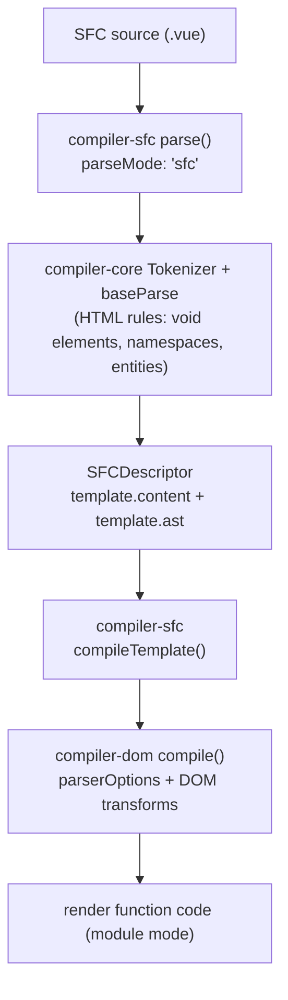

[日本語ページ](../ja/) / [English page](../en/)

## Slides

[Slide deck](https://records.yamanoku.net/vuefes-japan-2026/slide/)

---

## Introduction

I'm yamanoku. I'm a company employee and a parent of one child. I like web accessibility and HTML. At Vue Fes Japan 2025, I gave a talk on [Improving Web Application Accessibility in the Generative AI Era](https://records.yamanoku.net/vuefes-japan-2025/en/).

This time, as a continuation of that series, I focus on HTML itself inside Vue SFCs.

When you develop with Vue, can you clearly explain how you verify HTML "correctness"?

Vue SFCs let you write HTML in `<template>`. That is well known. Nesting violations, though, usually stop at development-time warnings and do not become hard compile errors. Lexical and syntactic rules are checked to some extent, but concrete HTML element usage is largely out of scope.

Today I will unpack how the compiler interprets templates, and how static analysis — ESLint, Markuplint, Biome, OxC, Vize, and similar tools — can protect HTML correctness that the compiler alone cannot.

Let's get into the main topic.

## HTML history and the current specification

Where do you usually encounter HTML? Sites, admin screens, component libraries, SSR diff comparison — it shows up all over frontend work.

HTML turns 35 this year since it was made publicly available. It spread in the early 1990s as markup for documents, then became a target for app UI and DOM diffing. It is not a legacy leftover; it is a foundation that is still being updated.

Early on it described document structure — headings, paragraphs, links. Later came forms and interaction. Today, even with SPA / SSR / design systems, the final output is often HTML. Even when you write Vue templates, the browser receives HTML. Understanding the specification is shared ground that comes before any framework.

Here is a rough timeline of how the specification evolved:

| Period | Event |
| --- | --- |
| 1989 | Writing of the WWW proposal |
| 1991 | The web goes public |
| 1993 | HTML 1.0 Internet Draft |
| 1995 | HTML 2.0 |
| 1997/1 | HTML 3.2 (W3C Recommendation) |
| 1997/12 | HTML 4.0 |
| 1999 | XML Recommendation |
| 2000 | XHTML 1.0 |
| 2004 | WHATWG founded |
| 2014 | HTML 5.0 |
| 2019/5 | Agreement to treat the WHATWG Living Standard as the single source of truth |
| 2021/1 | HTML specification unified under WHATWG |

Behind this timeline is a fork that leads to today's "it works, but the HTML is wrong" problem. Early HTML, as an application of SGML, had a quite permissive grammar. Closing tags could be omitted when context made them clear, and attribute shorthand was allowed. As a result, parsers became full of edge cases, and rendering engines diverged.

XHTML, which appeared around 2000, was an ambitious attempt to replace that permissiveness with strict XML-based rules. Close every tag, quote attribute values, lowercase element and attribute names, write empty elements as `<br />`. In short: "write strictly and stop."

It did not replace the existing web. The biggest issue was underestimating **backward compatibility** — today a core principle of web specifications. There was awareness of mode switching by MIME type, such as `text/html` versus `application/xhtml+xml`, but a strict specification breaks rendering when you get it wrong. Content authors may have supported it, yet browser implementers chose to preserve compatibility, and the plan stalled. HTML then consolidated toward "repair and keep rendering even when broken."

In practice we mainly use this latter HTML syntax. Pages can look fine even when markup is wrong. That is good for end users, but it makes it easy for developers to mistake "it works" for "it is correct."

In HTML5, [parsing rules themselves were redefined as a specification](https://html.spec.whatwg.org/multipage/parsing.html), without relying on SGML. Whether closing tags may be omitted, per-tag algorithms, and fine-grained exceptions are all spelled out. It was a heavy lift: reverse-engineering major engines, taking statistics from real content, and rewriting the specification around "the least-bad behavior." Parsing became more complex, but ambiguity decreased. That is a huge asset HTML5 left behind.

The current source of truth is the [HTML Standard (WHATWG)](https://html.spec.whatwg.org/). Ongoing specification text matters more than frozen version names. Since 2019, W3C has also coordinated around this Living Standard. OpenUI, Interop, and similar efforts keep moving as well. You could say that Living Standard is how we practice what XHTML taught us: do not stop evolution.

Under a Living Standard, element and attribute treatment can change with implementation reality. Old habits can become deprecated or non-conforming, and [Non-conforming features](https://html.spec.whatwg.org/#non-conforming-features) are spelled out. That is why machine checking beats relying on memory alone. Because parsing rules are written as a specification, linters can ask mechanical questions about "correctness."

The key point: "HTML that works" is not the same as "correct HTML."

If you put a `div` inside a `p`, the parser may repair the tree into something different from what you intended. HTML syntax keeps parsing through errors, so the page can still appear while structure, styles, and accessibility take side effects.

There is no single correct markup. Still, there is quality, and there are clear mistakes. Good HTML tends to be semantic, accessible, free of errors, and maintainable. Removing errors is the starting point.

Errors can be grouped into three kinds of rules.

### Lexical rules

Closing tags, attribute syntax, and similar concerns. Violations make parsers fail to build a proper DOM tree. In HTML syntax, though, repair can make things look as if they "still work."

```html
<!-- Bad: mismatched end tags -->
<div><p>text</div></p>
```

These are cases where start/end tags do not match, or attribute values lack quotes. XHTML / XML would fail immediately; HTML syntax may repair the tree, so the issue is easy to miss. At the same time, XHTML-derived habits — do not omit closing tags, quote attribute values — still help prevent lexical errors in practice.

### Vocabulary rules

Whether element and attribute names exist, and nesting rules from the **content model**. Violations often do not stop the parser; they produce an undesirable DOM.

```html
<!-- Bad: block elements cannot go inside p -->
<p>
  <div>block</div>
</p>

<!-- Bad: nested links are invalid -->
<a href="/a">
  outer
  <a href="/b">inner</a>
</a>

<!-- Bad: direct children of ul / ol should be li -->
<ul>
  <div>item</div>
</ul>
```

Even when tags match, wrong nesting can silently produce a broken DOM.

### Semantic rules

Meaning and usage of elements, and accessibility. Markup can be grammatically valid yet communicate the wrong meaning.

```html
<!-- Bad: using a heading only for looks -->
<h1 class="title-like">I only wanted larger text</h1>

<!-- Bad: building a button with an anchor -->
<a href="#" onclick="submitForm()">Submit</a>
```

Tools cannot catch everything here; review and experience still matter. Semantics connect directly to accessibility — one of HTML's strengths.

Part 1 takeaway: HTML traveled from permissive SGML-derived grammar, through XHTML's attempt at strictness, to a Living Standard that made parsing rules explicit in HTML5. "Works" and "correct" are not the same. Split correctness into lexical / vocabulary / semantic layers, then revisit Vue templates on that foundation.

## How HTML is used in Vue

Next, how Vue treats this HTML, and how far it guarantees it.

Frameworks treat HTML differently:

| Approach | Examples | Treatment |
| --- | --- | --- |
| HTML as a DSL | Vue / Svelte / Ripple | Declarative UI via templates |
| HTML-like JSX | React / SolidJS / Preact | Expressions in JS (XML-leaning conventions such as required closing tags) |
| HTML-first | Alpine.js / htmx | Behavior layered onto HTML |

Other frameworks appear here for context; the rest focuses on Vue. Vue's main path is the template DSL — an "HTML-like DSL." It looks like HTML, but it is ultimately transformed into virtual DOM factory functions. There are also Vue Vapor Mode and [Vue JSX](https://vuejsx.dev/), but I will not cover them here.

Vue SFC compilation has three stages:

1. **Parse** — HTML string → AST
2. **Transform** — transform the AST
3. **Generate** — AST → JS code string

<figure>


```mermaid
flowchart TD
  A["SFC source (.vue)"] --> B["compiler-sfc parse()<br/>parseMode: 'sfc'"]
  B --> C["compiler-core Tokenizer + baseParse<br/>(HTML rules: void elements, namespaces, entities)"]
  C --> D["SFCDescriptor<br/>template.content + template.ast"]
  D --> E["compiler-sfc<br/>compileTemplate()"]
  E --> F["compiler-dom compile()<br/>parserOptions + DOM transforms"]
  F --> G["render function code (module mode)"]
```

<figcaption>Flow from SFC source through parse / compileTemplate / compiler-dom to render function code</figcaption>
</figure>

`compiler-sfc` splits a file into an `SFCDescriptor` via `parse()`, then `compileScript` and `compileTemplate` handle `<script>` and `<template>`.

How the compiler interprets HTML:

- **Parse**: build an AST with HTML-leaning lexical rules (void elements, namespaces, character references)
- **Transform**: apply Vue directives and optimizations to the AST
- **Generate**: the final artifact is transformed into JavaScript that builds a virtual DOM, not an HTML string for the browser

So even though a template looks like HTML, the output is a program that assembles the DOM. Vue parses HTML, but it does not guarantee the same final DOM as the browser HTML parser. That is the fork this talk is about.

Even invalid nesting like the following can compile into valid function calls:

```html
<template>
  <p>
    <div>block</div>
  </p>
</template>
```

Virtual DOM creation builds elements programmatically, so browser HTML parser re-parenting does not happen the same way.

Vue is not doing nothing, though. Since Vue 3.4, `compiler-dom`'s `validateHtmlNesting` warns about invalid nesting in development:

<figure>


<figcaption>Example development nesting warning. Helpful DX, but ignoring it still lets the code run</figcaption>
</figure>

> `<h1>` cannot be child of `<p>`, according to HTML specifications. This can cause hydration errors or potentially disrupt future functionality.

This is a development **warning** via `onWarn`, not a hard compile error. Helpful DX — but if you ignore it, the code still runs.

What the Vue compiler covers:

| Rule | Vue compiler |
| --- | --- |
| Lexical | partial–yes (within parse coverage) |
| Vocabulary (content model) | some cases as dev-time warnings |
| Semantic | no |

In short, Vue itself does not fully guarantee HTML correctness. There are also gaps a compiler alone cannot cover:

| Layer | Examples | Limits |
| --- | --- | --- |
| Runtime | Hydration mismatch warnings | Not a correctness guarantee |
| Types | TypeScript (`HTMLElement`, etc.) | DOM API types, not conformance |
| `<head>` section | Markup outside the template | Hard to cover with the Vue compiler alone |
| Artifacts | Static analysis of output HTML | Only after build |

### Notes on other modes

#### Vapor Mode
Invalid nesting has historically "worked" under VDOM, but Vapor leans on `innerHTML`-based template instantiation, so browser HTML parser repairs apply directly. Invalid nesting can then cause compiled code / real DOM mismatches or runtime crashes (e.g. [vuejs/core#15256](https://github.com/vuejs/core/issues/15256)).

#### Pug
`eslint-plugin-vue` alone may not apply; community plugins such as `eslint-plugin-vue-pug` may be needed.

#### Vue JSX
Vue can also author UI in JSX. It targets Virtual DOM and Vapor Mode with an Oxc-based high-performance compiler. Even when it looks like HTML, the essence is **JS expression → render function**, so the verification path differs from SFC `<template>`. `validateHtmlNesting` and `eslint-plugin-vue` mainly cover `<template>`, so JSX usage still needs an explicit design for who checks HTML correctness. One nesting-check option is [`eslint-plugin-validate-jsx-nesting`](https://github.com/MananTank/eslint-plugin-validate-jsx-nesting).

## Tools for verifying HTML correctness in Vue

As we have seen, Vue templates become hyperscript, so invalid nesting can still pass as functions. Compiler and runtime Vue do not control or verify HTML semantics. Static analysis must fill that gap before the browser silently repairs the DOM.

Here I will follow the history of each tool's arrival and look at the role it was born to fill.

### ESLint / eslint-plugin-vue

The first widely shared foundation was ESLint and [eslint-plugin-vue](https://eslint.vuejs.org/). Its strength is putting template lexical errors into the daily development flow. [`vue/no-parsing-error`](https://eslint.vuejs.org/rules/no-parsing-error.html) catches many WHATWG HTML lexical syntax errors and is included in essential presets. With editor integration and CI, broken tags and attributes can be stopped early.

What ESLint-family tools mainly covered, though, was lexical and syntactic defense. A thick layer that reads content models and conformance from HTML specification data was still missing.

### Markuplint

Markuplint appeared to fill that gap. Its strength is **HTML Living Standard conformance** checking. [`permitted-contents`](https://markuplint.dev/docs/rules/permitted-contents) validates content models from specification data, [`no-obsolete-element`](https://markuplint.dev/docs/rules/no-obsolete-element) blocks obsolete elements, and [`require-accessible-name`](https://markuplint.dev/docs/rules/require-accessible-name) can check accessible names. With `@markuplint/vue-parser` and `@markuplint/vue-spec`, it handles `.vue` files.

[Pretenders](https://markuplint.dev/docs/guides/besides-html) go further: they let Markuplint treat Vue components as the native HTML elements they render. Mapping `List` → `ul` and `Item` → `li`, for example, reinforces vocabulary rules across component boundaries from specification data. Manual maps and Vue-oriented scanning are both possible.

At this point, two layers were in place: stop lexical errors, and check conformance from the specification.

### Biome / OxC

Next came a speed- and integration-oriented generation: Biome and OxC. Their role is to run similar checks faster inside a unified toolchain. Biome can stop duplicate attributes with [`noDuplicateAttributes`](https://biomejs.dev/linter/rules/no-duplicate-attributes/), run HTML-leaning rules such as [`noObsoleteTags`](https://biomejs.dev/linter/rules/no-obsolete-tags/) and [`noMisplacedListElements`](https://biomejs.dev/linter/rules/no-misplaced-list-elements/), and offer semantics-leaning help like [`useSemanticElements`](https://biomejs.dev/linter/rules/use-semantic-elements/). OxLint's strength is speed; today it is mainly script-side ([HTML linting is out of scope](https://oxc.rs/compatibility)).

They are not yet a full replacement for the HTML-conformance main line, but "speed" and "integration" became the next competitive axes.

### Vize

Further along that path is Vize. Its strength is stopping nesting that is valid in a single file but breaks after component composition, via cross-file checks. [Vize](https://vizejs.dev/rules/html/index.html) separates HTML conformance from Vue-specific and accessibility rules, and `html/cross-component-nesting` is especially important.

```html
<!-- App.vue -->
<template>
  <p>Summary <InfoCard /></p>
</template>

<!-- InfoCard.vue -->
<template>
  <div class="card"><slot /></div>
</template>
```

Each file is valid alone, but composition becomes `<p><div>…</div></p>`. Cross-file checks such as `vize lint --cross-file` catch that gap. Extending correctness into the post-composition layer — hard to see with ESLint or Markuplint alone — is the current evolutionary step.

### Roles accumulated through history

Seen this way, the practical division of labor is less a ranking matrix and more **layers stacked as each era filled a missing gap**:

1. **Stop lexical errors** — eslint-plugin-vue (`vue/no-parsing-error`)
2. **Check specification-based conformance** — Markuplint (`permitted-contents` and more)
3. **Add speed and integration** — Biome / OxC (HTML still maturing)
4. **Check post-composition nesting** — Vize (`html/cross-component-nesting`)

The practical main line today remains eslint-plugin-vue / Markuplint / Vize. Biome / OxC sit as speed-oriented reinforcement to watch. Also design who checks `<head>`, TypeScript types, and post-build HTML. Looking only at SFC templates is not enough.

## Closing

A quick recap of the three parts:

1. **Specification** — Living Standard plus lexical / vocabulary / semantic rules
2. **Usage in Vue** — templates are an HTML-like DSL; the compiler is not a final guarantee
3. **Verification tools** — combine the layers that evolved as ESLint → Markuplint → Biome/OxC → Vize

In practice, I recommend these next steps:

1. **Understand the compiler's coverage** (warning ≠ guarantee)
2. **Fill "Vue gaps" with linters** (syntax: eslint-plugin-vue / HTML conformance: Markuplint / cross-file: Vize)
3. **Also check correctness across component boundaries**
4. Follow HTML as a Living Standard
5. Move from robust markup to accessible output

A practical approach is to use the roles history already stacked: eslint-plugin-vue for syntax, Markuplint for specification-based conformance, and Vize for cross-file reinforcement. Biome / OxC remain speed-and-integration reinforcement to watch.

HTML is still being updated. As XHTML taught us, it matters not to stop the evolution of the specification. Understand Vue's compilation model, put up the seawall of static analysis, and let's build robust markup and accessible output together.

## References

- [HTML Standard](https://html.spec.whatwg.org/)
  - [HTML Standard: Parsing HTML documents](https://html.spec.whatwg.org/multipage/parsing.html)
- [WHATWG: Non-conforming features](https://html.spec.whatwg.org/#non-conforming-features)
- [XHTMLが残したもの](https://speakerdeck.com/yosuke_furukawa/xhtml-ga-nokoshita-mono)
- [Vue: validateHtmlNesting](https://github.com/vuejs/core/blob/main/packages/compiler-dom/src/transforms/validateHtmlNesting.ts)
- [eslint-plugin-vue: no-parsing-error](https://eslint.vuejs.org/rules/no-parsing-error.html)
- [Markuplint](https://markuplint.dev/)
- [Vize HTML Rules](https://vizejs.dev/rules/html/index.html)
- [Biome: noDuplicateAttributes](https://biomejs.dev/linter/rules/no-duplicate-attributes/) / [noObsoleteTags](https://biomejs.dev/linter/rules/no-obsolete-tags/) / [noMisplacedListElements](https://biomejs.dev/linter/rules/no-misplaced-list-elements/) / [useSemanticElements](https://biomejs.dev/linter/rules/use-semantic-elements/)
- [OxC Compatibility](https://oxc.rs/compatibility)
- [Vue JSX](https://vuejsx.dev/)
- [eslint-plugin-validate-jsx-nesting](https://github.com/MananTank/eslint-plugin-validate-jsx-nesting)
- [2025新卒研修・HTML/CSS #弁護士ドットコム](https://speakerdeck.com/bengo4com/20250405-bengo4com-htmlcss)
