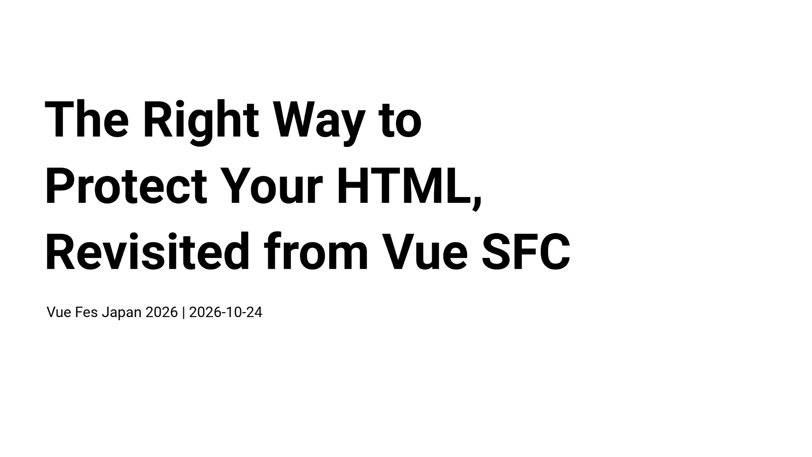
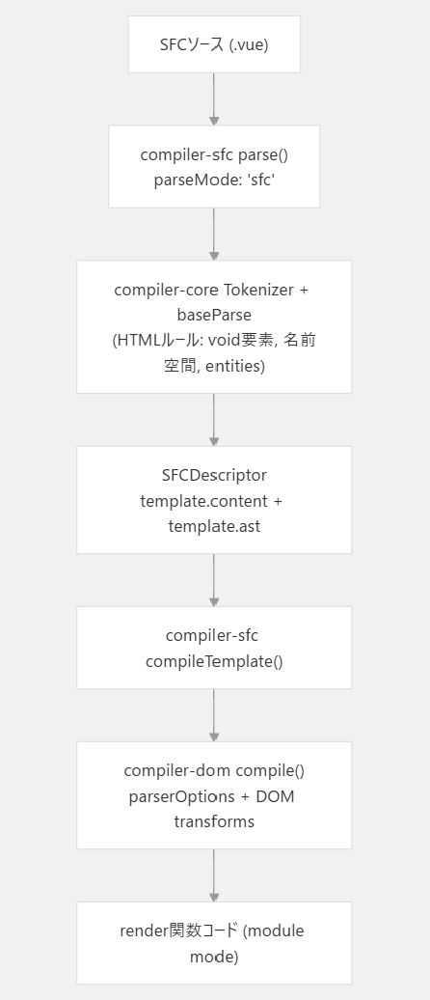
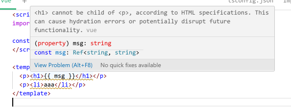

[English page](../en/) / [日本語ページ](../ja/)

## Slides

[Slide version](https://records.yamanoku.net/vuefes-japan-2026/slide/)

## Presentation Summary

I think it's common knowledge that Vue SFC come with syntax that lets you write HTML in the template block. But can you actually explain how you verify "HTML correctness" when developing with Vue?

Within the template of a Vue SFC, nesting violations between HTML elements will trigger a warning during development, but they won't clearly result in a compile error. Lexical and syntactic HTML rules are detected, but the compiler doesn't concern itself with the correct usage of specific HTML elements.

In this session, I'll unpack, from first principles, how the compiler interprets the HTML content written in a Vue SFC's template block, and introduce how the aspects of HTML correctness that a DOM compiler alone can't guarantee are currently being protected by the static analysis ecosystem of linters (ESLint, Markuplint, Biome, OxC, Vize, and others).

The HTML spec continues to be updated even now, as a Living Standard. By engaging correctly with HTML in that spirit, this talk aims to give you insights for achieving robust markup and accessible output through HTML in Vue.

## Intended audience

- Intermediate and above Vue developers
- People who want to understand the Vue compiler and SFC internals
- People interested in the HTML linter ecosystem
- People who want to use HTML more correctly

---

## How do you verify "HTML correctness" in Vue development?

This talk answers that question from the underlying mechanisms.

## How HTML is treated in frontend development

HTML is about 37 years old. It appears in websites and web applications, hydration comparisons in SSR (more precisely, the DOM), and UI library templates.

Frameworks treat HTML differently:

| Approach | Examples | Treatment |
| --- | --- | --- |
| HTML as a DSL | Vue / Svelte / Ripple | Declarative UI via templates |
| HTML-like JSX | React / SolidJS / Preact | Expressions in JS (closer to XHTML?) |
| HTML-first | Alpine.js / htmx | Behavior layered onto HTML |

Other frameworks appear here for context; the later linter comparison focuses on Vue only. Efforts such as OpenUI / Interop and HTML Day also treat HTML itself as a first-class subject.

A Vue template is an "HTML-like DSL." It looks like HTML, but it is ultimately transformed into virtual DOM factory functions. That gap is the subject of this session.

## What HTML "correctness" means

HTML continues to evolve as a Living Standard. Because its expressive range is wide, incorrect markup can still "work." There are also [non-conforming features](https://html.spec.whatwg.org/#non-conforming-features).

"HTML that works" and "correct HTML" are not the same. Rendering in a browser, conforming to the spec, and producing accessible output are separate concerns.

Correctness has at least these layers:

1. **Lexical / syntactic** — closing tags, attribute syntax
2. **Content model** — what may appear inside which element
3. **Semantics / accessibility** — meaning and intended use of elements

The Vue compiler mainly covers (1) and part of (2). It does not fully cover (3) or detailed element usage.

## The Vue SFC compile pipeline

Compilation roughly has three stages:

1. **Parse** — HTML string → AST
2. **Transform** — transform the AST
3. **Generate** — AST → JS code string

<figure>



<figcaption>Flow from SFC source through parse / compileTemplate / compiler-dom to render function code</figcaption>
</figure>

`compiler-sfc` splits a file into an `SFCDescriptor` via `parse()`, then `compileScript` and `compileTemplate` handle `<script>` and `<template>`. On the template side, `compiler-core`'s Tokenizer and `baseParse` build an AST with HTML rules (void elements, namespaces, entities), then `compiler-dom` transforms produce module-mode render function code.

### Templates become hyperscript

Even invalid nesting like the following can compile into valid function calls:

```html
<template>
  <p>
    <div>block</div>
  </p>
</template>
```

Virtual DOM creation builds elements programmatically, so browser HTML parser re-parenting does not happen the same way.

### Nesting violations stop at warnings

Since Vue 3.4, `compiler-dom`'s `validateHtmlNesting` warns about invalid nesting in development:

> `<h1>` cannot be child of `<p>`, according to HTML specifications. This can cause hydration errors or potentially disrupt future functionality.

<figure>



<figcaption>Example development nesting warning. Helpful DX, but ignoring it still lets the code run</figcaption>
</figure>

This is a development **warning** via `onWarn`, not a hard compile error. Vue looks at lexical/syntactic concerns, but not full HTML element usage.

In short, Vue itself does not finally guarantee HTML semantics. The compiler is excellent, but final HTML correctness is another layer's job.

## Gaps a compiler alone cannot cover

Defense mechanisms split by layer:

| Layer | Examples | Limits |
| --- | --- | --- |
| Runtime | Hydration mismatch warnings | Not a correctness guarantee |
| Dev-time lint | ESLint / Markuplint / Biome / OxC / Vize | Depends on config and rules |
| Types | TypeScript (`HTMLElement`, etc.) | DOM API types, not conformance |
| Artifacts | Static analysis of output HTML | Only after build |

Hydration warnings are useful, but they detect diffs. They do not validate semantics or correct element usage. Invalid nesting can surface as hydration issues when the browser restructures the DOM away from the virtual DOM expectation.

## How the static analysis ecosystem protects HTML

Because Vue templates become hyperscript, invalid nesting can still pass as functions. Compiler and runtime Vue do not control or verify HTML semantics. Static analysis must fill that gap before the browser silently repairs the DOM.

### Tools around Vue

This session's linter comparison focuses on the Vue ecosystem only.

- [eslint-plugin-vue](https://eslint.vuejs.org/) — e.g. `vue/no-parsing-error`
- [Markuplint](https://markuplint.dev/) — focused on HTML conformance
- [Biome](https://biomejs.dev/) — expanding HTML rules
- [OxLint / OxC](https://oxc.rs/) — Rust-based speed and growing rules
- [Vize](https://vizejs.dev/) — Vue-oriented; HTML rules separated from a11y

Accessibility linting has a different starting point: whether content is accessible, including WAI-ARIA. Here we focus on HTML conformance.

### eslint-plugin-vue

`vue/no-parsing-error` reports syntax errors in templates, including many WHATWG HTML syntax errors, and is included in essential presets. It does not fully cover element usage or semantics. Vue self-closing tags are partially allowed by default.

### Markuplint / Biome / OxC

| Tool | Strength | Relationship to Vue |
| --- | --- | --- |
| Markuplint | Spec-based HTML conformance | Can parse `.vue` |
| Biome | Fast unified toolchain | Growing HTML rules |
| OxLint | Fast Rust-based lint | Expanding correctness rules |

In the AI-agent era, fast lint feedback also has practical value.

### Vize HTML Rules

[Vize](https://vizejs.dev/rules/html/index.html) separates HTML conformance from Vue-specific and a11y rules. Besides rules like `html/deprecated-element` and `html/id-duplication`, `html/cross-component-nesting` is especially important.

```html
<!-- App.vue -->
<template>
  <p>Summary <InfoCard /></p>
</template>

<!-- InfoCard.vue -->
<template>
  <div class="card"><slot /></div>
</template>
```

Each file is valid alone, but composition becomes `<p><div>…</div></p>`. The browser restructures the DOM, which can cause hydration mismatches or non-conforming markup. Cross-file checks such as `vize lint --cross-file` catch gaps a compiler alone cannot.

### What linters see and miss

| Concern | Compiler | ESLint-vue | Markuplint etc. | Vize |
| --- | --- | --- | --- | --- |
| Lexical / syntax | partial–yes | yes | yes | yes |
| Nesting (single file) | warning | limited | mostly yes | yes |
| Nesting (cross-file) | no | no | limited | yes |
| Deprecated elements/attrs | no | mostly no | yes | yes |
| a11y | no | other plugins | depends | separate rules |

The point is not to trust one tool for everything, but to combine tools with clear responsibility boundaries.

Easy-to-miss angles remain. `<head>` often sits outside the SFC template, so the Vue compiler and eslint-plugin-vue alone may not cover it. TypeScript types such as `HTMLElement` describe the DOM API; they are not HTML conformance checks. Some issues appear only in post-build static analysis (e.g. Vize).

## Supplement: Vapor Mode / Pug

A brief supplement that reinforces the main point.

- **Vapor Mode** — Invalid nesting has historically "worked" under VDOM, but Vapor leans on `innerHTML`-based template instantiation, so browser HTML parser repairs apply directly. Invalid nesting can then cause compiled code / real DOM mismatches or runtime crashes (e.g. [vuejs/core#15256](https://github.com/vuejs/core/issues/15256)).
- **Pug** (`<template lang="pug">`) — `eslint-plugin-vue` alone may not apply; community plugins such as `eslint-plugin-vue-pug` may be needed.

In both cases the conclusion is the same: changing the compile target or DSL still requires an explicit design for who guarantees correctness.

## Closing

1. **Understand the compiler's coverage** (warning ≠ guarantee)
2. **Fill "Vue gaps" with linters**
   - Syntax: eslint-plugin-vue
   - Conformance: Markuplint / Biome / OxC / Vize
3. **Also check correctness across component boundaries**
4. Follow HTML as a Living Standard
5. Move from robust markup to accessible output

A practical combination is eslint-plugin-vue for syntax, plus Markuplint or Vize for conformance and cross-file checks. Tools will change, but designing "who guarantees what" remains.

Engage correctly with HTML, and build robust markup with Vue.

## References

- [Vue: validateHtmlNesting](https://github.com/vuejs/core/blob/main/packages/compiler-dom/src/transforms/validateHtmlNesting.ts)
- [eslint-plugin-vue: no-parsing-error](https://eslint.vuejs.org/rules/no-parsing-error.html)
- [Vize HTML Rules](https://vizejs.dev/rules/html/index.html)
- [WHATWG: Non-conforming features](https://html.spec.whatwg.org/#non-conforming-features)
