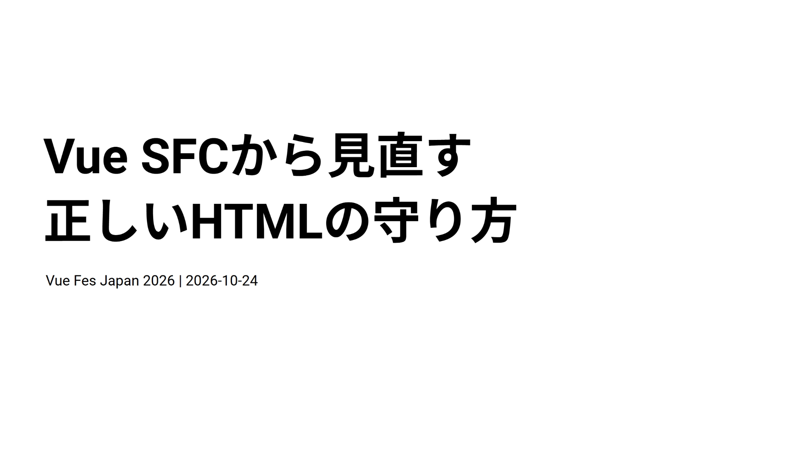
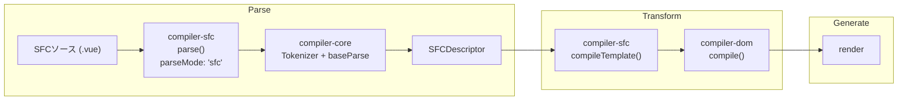

[日本語ページ](../ja/) / [English page](../en/)

## スライド

[スライド版ページ](https://records.yamanoku.net/vuefes-japan-2026/slide/)

---

## はじめに

やまのくと申します。会社員で、一児の父です。WebアクセシビリティとHTMLが好きで、Vue Fes Japan 2025では[生成AI時代のWebアプリケーションアクセシビリティ改善](https://records.yamanoku.net/vuefes-japan-2025/ja/)という発表をさせていただきました。

今回は、その延長線上で、VueのSFCにおけるHTMLそのものに焦点を当てます。

皆さん、Vueを使った開発をするとき、「HTMLの正しさ」をどのように検証しているか、明確に答えられるでしょうか？

VueのSFCには `<template>` でHTMLを書ける構文があります。これは周知の事実だと思います。一方で、要素間のネスト違反があっても開発時の警告にとどまり、明確なコンパイルエラーにはなりません。字句的・構文的なルールはある程度見ますが、具体的なHTML要素の使い方までは関与していません。

本日は、コンパイラがtemplateをどう解釈しているかを仕組みから紐解き、コンパイラだけでは保てないHTMLの正しさを、Linterといった静的解析（ESLint、Markuplint、Biome、OxC、Vizeなど）でいまどう守れるかを紹介します。

それでは、本題に入っていきましょう。

## HTMLの歴史と現在の仕様について

皆さんは普段、HTMLをどこで見かけていますか。Webサイト、管理画面、コンポーネントライブラリ、SSRの差分比較など、フロントエンド開発のあちこちにあります。

HTMLは一般に公開されて今年で35周年になります。1990年代前半に文書のためのマークアップとして広がり、その後アプリのUIやDOM差分比較の対象にもなりました。「古い技術」ではなく、今も更新され続ける基盤です。

初期は見出し・段落・リンクなど文書構造を表す言語でした。中期にはフォームやインタラクションが増え、現在はSPA / SSR / デザインシステムでも最終出力がHTMLであることが多いです。Vueでtemplateを書いていても、ブラウザが受け取る最終成果物はHTMLです。だから仕様の理解は、フレームワーク以前の共通基盤になります。

仕様の進化をざっくり押さえておきます。

| 時期 | 出来事 |
| --- | --- |
| 1989 | WWWの提案書の執筆 |
| 1991 | ウェブが公開 |
| 1993 | HTML 1.0 Internet Draft |
| 1995 | HTML 2.0 |
| 1997/1 | HTML 3.2（W3C勧告） |
| 1997/12 | HTML 4.0 |
| 1999 | XML 仕様勧告 |
| 2000 | XHTML 1.0 |
| 2004 | WHATWG 発足 |
| 2014 | HTML 5.0 |
| 2019/5 | WHATWG Living Standard を単一の正とする合意 |
| 2021/1 | WHATWGのもとでHTMLの仕様を一本化 |

この年表の背後には、いまの「動くのに正しくないHTML」問題につながる分岐があります。初期のHTMLはSGMLの応用として、かなりおおらかな文法でした。文脈から分かるなら閉じタグを省略でき、属性のショートハンドも認められます。その結果、パーサは例外ケースだらけになり、レンダリングエンジンごとの差も生まれました。

2000年頃に登場したXHTMLは、このおおらかさをXMLベースの厳格なルールで置き換えようとする意欲的な試みでした。全タグを閉じる、属性値は引用符で囲む、要素名・属性名は小文字、空要素は `<br />` のように書く決まりです。いわば「厳格に書いて止める」方向です。

しかし、既存のWebの置き換えには至りませんでした。いちばん大きかったのは、いまではWeb仕様の鉄則とも言える**後方互換性**を軽く見ていたことです。`text/html` と `application/xhtml+xml` のようなMIME Typeによるモード切替の意識はありましたが、厳格な仕様は間違えると表示不備になります。コンテンツ作者には支持されても、ブラウザ実装側は互換性維持を選び、計画は頓挫しました。そしてHTMLは「壊れても補正して表示する」方向で一本化されていきます。

いま現場で主に使うのは、この後者のHTML構文です。誤りがあっても画面は動いて見えやすい。利用者には良いことですが、開発者にとっては「動いている＝正しい」と錯覚しやすい土壌でもあります。

HTML5では、SGMLに頼らず[パース規則そのものを仕様として定義し直しました](https://html.spec.whatwg.org/multipage/parsing.html)。閉じタグの省略可否、タグごとのアルゴリズム、細かい例外まで明示されています。主要エンジンの挙動をリバースエンジニアリングし、実コンテンツの統計を取り、「いちばんマシな挙動」に合わせて仕様を作り直す、という力業でした。パースは複雑になりましたが、曖昧さは減りました。これはHTML5が残した巨大な資産です。

いまのHTMLの正本は [HTML Standard（WHATWG）](https://html.spec.whatwg.org/) です。凍結されたバージョン名より、継続更新される仕様本文が基準です。2019年以降、W3CもこのLiving Standardを前提に協調しています。OpenUI / Interopなど、実装とコミュニティの動きも続きます。XHTMLが教えてくれた「進化を止めないこと」を、Living Standardという形で実践している、と言ってもよいでしょう。

Living Standardでは、要素や属性の扱いが実装状況に合わせて更新され得ます。「昔からの慣習」が今の仕様では非推奨・非適合なこともあり、[Non-conforming features](https://html.spec.whatwg.org/#non-conforming-features) も明示されています。だからこそ、記憶だけに頼らず機械検証が効きます。パース規則が仕様として書かれているからこそ、Linterは「正しさ」を機械的に問えるようになった、とも言えます。

ここで大事なのは、「動くHTML」と「正しいHTML」は違う、ということです。

たとえば `p` の中に `div` を置くと、パーサが補正し、実際のDOMは意図と違う形になり得ます。HTML構文はエラーでも最後までパースするため、画面は出ても構造・スタイル・アクセシビリティに副作用が出ます。

マークアップに唯一の正解はありません。それでも品質の良し悪しと、明確な誤りはあります。「良いHTML」の条件としては、セマンティックであること、アクセシブルであること、誤りがないこと、保守しやすいことなどが挙げられます。まずは誤りをなくすことがスタート地点です。

誤りは、次の3つのルールに分類できます。

### 字句的ルール

タグの閉じ方、属性の書き方などです。違反するとパーサがエラーを出し、DOMツリーが正しく作れません。ただしHTML構文では補正されて「動いて」見えることがあります。

```html
<!-- NG: 終了タグが対応していない -->
<div><p>テキスト</div></p>
```

開始タグと終了タグの対応が崩れていたり、属性値のクオートが欠けていたりする例です。XHTML／XMLなら即座に止まりますが、HTML構文では補正されて気づきにくいことがあります。一方で、閉じタグを省略しない・属性値を引用符で囲む、といったXHTML由来の慣例は、字句エラーを未然に減らす実践としても今も効いています。

### 語彙的ルール

使える要素・属性と、**内容モデル（content model）** による入れ子ルールです。違反してもパーサは止まらず、望ましくないDOMになります。

```html
<!-- NG: p の中にブロック要素は置けない -->
<p>
  <div>block</div>
</p>

<!-- NG: リンクの入れ子は不可 -->
<a href="/a">
  外側
  <a href="/b">内側</a>
</a>

<!-- NG: ul / ol の直接の子は li -->
<ul>
  <div>item</div>
</ul>
```

タグの対応は合っていても、要素の入れ子が誤っていると静かに壊れたDOMができます。

### 意味論的ルール

要素の意味と使い方、アクセシビリティです。文法として正しくても伝わる意味が違うことがあります。

```html
<!-- NG: 見た目のためだけに見出しを使う -->
<h1 class="title-like">ただ大きい文字にしたいだけ</h1>

<!-- NG: ボタンを a で作る -->
<a href="#" onclick="submitForm()">送信</a>
```

ツールだけでは完全には検出できず、レビューと経験が必要です。意味論は、HTMLの強みであるアクセシビリティに直結します。

第1部のまとめです。HTMLは、おおらかなSGML由来の文法から、XHTMLという厳格化の試みを経て、HTML5でパース規則を明示したLiving Standardへとたどり着きました。「動く」ことと「正しい」ことは一致しません。正しさは字句 / 語彙 / 意味論で切り分け、その土台の上でVueのtemplateを見直していきます。

## VueでHTMLはどのように使われているのか

ここからは、VueがこのHTMLをどう扱い、どこまで保証していくのかを見ていきます。

フレームワークごとの扱いも分かれます。

| 系統 | 例 | 扱い |
| --- | --- | --- |
| HTMLをDSLとして使う | Vue / Svelte / Ripple | template等で宣言的UI |
| JSXでHTML風に書く | React / SolidJS / Preact | JSの中の式（閉じタグ必須などXML寄りの慣習） |
| HTMLファースト | Alpine.js / htmx | HTMLを起点に振る舞いを足す |

文脈整理として他フレームワークにも触れますが、以降はVueに絞ります。Vueの本線はtemplate DSLで、「HTMLっぽいDSL」として書けます。見た目はHTMLですが、最終的には仮想DOM生成の関数へと変換されます。他にもVue Vapor Modeや[Vue JSX](https://vuejsx.dev/)もありますが、ここでは触れません。

Vue SFCのコンパイルは次の3段階に分けられます。

1. **Parse** — HTML文字列 → AST
2. **Transform** — AST の変換
3. **Generate** — AST → JSコード文字列

<figure>



<figcaption>SFCソースが Parse → Transform → Generate を経て render 関数コードになる流れ</figcaption>
</figure>

`compiler-sfc` はファイルを `parse()` で `SFCDescriptor` に分解し、`compileScript` と `compileTemplate` がそれぞれ `<script>` / `<template>` を処理します。

コンパイラはHTMLを次のように解釈します。

- **Parse時**: void要素・名前空間・実体参照など、HTML寄りの字句ルールでASTを作る
- **Transform時**: Vueディレクティブや最適化をASTに適用する
- **Generate時**: 最終成果物はブラウザ向けHTML文字列ではなく、仮想DOMを作るJavaScriptに変換

つまりtemplateの見た目はHTMLでも、出力は「DOMを組み立てるプログラム」です。VueはHTMLをパースしますが、ブラウザのHTMLパーサと同じ最終DOMを保証するわけではありません。ここが、今日の本題の分岐点です。

たとえば次のような不正なネストがあっても、コンパイル後は「関数呼び出し」として成立し得ます。

```html
<template>
  <p>
    <div>block</div>
  </p>
</template>
```

仮想DOM生成では要素をプログラム的に作るため、ブラウザのHTMLパーサが行うような再配置が起きないからです。

ではVueは何もしないのかというと、そうではありません。Vue 3.4以降、`compiler-dom` の `validateHtmlNesting` により、不正なネストが開発時に警告されます。

<figure>


<figcaption>開発時のネスト警告の例。ありがたいDXだが、警告を無視すればそのまま動いてしまう</figcaption>
</figure>

> `<h1>` cannot be child of `<p>`, according to HTML specifications. This can cause hydration errors or potentially disrupt future functionality.

これは `onWarn` による**開発時の警告**であり、明確なコンパイルエラーではありません。ありがたいDXですが、警告を無視すればそのまま動いてしまいます。

Vueコンパイラが見る範囲は次のとおりです。

| ルール | Vueコンパイラ |
| --- | --- |
| 字句的 | △〜○（パースできる範囲） |
| 語彙的（内容モデル） | 一部を開発時警告 |
| 意味論的 | ✕ |

つまり、Vue自身はHTMLの正しさを完全には保証してくれません。コンパイラだけでは守れない隙間もあります。

| レイヤー | 例 | 限界 |
| --- | --- | --- |
| 実行時 | ハイドレーションミスマッチ警告 | 正しさの保証ではない |
| 型 | TypeScript（`HTMLElement` など） | DOM APIの型であり適合性ではない |
| `<head>` 部分 | template外のマークアップ | Vueコンパイラだけでは見にくい |
| 成果物 | 出力HTMLの静的解析 | ビルド後にしか見えない |

### 補足・別のモード

#### Vapor Mode
VDOMモードでは不正ネストも「動いて」きた歴史がありますが、Vapor は `innerHTML` ベースのテンプレート生成に寄り、ブラウザのHTMLパーサの修復がそのまま効きます。不正ネストがコンパイル結果と実DOMの不一致・実行時クラッシュにつながり得ます（例: [vuejs/core#15256](https://github.com/vuejs/core/issues/15256)）。

#### Pug
`eslint-plugin-vue` だけでは効かない場合があり、コミュニティ製プラグイン（例: `eslint-plugin-vue-pug`）が必要になります。

#### Vue JSX
VueでもJSXでUIを書けます。Virtual DOM / Vapor Mode に対応し、Oxcベースの高速コンパイラをうたうプロジェクトです。見た目はHTMLでも本質は **JS式 → レンダー関数** であり、SFCの `<template>` とは検証経路が異なります。`validateHtmlNesting` や `eslint-plugin-vue` の守備範囲は主に `<template>` 向けなので、JSXを使う場合は別途、誰がHTMLの正しさを見るかを設計する必要があります。ネスト検証の一例として [`eslint-plugin-validate-jsx-nesting`](https://github.com/MananTank/eslint-plugin-validate-jsx-nesting) があります。

## VueでHTMLの正しさを検証するためのツール紹介

ここまで見てきた通り、Vueのテンプレートは最終的に Hyperscript に変換されるため、不正なネストでも関数としては通ってしまいます。コンパイラや実行時のVue自身はHTMLセマンティクスを制御・検証しません。だからブラウザが意図せぬDOM修正を起こす前に、静的解析が隙間を埋める必要があります。

ここでは各ツールの登場の歴史をたどりながら、それぞれが何の役割をもって生まれてきたのかを見ていきます。

### ESLint / eslint-plugin-vue

最初に広まった土台は、ESLint と [eslint-plugin-vue](https://eslint.vuejs.org/) です。長所は、template の字句エラーを日常の開発フローに乗せられることです。[`vue/no-parsing-error`](https://eslint.vuejs.org/rules/no-parsing-error.html) は WHATWG HTML の字句的な構文エラーを多く検知でき、essential 系プリセットにも含まれます。エディタ連携とCIで、壊れたタグや属性を早期に止められます。

一方で、ESLint系が得意なのは主に字句・構文寄りの守備です。内容モデルや仕様適合性までを、HTML仕様データとして厚く見る層は、まだ足りていませんでした。

### Markuplint

その隙間を埋めるように登場したのが Markuplint です。長所は、HTML Living Standard ベースの**適合性検証**ができることです。[`permitted-contents`](https://markuplint.dev/docs/rules/permitted-contents) で内容モデルを仕様データから検証でき、[`no-obsolete-element`](https://markuplint.dev/docs/rules/no-obsolete-element) で廃止要素を止め、[`require-accessible-name`](https://markuplint.dev/docs/rules/require-accessible-name) でアクセシブルネームも見られます。`@markuplint/vue-parser` / `@markuplint/vue-spec` で `.vue` を扱えます。

適合性だけでなく、現場で効く特徴的なルールもあります。いくつか紹介します。

[`no-pseudo-list`](https://markuplint.dev/ja/docs/rules/no-pseudo-list) は、ビュレット文字で箇条書きを擬似している箇所を止め、`ul` / `li` を使うよう求めます。見た目だけのリストは、スクリーンリーダーにリストとして伝わりません。

```html
<!-- NG: ビュレット文字で擬似リスト -->
<div>
  • Apple<br />
  • Banana<br />
  • Citrus
</div>
```

[`no-consecutive-br`](https://markuplint.dev/ja/docs/rules/no-consecutive-br) は、連続する `<br>` に警告します。改行の重ね打ちで余白を作る代わりに、段落や余白用のスタイルへ寄せましょう。`--fix` による自動修正にも対応しています。

```html
<!-- NG: 連続 br で余白を作っている -->
<p>
  A...<br />
  <br />
  B...
</p>
```

[`no-skipped-heading-level`](https://markuplint.dev/ja/docs/rules/no-skipped-heading-level) は、見出しレベルを飛ばすと警告します。HTML Living Standard の見出しとアウトラインの要件に沿い、`h1` の次に突然 `h3` が出るような飛びを止めます。見た目調整のための見出し飛ばしは、文書構造を壊します。

```html
<!-- NG: h1 の次が h3 -->
<h1>見出し1</h1>
<h3>見出し3</h3>
```

[`no-broken-fragment-link`](https://markuplint.dev/ja/docs/rules/no-broken-fragment-link) は、`#id` のようなフラグメントリンクが、同じドキュメント内の実在する ID を指しているかを見ます。仕様上は参照先がなくても適合性違反にはなりませんが、リンクが何もしないまま残るのは実害です。ページ内リンクの壊れを静的に止められます。

```html
<!-- NG: #baz に対応する id がない -->
<a href="#baz">Fragment link</a>
<section id="qux">...</section>
```

さらに [Pretenders](https://markuplint.dev/docs/guides/besides-html) があります。Vueコンポーネントを描画結果のネイティブHTML要素に見立てて検証できます。たとえば `List` → `ul`、`Item` → `li` とマップすると、コンポーネント境界をまたぐ語彙的ルールを仕様データ側から補強できます。手動マップのほか、Vue向けの scan も可能です。

ここまでで、「字句を止める」と「仕様で適合性を見る」という二層が揃いました。

### Biome / OxC

続いて出てきたのが、Biome や OxC といった高速・統合志向の世代です。役割は「同じ検証をより速く、ツールチェーンに載せる」ことです。Biome では [`noDuplicateAttributes`](https://biomejs.dev/linter/rules/no-duplicate-attributes/) で重複属性を止めたり、[`noObsoleteTags`](https://biomejs.dev/linter/rules/no-obsolete-tags/) や [`noMisplacedListElements`](https://biomejs.dev/linter/rules/no-misplaced-list-elements/) といった HTML 寄りのルール、[`useSemanticElements`](https://biomejs.dev/linter/rules/use-semantic-elements/) のような意味論寄りの支援を、統合ツールチェーンの中で高速に回せます。OxLint は速度が強みで、現状は script 側の解析が中心です（[HTML lint は Out of Scope](https://oxc.rs/compatibility)）。

HTML適合性の本線を置き換える段階ではありませんが、「速さ」と「統合」が次の競争軸になった、という変化は押さえておきたいです。

### Vize

その流れの先に、近年登場しているのが Vize です。長所は、単ファイルでは合法でもコンポーネント合成で壊れるネストを、ファイル横断で止められることです。[Vize](https://vizejs.dev/rules/html/index.html) は HTML適合性を Vue固有ルール / アクセシビリティから分離して提供しており、特に重要なのが `html/cross-component-nesting` です。

```html
<!-- App.vue -->
<template>
  <p>Summary <InfoCard /></p>
</template>

<!-- InfoCard.vue -->
<template>
  <div class="card"><slot /></div>
</template>
```

各ファイル単体では合法でも、合成結果は実質 `<p><div>…</div></p>` となり不正です。`vize lint --cross-file` のようにファイル横断で見て初めて防げる領域です。ESLintでもMarkuplintでも見えにくかった「合成後」の正しさを押し広げているのが、いまの進化点です。

### 歴史が積み上げた役割分担

こうして見ると、優劣の星取表より、**時代ごとに足りない層を埋めてきた結果としての役割分担**がはっきりします。

1. **字句を止める** — eslint-plugin-vue（`vue/no-parsing-error`）
2. **仕様ベースの適合性を見る** — Markuplint（`permitted-contents` など）
3. **速さと統合を足す** — Biome / OxC（HTMLは拡充途上）
4. **合成後のネストを見る** — Vize（`html/cross-component-nesting`）

実践の本線は、いまも eslint-plugin-vue / Markuplint / Vize です。Biome / OxC は速度面の補強として追う位置づけです。あわせて、`<head>` や TypeScript の型、出力後の静的解析まで含めて、誰が何を見るかを設計します。SFCのtemplateを見ていれば十分、というわけではありません。

## おわりに

今日の3部をおさらいします。

1. **仕様** — Living Standardと、字句 / 語彙 / 意味論
2. **Vueでの使い方** — templateはHTMLっぽいDSL。コンパイラは最終保証しない
3. **検証ツール** — ESLint → Markuplint → Biome/OxC → Vize と進化してきた層を組み合わせて隙間を埋める

実践としては、次の一歩をお勧めします。

1. **コンパイラの守備範囲を理解する**（警告≠保証）
2. **Linterで「Vueの隙間」を埋める**（構文: eslint-plugin-vue / HTML適合性: Markuplint / クロスファイル: Vize）
3. **コンポーネント境界をまたぐ正しさも見る**
4. Living StandardとしてのHTMLに追随する
5. 堅牢なマークアップ → アクセシブルなアウトプットへ

おすすめは、歴史が積み上げた役割分担をそのまま使うことです。eslint-plugin-vueで構文を押さえ、Markuplintで仕様ベースの適合性を、Vizeでクロスファイルを補強する。Biome / OxCは速度と統合の補強として追います。

HTMLの仕様は今も更新されています。XHTMLが教えてくれたように、仕様の進化を止めないことが大事です。Vueのコンパイルの仕組みを理解したうえで、静的解析という防波堤を立て、堅牢なマークアップとアクセシブルなアウトプットを一緒に実現していきましょう。

## 参考文献

- [HTML Standard](https://html.spec.whatwg.org/)
  - [HTML Standard: Parsing HTML documents](https://html.spec.whatwg.org/multipage/parsing.html)
- [WHATWG: Non-conforming features](https://html.spec.whatwg.org/#non-conforming-features)
- [XHTMLが残したもの](https://speakerdeck.com/yosuke_furukawa/xhtml-ga-nokoshita-mono)
- [Vue: validateHtmlNesting](https://github.com/vuejs/core/blob/main/packages/compiler-dom/src/transforms/validateHtmlNesting.ts)
- [eslint-plugin-vue: no-parsing-error](https://eslint.vuejs.org/rules/no-parsing-error.html)
- [Markuplint](https://markuplint.dev/)
  - [no-pseudo-list](https://markuplint.dev/ja/docs/rules/no-pseudo-list)
  - [no-consecutive-br](https://markuplint.dev/ja/docs/rules/no-consecutive-br)
  - [no-skipped-heading-level](https://markuplint.dev/ja/docs/rules/no-skipped-heading-level)
  - [no-broken-fragment-link](https://markuplint.dev/ja/docs/rules/no-broken-fragment-link)
- [Vize HTML Rules](https://vizejs.dev/rules/html/index.html)
- [Biome: noDuplicateAttributes](https://biomejs.dev/linter/rules/no-duplicate-attributes/) / [noObsoleteTags](https://biomejs.dev/linter/rules/no-obsolete-tags/) / [noMisplacedListElements](https://biomejs.dev/linter/rules/no-misplaced-list-elements/) / [useSemanticElements](https://biomejs.dev/linter/rules/use-semantic-elements/)
- [OxC Compatibility](https://oxc.rs/compatibility)
- [Vue JSX](https://vuejsx.dev/)
- [eslint-plugin-validate-jsx-nesting](https://github.com/MananTank/eslint-plugin-validate-jsx-nesting)
- [2025新卒研修・HTML/CSS #弁護士ドットコム](https://speakerdeck.com/bengo4com/20250405-bengo4com-htmlcss)
