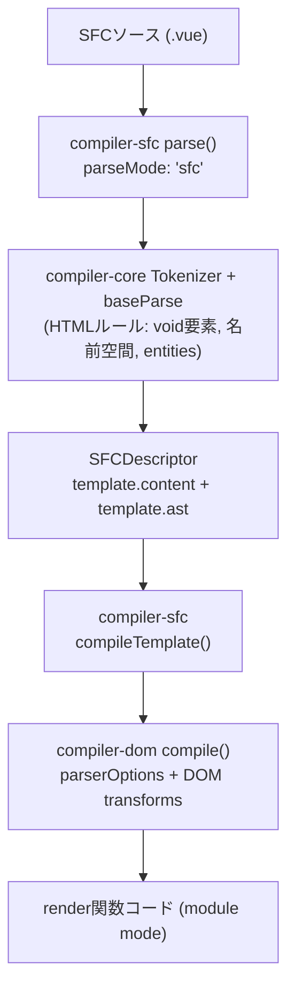

[日本語ページ](../ja/) / [English page](../en/)

## スライド

[スライド版ページ](https://records.yamanoku.net/vuefes-japan-2026/slide/)

## 発表概要

VueのSFCにはtemplateブロックにてHTMLを記述できる構文が備わっていることは周知の事実だと思いますが、Vueを使った開発をするときにどのように「HTMLの正しさ」を検証しているか皆さんは説明できますでしょうか？

VueのSFCにおけるtemplate内ではHTMLの要素間のネスト違反があっても、開発時に警告してきますが明確にコンパイルエラーにはなりません。HTMLの字句的・構文的ルールについても検出されますが、具体的なHTML要素の使い方に関しては関与していません。

本セッションでは、Vue SFCのtemplateブロックで書かれたHTMLの内容をコンパイラがどのように解釈しているかについてを仕組みから紐解き、DOMのコンパイラだけでは保てないHTMLの正しさについてをLinterといった静的解析エコシステム（ESLint、Markuplint、Biome、OxC、Vizeなど）たちによって今現在どのように守れるかについてを紹介します。

HTMLの仕様はLiving Standardとして今なお更新されています。そんなHTMLと正しく向き合いながら、Vueで堅牢なマークアップとHTMLによるアクセシブルなアウトプットを実現する知見を提供します。

## 想定聴衆

- Vue中級者以上向け
- VueのコンパイラやSFCの内部の仕組みを知りたい方
- HTMLにおけるLinterエコシステムの状況を知りたい人
- HTMLをより正しく使っていきたい人

---

## Vue開発で「HTMLの正しさ」をどう検証していますか？

今日はこの問いに、仕組みから答えを出していきます。

## HTMLはフロントエンドでどう扱われているか

HTMLは生まれて約37年になります。WebサイトやWebアプリケーション、SSRにおけるハイドレーション比較（正確にはDOM）、UIライブラリのテンプレートなど、さまざまな場所で活用されています。

フレームワークごとの扱いも分かれます。

| 系統 | 例 | 扱い |
| --- | --- | --- |
| HTMLをDSLとして使う | Vue / Svelte / Ripple | template等で宣言的UI |
| JSXでHTML風に書く | React / SolidJS / Preact | JSの中の式（XHTML寄り？） |
| HTMLファースト | Alpine.js / htmx | HTMLを起点に振る舞いを足す |

文脈整理として他フレームワークにも触れますが、以降のLinter比較はVueに絞ります。OpenUI / Interop や HTML Day のように、HTMLそのものを正面から扱う動きもあります。

Vueのtemplateは「HTMLっぽいDSL」です。見た目はHTMLですが、最終的には仮想DOM生成の関数へと変換されます。このギャップが、本セッションの主題です。

## HTMLの「正しさ」とは何か

HTMLはLiving Standardとして今も更新され続けています。HTML構文はエラーがあっても補正されて最後までパースされるため、意図と違う書き方でも「動いて」しまうことがあります。[Non-conforming features](https://html.spec.whatwg.org/#non-conforming-features) という要素群も存在します。

ここで重要なのは、「動くHTML」と「正しいHTML」は違うということです。ブラウザで表示されることと、仕様に適合していること、アクセシブルなアウトプットになることは別問題です。

マークアップに唯一の正解はありません。それでも品質の良し悪しと、明確な誤りはあります。「良いHTML」の条件としては、セマンティックであること、アクセシブルであること、誤りがないこと、保守しやすいことなどが挙げられます。まずは誤りをなくすことがスタート地点です。

誤りは次の3つのルールに分類できます。

### 1. 字句的ルール

タグの閉じ方、属性の書き方など。違反するとパーサがエラーを出し、DOMツリーが正しく作れません。HTML構文では補正されて「動いて」見えることがあります。

### 2. 語彙的ルール

使える要素・属性と、**内容モデル（content model）** による入れ子ルール。例として、`label` の中に `div` / `p` は置けず、`p` の中に `div` も置けません。違反してもパーサは止まらず、望ましくないDOMになります。

### 3. 意味論的ルール

要素の意味と使い方、アクセシビリティ。文法として正しくても伝わる意味が違うことがあります（見た目のためだけに `h1` を使う、ボタンを `a` で作る、など）。ツールだけでは完全には検出できず、レビューと経験が必要です。

Vueコンパイラが主に関与するのは字句的ルールと、一部の語彙的ルール（内容モデルの開発時警告）です。意味論や、より細かい要素の使い方までは見てくれません。

## Vue SFCのコンパイルパイプライン

コンパイルはざっくり次の3段階です。

1. **Parse** — HTML文字列 → AST
2. **Transform** — AST の変換
3. **Generate** — AST → JSコード文字列

<figure>



<figcaption>SFCソースが parse / compileTemplate / compiler-dom を経て render 関数コードになる流れ</figcaption>
</figure>

`compiler-sfc` はファイルを `parse()` で `SFCDescriptor` に分解し、`compileScript` と `compileTemplate` がそれぞれ `<script>` / `<template>` を処理します。template側は `compiler-core` の Tokenizer と `baseParse` で HTMLルール（void要素、名前空間、entities）を踏まえたASTになり、`compiler-dom` の transforms を経て module mode の render 関数コードになります。

### template は最終的に Hyperscript になる

たとえば次のような不正なネストがあっても、コンパイル後は「関数呼び出し」として成立し得ます。

```html
<template>
  <p>
    <div>block</div>
  </p>
</template>
```

仮想DOM生成では要素をプログラム的に作るため、ブラウザのHTMLパーサが行うような再配置が起きないからです。

### ネスト違反は「警告」止まり

Vue 3.4以降、`compiler-dom` の `validateHtmlNesting` により、不正なネストが開発時に警告されます。

> `<h1>` cannot be child of `<p>`, according to HTML specifications. This can cause hydration errors or potentially disrupt future functionality.

<figure>


<figcaption>開発時のネスト警告の例。ありがたいDXだが、警告を無視すればそのまま動いてしまう</figcaption>
</figure>

これは `onWarn` による**開発時の警告**であり、明確なコンパイルエラーではありません。字句的ルールと一部の語彙的ルール（内容モデル）は見ますが、意味論や具体的なHTML要素の使い方全般までは関与しません。

つまり、Vue自身はHTMLセマンティクスを最終保証しません。コンパイラは優秀ですが、HTMLの正しさの最終保証は別レイヤーの仕事です。

## コンパイラだけでは守れない隙間

守るための機構はレイヤーごとに分かれます。

| レイヤー | 例 | 限界 |
| --- | --- | --- |
| 実行時 | ハイドレーションミスマッチ警告 | 正しさの保証ではない |
| 開発時Lint | ESLint / Markuplint / Biome / OxC / Vize | 設定とルール次第 |
| 型 | TypeScript（`HTMLElement` など） | DOM APIの型であり適合性ではない |
| 成果物 | 出力HTMLの静的解析 | ビルド後にしか見えない |

ハイドレーションの警告は有用ですが、あくまで差分検知です。セマンティクスや要素の正しい使い方までは見てくれません。不正なネストは、ブラウザ側の再配置と仮想DOMの期待がずれて、ハイドレーション問題として表面化することがあります。

## 静的解析エコシステムでどう守るか

Vueのテンプレートは最終的に Hyperscript に変換されるため、不正なネストでも関数としては通ってしまいます。コンパイラや実行時のVue自身はHTMLセマンティクスを制御・検証しません。だからブラウザが意図せぬDOM修正を起こす前に、静的解析が隙間を埋める必要があります。

### Vue周辺で使えるツールたち

本セッションのLinter比較はVue周辺に絞ります。

- [eslint-plugin-vue](https://eslint.vuejs.org/) — `vue/no-parsing-error` など
- [Markuplint](https://markuplint.dev/) — HTML適合性に特化
- [Biome](https://biomejs.dev/) — HTML rules が拡充中
- [OxLint / OxC](https://oxc.rs/) — Rust製、速度とルール拡充
- [Vize](https://vizejs.dev/) — Vue向け。HTML rules を a11y と分離

アクセシビリティLintとは起点が違います。a11yはコンテンツがアクセシブルかを起点にし、WAI-ARIAの管轄が入ります。ここではHTML適合性の側を見ます。

### eslint-plugin-vue

`vue/no-parsing-error` は template 内の構文エラー（HTML含む）を報告します。WHATWG HTMLの構文エラーを多く検知でき、essential系のプリセットにも含まれます。一方で、要素の使い方全般やセマンティクスまではカバーしません。Vueのセルフクローズは既定で一部許容されています。

### Markuplint / Biome / OxC

| ツール | 強み | Vueとの関係 |
| --- | --- | --- |
| Markuplint | HTML仕様ベースの適合性 | `.vue` をパーサで扱える |
| Biome | 高速・統合ツールチェーン | HTML rules が増加中 |
| OxLint | Rust製で高速 | correctness系ルールが拡充中 |

AIエージェント時代には、応答が速いLintも実務上の価値があります。

### Vize の HTML Rules

[Vize](https://vizejs.dev/rules/html/index.html) は HTML適合性を Vue固有ルール / a11y から分離して提供しています。`html/deprecated-element` や `html/id-duplication` といったルールに加え、特に重要なのが `html/cross-component-nesting` です。

```html
<!-- App.vue -->
<template>
  <p>Summary <InfoCard /></p>
</template>

<!-- InfoCard.vue -->
<template>
  <div class="card"><slot /></div>
</template>
```

各ファイル単体では合法でも、合成結果は実質 `<p><div>…</div></p>` となり不正です。ブラウザがDOMを組み替え、ハイドレーションミスマッチや非適合なDOMにつながります。`vize lint --cross-file` のようにファイル横断で見て初めて防げる領域であり、コンパイラ単体では守れない典型的な隙間です。

### Linterが見るもの / 見ないもの

| 観点 | コンパイラ | ESLint-vue | Markuplint等 | Vize |
| --- | --- | --- | --- | --- |
| 字句的 | △ | ○ | ○ | ○ |
| 語彙的・ネスト（単ファイル） | 警告 | 限定的 | ○寄り | ○ |
| 語彙的・ネスト（クロスファイル） | ✕ | ✕ | 限定的 | ○ |
| 非推奨要素・属性 | ✕ | ✕寄り | ○ | ○ |
| 意味論 / a11y | ✕ | 別プラグイン | 設定次第 | 別ルール群 |

大事なのは「どれか一つに全部任せる」のではなく、守備範囲の違いを理解して組み合わせることです。

見落としやすい観点もあります。`<head>` は SFC の template 外にあり、Vueコンパイラや eslint-plugin-vue だけでは見にくいです。TypeScript の `HTMLElement` 等は DOM API の型であり、HTML適合性の検証ではありません。ビルド成果物への静的解析（Vize等）で初めて見える層もあります。

## 補足：Vapor Mode / Pug

本編の主張を補強する短い補足です。

- **Vapor Mode** — VDOMモードでは不正ネストも「動いて」きた歴史がありますが、Vapor は `innerHTML` ベースのテンプレート生成に寄り、ブラウザのHTMLパーサの修復がそのまま効きます。不正ネストがコンパイル結果と実DOMの不一致・実行時クラッシュにつながり得ます（例: [vuejs/core#15256](https://github.com/vuejs/core/issues/15256)）。
- **Pug**（`<template lang="pug">`）— `eslint-plugin-vue` だけでは効かない場合があり、コミュニティ製プラグイン（例: `eslint-plugin-vue-pug`）が必要になります。

どちらも結論は同じで、コンパイル形態やDSLを変えても「正しさを誰が保証するか」は別途設計が要ります。

## まとめ

1. **コンパイラの守備範囲を理解する**（警告≠保証）
2. **Linterで「Vueの隙間」を埋める**
   - 構文: eslint-plugin-vue
   - 適合性: Markuplint / Biome / OxC / Vize
3. **コンポーネント境界をまたぐ正しさも見る**
4. Living StandardとしてのHTMLに追随する
5. 堅牢なマークアップ → アクセシブルなアウトプットへ

おすすめは、eslint-plugin-vueで構文を押さえつつ、MarkuplintやVizeで適合性・クロスファイルを補強する組み合わせです。ツールは移り変わりますが、「誰が何を保証するか」を設計する考え方は残ります。

HTMLと正しく向き合いながら、Vueで堅牢なマークアップを実現していきましょう。

## 参考・関連

- [Vue: validateHtmlNesting](https://github.com/vuejs/core/blob/main/packages/compiler-dom/src/transforms/validateHtmlNesting.ts)
- [eslint-plugin-vue: no-parsing-error](https://eslint.vuejs.org/rules/no-parsing-error.html)
- [Vize HTML Rules](https://vizejs.dev/rules/html/index.html)
- [WHATWG: Non-conforming features](https://html.spec.whatwg.org/#non-conforming-features)
- [弁護士ドットコム 新卒研修2025 HTML/CSS（太田良典）](https://speakerdeck.com/bengo4com/20250405-bengo4com-htmlcss)
