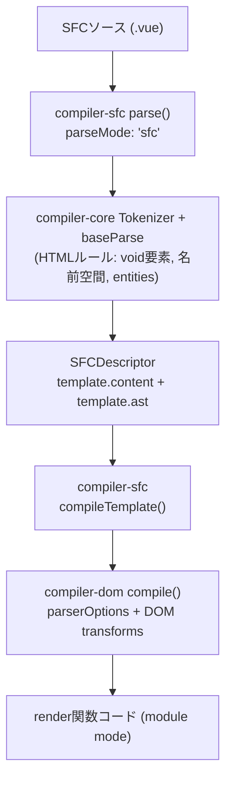

[日本語ページ](../ja/) / [English page](../en/)

## スライド

[スライド版ページ](https://records.yamanoku.net/vuefes-japan-2026/slide/)

## 発表概要

VueのSFCにはtemplateブロックにてHTMLを記述できる構文が備わっていることは周知の事実だと思いますが、Vueを使った開発をするときにどのように「HTMLの正しさ」を検証しているか皆さんは説明できますでしょうか？

VueのSFCにおけるtemplate内ではHTMLの要素間のネスト違反があっても、開発時に警告してきますが明確にコンパイルエラーにはなりません。HTMLの字句的・構文的ルールについても検出されますが、具体的なHTML要素の使い方に関しては関与していません。

本セッションでは、Vue SFCのtemplateブロックで書かれたHTMLの内容をコンパイラがどのように解釈しているかについてを仕組みから紐解き、DOMのコンパイラだけでは保てないHTMLの正しさについてをLinterといった静的解析エコシステム（ESLint、Markuplint、Biome、OxC、Vizeなど）たちによって今現在どのように守れるかについてを紹介します。

HTMLの仕様はLiving Standardとして今なお更新されています。そんなHTMLと正しく向き合いながら、Vueで堅牢なマークアップとHTMLによるアクセシブルなアウトプットを実現する知見を提供します。

## 想定聴衆

- Vue中級者以上向け
- VueのコンパイラやSFCの内部の仕組みを知りたい方
- HTMLにおけるLinterエコシステムの状況を知りたい人
- HTMLをより正しく使っていきたい人

## 構成（各約10分）

1. HTMLの歴史と現在の仕様について（聴衆に仕様へ馴染みのない方も多い想定のため、内容を厚めに）
2. VueでHTMLはどのように使われているのか
3. VueでHTMLの正しさを検証するためのツール紹介

時間配分は均等でも、第1部はスライドを多めにして丁寧に進め、第2・3部は要点を絞って同じ10分に収めます。

---

## Vue開発で「HTMLの正しさ」をどう検証していますか？

今日はこの問いに、3部構成で答えを出していきます。

## 1. HTMLの歴史と現在の仕様について

普段、HTMLをどこで見かけていますか。Webサイト、管理画面、コンポーネントライブラリ、SSRの差分比較など、フロントエンド開発のあちこちにHTMLがあります。

HTMLは生まれて約37年になります。1990年代前半に誕生し、文書のためのマークアップとして広がりました。その後、アプリのUI宣言やDOMの差分比較の対象にもなり、「古い技術」ではなく今も更新され続ける基盤になっています。

### 文書の言語から、アプリの基盤へ

初期は見出し・段落・リンクなど文書構造を表す言語でした。中期にはフォームやインタラクションが増え、現在はSPA / SSR / デザインシステムでも最終出力がHTMLであることが多くあります。Vueでtemplateを書いていても、ブラウザが受け取る最終成果物はHTMLです。だから仕様の理解は、フレームワーク以前の共通基盤になります。

### 仕様はどう進化してきたか

| 時期 | 出来事 |
| --- | --- |
| 1997 | HTML 4 |
| 2000頃 | XHTML 1.0（XML寄りへの分岐） |
| 2004 | WHATWG 発足（互換性を重視した進化） |
| 2014 | W3C HTML5 Recommendation |
| 2019〜 | WHATWG Living Standard を単一の正とする合意 |

XHTMLは「厳格に書いて止める」方向、HTMLは「壊れても補正して表示する」方向でした。いま現場で主に使うのは後者のHTML構文で、その結果、誤りがあっても画面は動いて見えやすくなっています。

### いまのHTMLは Living Standard

正本は [HTML Standard（WHATWG）](https://html.spec.whatwg.org/) です。凍結されたバージョン名より、継続更新される仕様本文が基準になります。2019年以降、W3CもこのLiving Standardを前提に協調しています。OpenUI / Interop / HTML Day など、実装とコミュニティの動きも続きます。

Living Standardでは、要素や属性の扱いが実装状況に合わせて更新され得ます。「昔からの慣習」が今の仕様では非推奨・非適合なこともあり、[Non-conforming features](https://html.spec.whatwg.org/#non-conforming-features) も明示されています。だからこそ、記憶だけに頼らず機械検証が効きます。

### 「動くHTML」と「正しいHTML」は違う

たとえば `p` の中に `div` を置くと、パーサが補正し、実際のDOMは意図と違う形になり得ます。HTML構文はエラーでも最後までパースするため、画面は出ても構造・スタイル・アクセシビリティに副作用が出ます。

マークアップに唯一の正解はありません。それでも品質の良し悪しと、明確な誤りはあります。「良いHTML」の条件としては、セマンティックであること、アクセシブルであること、誤りがないこと、保守しやすいことなどが挙げられます。まずは誤りをなくすことがスタート地点です。

誤りは次の3つのルールに分類できます。

### 字句的ルール

タグの閉じ方、属性の書き方など。違反するとパーサがエラーを出し、DOMツリーが正しく作れません。HTML構文では補正されて「動いて」見えることがあります。

### 語彙的ルール

使える要素・属性と、**内容モデル（content model）** による入れ子ルール。違反してもパーサは止まらず、望ましくないDOMになります。

| 親 | 置けない例 | なぜまずいか |
| --- | --- | --- |
| `p` | `div`, `p`, `ul` | 段落の中にブロックを入れられない |
| `label` | `div`, `p` | ラベルの内容モデル外 |
| `a` | `a` | リンクの入れ子は不可 |
| `ul` / `ol` | 直接の `div` | 子は基本的に `li` |

### 意味論的ルール

要素の意味と使い方、アクセシビリティ。文法として正しくても伝わる意味が違うことがあります（見た目のためだけに `h1` を使う、ボタンを `a` で作る、など）。ツールだけでは完全には検出できず、レビューと経験が必要です。

### 第1部のまとめ

HTMLはLiving Standardとして今も更新されています。「動く」ことと「正しい」ことは一致しません。正しさは字句 / 語彙 / 意味論で切り分け、その土台の上でVueのtemplateを見直します。

## 2. VueでHTMLはどのように使われているのか

フレームワークごとの扱いも分かれます。

| 系統 | 例 | 扱い |
| --- | --- | --- |
| HTMLをDSLとして使う | Vue / Svelte / Ripple | template等で宣言的UI |
| JSXでHTML風に書く | React / SolidJS / Preact | JSの中の式（XHTML寄り？） |
| HTMLファースト | Alpine.js / htmx | HTMLを起点に振る舞いを足す |

文脈整理として他フレームワークにも触れますが、以降はVueに絞ります。Vueのtemplateは「HTMLっぽいDSL」です。見た目はHTMLですが、最終的には仮想DOM生成の関数へと変換されます。

### コンパイルパイプライン

コンパイルはざっくり次の3段階です。

1. **Parse** — HTML文字列 → AST
2. **Transform** — AST の変換
3. **Generate** — AST → JSコード文字列

<figure>



<figcaption>SFCソースが parse / compileTemplate / compiler-dom を経て render 関数コードになる流れ</figcaption>
</figure>

`compiler-sfc` はファイルを `parse()` で `SFCDescriptor` に分解し、`compileScript` と `compileTemplate` がそれぞれ `<script>` / `<template>` を処理します。

### template は最終的に Hyperscript になる

たとえば次のような不正なネストがあっても、コンパイル後は「関数呼び出し」として成立し得ます。

```html
<template>
  <p>
    <div>block</div>
  </p>
</template>
```

仮想DOM生成では要素をプログラム的に作るため、ブラウザのHTMLパーサが行うような再配置が起きないからです。

### ネスト違反は「警告」止まり

Vue 3.4以降、`compiler-dom` の `validateHtmlNesting` により、不正なネストが開発時に警告されます。

> `<h1>` cannot be child of `<p>`, according to HTML specifications. This can cause hydration errors or potentially disrupt future functionality.

<figure>


<figcaption>開発時のネスト警告の例。ありがたいDXだが、警告を無視すればそのまま動いてしまう</figcaption>
</figure>

これは `onWarn` による**開発時の警告**であり、明確なコンパイルエラーではありません。

Vueコンパイラが見る範囲は次のとおりです。

| ルール | Vueコンパイラ |
| --- | --- |
| 字句的 | △〜○（パースできる範囲） |
| 語彙的（内容モデル） | 一部を開発時警告 |
| 意味論的 | ✕ |

つまり、Vue自身はHTMLセマンティクスを最終保証しません。

### コンパイラだけでは守れない隙間

| レイヤー | 例 | 限界 |
| --- | --- | --- |
| 実行時 | ハイドレーションミスマッチ警告 | 正しさの保証ではない |
| 型 | TypeScript（`HTMLElement` など） | DOM APIの型であり適合性ではない |
| `<head>` など | template外のマークアップ | Vueコンパイラだけでは見にくい |
| 成果物 | 出力HTMLの静的解析 | ビルド後にしか見えない |

### 補足：Vapor Mode / Pug

- **Vapor Mode** — VDOMモードでは不正ネストも「動いて」きた歴史がありますが、Vapor は `innerHTML` ベースのテンプレート生成に寄り、ブラウザのHTMLパーサの修復がそのまま効きます。不正ネストがコンパイル結果と実DOMの不一致・実行時クラッシュにつながり得ます（例: [vuejs/core#15256](https://github.com/vuejs/core/issues/15256)）。
- **Pug**（`<template lang="pug">`）— `eslint-plugin-vue` だけでは効かない場合があり、コミュニティ製プラグイン（例: `eslint-plugin-vue-pug`）が必要になります。

どちらも結論は同じで、コンパイル形態やDSLを変えても「正しさを誰が保証するか」は別途設計が要ります。

## 3. VueでHTMLの正しさを検証するためのツール紹介

Vueのテンプレートは最終的に Hyperscript に変換されるため、不正なネストでも関数としては通ってしまいます。コンパイラや実行時のVue自身はHTMLセマンティクスを制御・検証しません。だからブラウザが意図せぬDOM修正を起こす前に、静的解析が隙間を埋める必要があります。

### Vue周辺で使えるツールたち

- [eslint-plugin-vue](https://eslint.vuejs.org/) — 字句的（構文）を中心に
- [Markuplint](https://markuplint.dev/) — **HTML仕様のマークアップルールを最も厚く継承**
- [Vize](https://vizejs.dev/) — Vue向け。HTML rules をアクセシビリティと分離
- [Biome](https://biomejs.dev/) / [OxLint（OxC）](https://oxc.rs/) — HTML対応は拡充途上（補足）

アクセシビリティLintとは起点が違います。ここではHTML適合性の側を見ます。Markuplintは Biome / OxC と同列ではなく、eslint-plugin-vue や Vize と同じく個別に取り上げます。

### eslint-plugin-vue

`vue/no-parsing-error` は template 内の構文エラー（HTML含む）を報告します。WHATWG HTMLの字句的な構文エラーを多く検知でき、essential系のプリセットにも含まれます。一方で、語彙的ルール全般や意味論まではカバーしません。

### Markuplint — HTML仕様を継承するLint

紹介するLinterの中で、Markuplintは HTML Living Standard ベースの**適合性検証に特化**しており、マークアップルールの継承が圧倒的に厚いです。`@markuplint/vue-parser` / `@markuplint/vue-spec` で `.vue` を扱えます。

代表ルール:

- [`permitted-contents`](https://markuplint.dev/docs/rules/permitted-contents) — 内容モデル（語彙的）
- [`no-obsolete-element`](https://markuplint.dev/docs/rules/no-obsolete-element) — 廃止要素
- [`require-accessible-name`](https://markuplint.dev/docs/rules/require-accessible-name) — アクセシブルネーム（意味論寄り）

字句・語彙・意味論のうち、特に語彙的ルール（内容モデル）を仕様データから検証できるのが強みです。

### Biome / OxC — 拡充途上の補足枠

| ツール | HTMLまわりの現状 |
| --- | --- |
| Biome | HTML rules が増えつつある（重複属性、一部内容モデル、アクセシビリティなど） |
| OxLint | HTML lint は Out of Scope。Vue template lint も未対応 |

速度や統合ツールチェーンとしては有望ですが、HTMLマークアップルールの厚みでは Markuplint に及びません。本線は eslint-plugin-vue / Markuplint / Vize です。

### Vize の HTML Rules

[Vize](https://vizejs.dev/rules/html/index.html) は HTML適合性を Vue固有ルール / アクセシビリティから分離して提供しています。特に重要なのが `html/cross-component-nesting` です。

```html
<!-- App.vue -->
<template>
  <p>Summary <InfoCard /></p>
</template>

<!-- InfoCard.vue -->
<template>
  <div class="card"><slot /></div>
</template>
```

各ファイル単体では合法でも、合成結果は実質 `<p><div>…</div></p>` となり不正です。`vize lint --cross-file` のようにファイル横断で見て初めて防げる領域です。

### ツールが見るもの / 見ないもの

| 観点 | コンパイラ | ESLint-vue | Markuplint | Biome/OxC | Vize |
| --- | --- | --- | --- | --- | --- |
| 字句的 | △〜○ | ○ | ○ | △ | ○ |
| 語彙的・ネスト（単ファイル） | 警告 | 限定的 | ○ | △ | ○ |
| 語彙的・ネスト（クロスファイル） | ✕ | ✕ | Pretenders等で一部 | ✕寄り | ○ |
| 非推奨・廃止要素 | ✕ | ✕寄り | ○ | △ | ○ |
| 意味論 / アクセシビリティ | ✕ | 別プラグイン | ○寄り | △〜○ | 別ルール群 |

大事なのは「どれか一つに全部任せる」のではなく、守備範囲の違いを理解して組み合わせることです。HTML仕様の厚みでは Markuplint が突出しています。`<head>` や TypeScript の型、出力後の静的解析まで含めて、誰が何を見るかを設計します。

## まとめ

1. **仕様** — Living Standardと、字句 / 語彙 / 意味論（各約10分のうち、ここを厚めに）
2. **Vueでの使い方** — templateはHTMLっぽいDSL。コンパイラは最終保証しない
3. **検証ツール** — eslint-plugin-vue / Markuplint / Vize を軸に隙間を埋める（Biome・OxCは補足）

実践としては次のとおりです。

1. **コンパイラの守備範囲を理解する**（警告≠保証）
2. **Linterで「Vueの隙間」を埋める**（構文: eslint-plugin-vue / HTML適合性: Markuplint / クロスファイル: Vize）
3. **コンポーネント境界をまたぐ正しさも見る**
4. Living StandardとしてのHTMLに追随する
5. 堅牢なマークアップ → アクセシブルなアウトプットへ

HTMLと正しく向き合いながら、Vueで堅牢なマークアップを実現していきましょう。

## 参考・関連

- [セッションページ](https://vuefes.jp/2026/speaker/yamanoku)
- [HTML Standard](https://html.spec.whatwg.org/)
- [Vue: validateHtmlNesting](https://github.com/vuejs/core/blob/main/packages/compiler-dom/src/transforms/validateHtmlNesting.ts)
- [eslint-plugin-vue: no-parsing-error](https://eslint.vuejs.org/rules/no-parsing-error.html)
- [Markuplint](https://markuplint.dev/) / [permitted-contents](https://markuplint.dev/docs/rules/permitted-contents)
- [Vize HTML Rules](https://vizejs.dev/rules/html/index.html)
- [WHATWG: Non-conforming features](https://html.spec.whatwg.org/#non-conforming-features)
- [弁護士ドットコム 新卒研修2025 HTML/CSS（太田良典）](https://speakerdeck.com/bengo4com/20250405-bengo4com-htmlcss)
- [新卒エンジニア向けHTML/CSS研修を開催しました（Creators’ blog）](https://creators.bengo4.com/entry/2025/08/01/080000)
