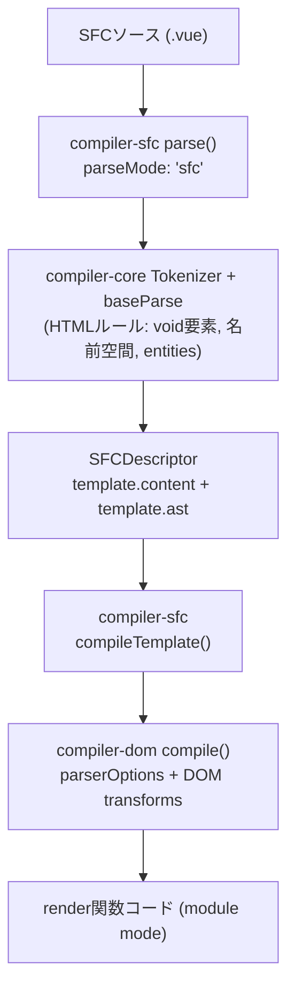

[日本語ページ](../ja/) / [English page](../en/)

## スライド

[スライド版ページ](https://records.yamanoku.net/vuefes-japan-2026/slide/)

---

## はじめに

やまのくと申します。会社員で、一児の父です。WebアクセシビリティとHTMLが好きで、Vue Fes Japan 2025では[生成AI時代のWebアプリケーションアクセシビリティ改善](https://records.yamanoku.net/vuefes-japan-2025/ja/)という発表をさせていただきました。

今回は、その延長線上で、VueのSFCにおけるHTMLそのものに焦点を当てます。

皆さん、Vueを使った開発をするとき、「HTMLの正しさ」をどのように検証しているか、明確に答えられるでしょうか？

VueのSFCには `<template>` でHTMLを書ける構文があります。これは周知の事実だと思います。一方で、要素間のネスト違反があっても開発時の警告にとどまり、明確なコンパイルエラーにはなりません。字句的・構文的なルールはある程度見ますが、具体的なHTML要素の使い方までは関与していません。

本日は、コンパイラがtemplateをどう解釈しているかを仕組みから紐解き、コンパイラだけでは保てないHTMLの正しさを、Linterといった静的解析（ESLint、Markuplint、Biome、OxC、Vizeなど）でいまどう守れるかを紹介します。

それでは、本題に入っていきましょう。

## HTMLの歴史と現在の仕様について

皆さんは普段、HTMLをどこで見かけていますか。Webサイト、管理画面、コンポーネントライブラリ、SSRの差分比較など、フロントエンド開発のあちこちにあります。

HTMLは生まれて約37年になります。1990年代前半に文書のためのマークアップとして広がり、その後アプリのUIやDOM差分比較の対象にもなりました。「古い技術」ではなく、今も更新され続ける基盤です。

初期は見出し・段落・リンクなど文書構造を表す言語でした。中期にはフォームやインタラクションが増え、現在はSPA / SSR / デザインシステムでも最終出力がHTMLであることが多いです。Vueでtemplateを書いていても、ブラウザが受け取る最終成果物はHTMLです。だから仕様の理解は、フレームワーク以前の共通基盤になります。

仕様の進化をざっくり押さえておきます。

| 時期 | 出来事 |
| --- | --- |
| 1997 | HTML 4 |
| 2000頃 | XHTML 1.0（XML寄りへの分岐） |
| 2004 | WHATWG 発足（互換性を重視した進化） |
| 2014 | W3C HTML5 Recommendation |
| 2019〜 | WHATWG Living Standard を単一の正とする合意 |

XHTMLは「厳格に書いて止める」方向、HTMLは「壊れても補正して表示する」方向でした。いま現場で主に使うのは後者のHTML構文です。その結果、誤りがあっても画面は動いて見えやすい。これは利用者には良いことですが、開発者にとっては「動いている＝正しい」と錯覚しやすい土壌でもあります。

いまのHTMLの正本は [HTML Standard（WHATWG）](https://html.spec.whatwg.org/) です。凍結されたバージョン名より、継続更新される仕様本文が基準です。2019年以降、W3CもこのLiving Standardを前提に協調しています。OpenUI / Interop / HTML Day など、実装とコミュニティの動きも続きます。

Living Standardでは、要素や属性の扱いが実装状況に合わせて更新され得ます。「昔からの慣習」が今の仕様では非推奨・非適合なこともあり、[Non-conforming features](https://html.spec.whatwg.org/#non-conforming-features) も明示されています。だからこそ、記憶だけに頼らず機械検証が効きます。

ここで大事なのは、「動くHTML」と「正しいHTML」は違う、ということです。

たとえば `p` の中に `div` を置くと、パーサが補正し、実際のDOMは意図と違う形になり得ます。HTML構文はエラーでも最後までパースするため、画面は出ても構造・スタイル・アクセシビリティに副作用が出ます。

マークアップに唯一の正解はありません。それでも品質の良し悪しと、明確な誤りはあります。「良いHTML」の条件としては、セマンティックであること、アクセシブルであること、誤りがないこと、保守しやすいことなどが挙げられます。まずは誤りをなくすことがスタート地点です。弁護士ドットコムの[新卒向けHTML/CSS研修](https://speakerdeck.com/bengo4com/20250405-bengo4com-htmlcss)でも強調されていた論点でもあります。

誤りは、次の3つのルールに分類できます。

### 字句的ルール

タグの閉じ方、属性の書き方などです。違反するとパーサがエラーを出し、DOMツリーが正しく作れません。ただしHTML構文では補正されて「動いて」見えることがあります。

### 語彙的ルール

使える要素・属性と、**内容モデル（content model）** による入れ子ルールです。違反してもパーサは止まらず、望ましくないDOMになります。

| 親 | 置けない例 | なぜまずいか |
| --- | --- | --- |
| `p` | `div`, `p`, `ul` | 段落の中にブロックを入れられない |
| `label` | `div`, `p` | ラベルの内容モデル外 |
| `a` | `a` | リンクの入れ子は不可 |
| `ul` / `ol` | 直接の `div` | 子は基本的に `li` |

### 意味論的ルール

要素の意味と使い方、アクセシビリティです。文法として正しくても伝わる意味が違うことがあります。見た目のためだけに `h1` を使う、ボタンを `a` で作る、意味のある画像に `alt` がない、などです。ツールだけでは完全には検出できず、レビューと経験が必要です。

第1部のまとめです。HTMLはLiving Standardとして今も更新されています。「動く」ことと「正しい」ことは一致しません。正しさは字句 / 語彙 / 意味論で切り分け、その土台の上でVueのtemplateを見直していきます。

## VueでHTMLはどのように使われているのか

ここからは、VueがこのHTMLをどう扱い、どこまで保証するのかを見ていきます。

フレームワークごとの扱いも分かれます。

| 系統 | 例 | 扱い |
| --- | --- | --- |
| HTMLをDSLとして使う | Vue / Svelte / Ripple | template等で宣言的UI |
| JSXでHTML風に書く | React / SolidJS / Preact | JSの中の式（閉じタグ必須などXML寄りの慣習） |
| HTMLファースト | Alpine.js / htmx | HTMLを起点に振る舞いを足す |

文脈整理として他フレームワークにも触れますが、以降はVueに絞ります。Vueの本線はtemplate DSLで、「HTMLっぽいDSL」として書けます。見た目はHTMLですが、最終的には仮想DOM生成の関数へと変換されます。JSX経路（[Vue JSX](https://vuejsx.dev/)）もありますが、後の補足で触れます。

コンパイルはざっくり次の3段階です。

1. **Parse** — HTML文字列 → AST
2. **Transform** — AST の変換
3. **Generate** — AST → JSコード文字列

<figure>



<figcaption>SFCソースが parse / compileTemplate / compiler-dom を経て render 関数コードになる流れ</figcaption>
</figure>

`compiler-sfc` はファイルを `parse()` で `SFCDescriptor` に分解し、`compileScript` と `compileTemplate` がそれぞれ `<script>` / `<template>` を処理します。

コンパイラはHTMLを次のように解釈します。

- **Parse時**: void要素・名前空間・実体参照など、HTML寄りの字句ルールでASTを作る
- **Transform時**: Vueディレクティブや最適化をASTに適用する
- **Generate時**: 最終成果物はブラウザ向けHTML文字列ではなく、仮想DOMを作るJavaScript

つまり template の見た目はHTMLでも、出力は「DOMを組み立てるプログラム」です。VueはHTMLをパースしますが、ブラウザのHTMLパーサと同じ最終DOMを保証するわけではありません。ここが、今日の本題の分岐点です。

たとえば次のような不正なネストがあっても、コンパイル後は「関数呼び出し」として成立し得ます。

```html
<template>
  <p>
    <div>block</div>
  </p>
</template>
```

仮想DOM生成では要素をプログラム的に作るため、ブラウザのHTMLパーサが行うような再配置が起きないからです。

では、Vueは何もしないのかというと、そうではありません。Vue 3.4以降、`compiler-dom` の `validateHtmlNesting` により、不正なネストが開発時に警告されます。

> `<h1>` cannot be child of `<p>`, according to HTML specifications. This can cause hydration errors or potentially disrupt future functionality.

（`<p>` の子に `<h1>` は置けません。HTML仕様に従っています。ハイドレーションエラーや将来の機能への影響を引き起こす可能性があります。）

<figure>


<figcaption>開発時のネスト警告の例。ありがたいDXだが、警告を無視すればそのまま動いてしまう</figcaption>
</figure>

これは `onWarn` による**開発時の警告**であり、明確なコンパイルエラーではありません。ありがたいDXですが、警告を無視すればそのまま動いてしまいます。

Vueコンパイラが見る範囲は次のとおりです。

| ルール | Vueコンパイラ |
| --- | --- |
| 字句的 | △〜○（パースできる範囲） |
| 語彙的（内容モデル） | 一部を開発時警告 |
| 意味論的 | ✕ |

つまり、Vue自身はHTMLセマンティクスを最終保証しません。コンパイラだけでは守れない隙間もあります。

| レイヤー | 例 | 限界 |
| --- | --- | --- |
| 実行時 | ハイドレーションミスマッチ警告 | 正しさの保証ではない |
| 型 | TypeScript（`HTMLElement` など） | DOM APIの型であり適合性ではない |
| `<head>` など | template外のマークアップ | Vueコンパイラだけでは見にくい |
| 成果物 | 出力HTMLの静的解析 | ビルド後にしか見えない |

補足として、形態が変わっても結論は同じ、という話をします。

### Vapor Mode
VDOMモードでは不正ネストも「動いて」きた歴史がありますが、Vapor は `innerHTML` ベースのテンプレート生成に寄り、ブラウザのHTMLパーサの修復がそのまま効きます。不正ネストがコンパイル結果と実DOMの不一致・実行時クラッシュにつながり得ます（例: [vuejs/core#15256](https://github.com/vuejs/core/issues/15256)）。

### Pug
`eslint-plugin-vue` だけでは効かない場合があり、コミュニティ製プラグイン（例: `eslint-plugin-vue-pug`）が必要になります。

### Vue JSX
VueでもJSXでUIを書けます。Virtual DOM / Vapor Mode に対応し、Oxcベースの高速コンパイラをうたうプロジェクトです。見た目はHTMLでも本質は **JS式 → レンダー関数** であり、SFCの `<template>` とは検証経路が異なります。`validateHtmlNesting` や `eslint-plugin-vue` の守備範囲は主に `<template>` 向けなので、JSXを使う場合は別途、誰がHTMLの正しさを見るかを設計する必要があります。ネスト検証の一例として [`eslint-plugin-validate-jsx-nesting`](https://github.com/MananTank/eslint-plugin-validate-jsx-nesting) があります。

## VueでHTMLの正しさを検証するためのツール紹介

ここまで見てきた通り、Vueのテンプレートは最終的に Hyperscript に変換されるため、不正なネストでも関数としては通ってしまいます。コンパイラや実行時のVue自身はHTMLセマンティクスを制御・検証しません。だからブラウザが意図せぬDOM修正を起こす前に、静的解析が隙間を埋める必要があります。

本日紹介するツールは次のとおりです。

- [eslint-plugin-vue](https://eslint.vuejs.org/) — 字句的（構文）を中心に
- [Markuplint](https://markuplint.dev/) — HTML仕様のマークアップルールを最も厚く継承
- [Vize](https://vizejs.dev/) — Vue向け。HTML rules をアクセシビリティと分離
- [Biome](https://biomejs.dev/) / [OxLint（OxC）](https://oxc.rs/) — HTML対応は拡充途上（補足）

アクセシビリティLintとは起点が違います。ここではHTML適合性の側を見ます。Markuplintは Biome / OxC と同列ではなく、eslint-plugin-vue や Vize と同じく個別に取り上げます。

まず [eslint-plugin-vue](https://eslint.vuejs.org/) です。`vue/no-parsing-error` は template 内の構文エラー（HTML含む）を報告します。WHATWG HTMLの字句的な構文エラーを多く検知でき、essential系のプリセットにも含まれます。一方で、語彙的ルール全般や意味論まではカバーしません。

次に Markuplint です。紹介するLinterの中で、Markuplintは HTML Living Standard ベースの**適合性検証に特化**しており、マークアップルールの継承が圧倒的に厚いです。`@markuplint/vue-parser` / `@markuplint/vue-spec` で `.vue` を扱えます。

代表ルールは次のとおりです。

- [`permitted-contents`](https://markuplint.dev/docs/rules/permitted-contents) — 内容モデル（語彙的）
- [`no-obsolete-element`](https://markuplint.dev/docs/rules/no-obsolete-element) — 廃止要素
- [`require-accessible-name`](https://markuplint.dev/docs/rules/require-accessible-name) — アクセシブルネーム（意味論寄り）

字句・語彙・意味論のうち、特に語彙的ルール（内容モデル）を仕様データから検証できるのが強みです。

Vueコンポーネントを描画結果のネイティブHTML要素に見立てて検証する [Pretenders](https://markuplint.dev/docs/guides/besides-html) もあります。たとえば `List` → `ul`、`Item` → `li` とマップすると、コンポーネント境界をまたぐ語彙的ルールを仕様データ側から補強できます。手動マップのほか、Vue向けの scan も可能です。

Biome / OxC は拡充途上の補足枠として押さえます。

| ツール | HTMLまわりの現状 |
| --- | --- |
| Biome | 字句: [`noDuplicateAttributes`](https://biomejs.dev/linter/rules/no-duplicate-attributes/)。語彙寄り: [`noObsoleteTags`](https://biomejs.dev/linter/rules/no-obsolete-tags/)、[`noMisplacedListElements`](https://biomejs.dev/linter/rules/no-misplaced-list-elements/)（nursery）。意味論寄り: [`useSemanticElements`](https://biomejs.dev/linter/rules/use-semantic-elements/) など。`.vue` は experimental |
| OxLint | [HTML lint は Out of Scope](https://oxc.rs/compatibility)。Vue は script 中心で template lint は未対応 |

速度や統合ツールチェーンとしては有望ですが、HTMLマークアップルールの厚みでは Markuplint に及びません。本線は eslint-plugin-vue / Markuplint / Vize です。

そして Vize です。[Vize](https://vizejs.dev/rules/html/index.html) は HTML適合性を Vue固有ルール / アクセシビリティから分離して提供しています。特に重要なのが `html/cross-component-nesting` です。

```html
<!-- App.vue -->
<template>
  <p>Summary <InfoCard /></p>
</template>

<!-- InfoCard.vue -->
<template>
  <div class="card"><slot /></div>
</template>
```

各ファイル単体では合法でも、合成結果は実質 `<p><div>…</div></p>` となり不正です。`vize lint --cross-file` のようにファイル横断で見て初めて防げる領域です。

ツールが見るもの / 見ないものを一覧にすると、次のようになります。

| 観点 | コンパイラ | ESLint-vue | Markuplint | Biome/OxC | Vize |
| --- | --- | --- | --- | --- | --- |
| 字句的 | △〜○ | ○ | ○ | △ | ○ |
| 語彙的・ネスト（単ファイル） | 警告 | 限定的 | ○ | △ | ○ |
| 語彙的・ネスト（クロスファイル） | ✕ | ✕ | Pretenders等で一部 | ✕寄り | ○ |
| 非推奨・廃止要素 | ✕ | ✕寄り | ○ | △ | ○ |
| 意味論 / アクセシビリティ | ✕ | 別プラグイン | ○寄り | △〜○ | 別ルール群 |

大事なのは「どれか一つに全部任せる」のではなく、守備範囲の違いを理解して組み合わせることです。HTML仕様の厚みでは Markuplint が突出しています。`<head>` や TypeScript の型、出力後の静的解析まで含めて、誰が何を見るかを設計します。

## おわりに

今日の3部をおさらいします。

1. **仕様** — Living Standardと、字句 / 語彙 / 意味論
2. **Vueでの使い方** — templateはHTMLっぽいDSL。コンパイラは最終保証しない
3. **検証ツール** — eslint-plugin-vue / Markuplint / Vize を軸に隙間を埋める（Biome・OxCは補足）

実践としては、次の一歩をお勧めします。

1. **コンパイラの守備範囲を理解する**（警告≠保証）
2. **Linterで「Vueの隙間」を埋める**（構文: eslint-plugin-vue / HTML適合性: Markuplint / クロスファイル: Vize）
3. **コンポーネント境界をまたぐ正しさも見る**
4. Living StandardとしてのHTMLに追随する
5. 堅牢なマークアップ → アクセシブルなアウトプットへ

おすすめは、eslint-plugin-vueで構文を押さえつつ、Markuplintで仕様ベースの適合性を、Vizeでクロスファイルを補強する組み合わせです。Biome / OxCはこれから追う補足枠です。

HTMLの仕様は今も更新されています。Vueのコンパイルの仕組みを理解したうえで、静的解析という防波堤を立て、堅牢なマークアップとアクセシブルなアウトプットを一緒に実現していきましょう。

## 参考文献

- [HTML Standard](https://html.spec.whatwg.org/)
- [WHATWG: Non-conforming features](https://html.spec.whatwg.org/#non-conforming-features)
- [Vue: validateHtmlNesting](https://github.com/vuejs/core/blob/main/packages/compiler-dom/src/transforms/validateHtmlNesting.ts)
- [eslint-plugin-vue: no-parsing-error](https://eslint.vuejs.org/rules/no-parsing-error.html)
- [Markuplint](https://markuplint.dev/)
- [Vize HTML Rules](https://vizejs.dev/rules/html/index.html)
- [Biome: noDuplicateAttributes](https://biomejs.dev/linter/rules/no-duplicate-attributes/) / [noObsoleteTags](https://biomejs.dev/linter/rules/no-obsolete-tags/) / [noMisplacedListElements](https://biomejs.dev/linter/rules/no-misplaced-list-elements/) / [useSemanticElements](https://biomejs.dev/linter/rules/use-semantic-elements/)
- [OxC Compatibility](https://oxc.rs/compatibility)
- [Vue JSX](https://vuejsx.dev/)
- [eslint-plugin-validate-jsx-nesting](https://github.com/MananTank/eslint-plugin-validate-jsx-nesting)
- [弁護士ドットコム 新卒研修2025 HTML/CSS（太田良典）](https://speakerdeck.com/bengo4com/20250405-bengo4com-htmlcss)
