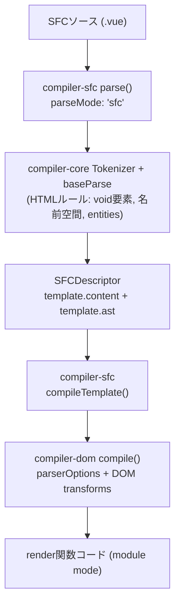

<h1 mt="24">Vue SFCから見直す<br>正しいHTMLの守り方</h1>

<div mt="5">
Vue Fes Japan 2026 | <time datetime="2026-10-24">2026-10-24</time>
</div>

<div mt="6">

[ドキュメントページ版（日本語）](https://records.yamanoku.net/vuefes-japan-2026/ja/) | [Document Page Version（English）](https://records.yamanoku.net/vuefes-japan-2026/en/)

</div>

<div class="absolute bottom-10">
  <span class="text-6 font-700">
    やまのく（yamanoku）
  </span>
</div>

<!--
サイボウズトラック 14:20 - 14:50。本日はお集まりいただきありがとうございます。
-->

---

## 発表者：やまのく（yamanoku）

- 会社員 / 一児の父
- WebアクセシビリティとHTMLが好き
- Vue Fes Japan Online 2022 / 2023 / 2025 に続き登壇

<!--
やまのくと申します。会社員で、一児の父です。WebアクセシビリティとHTMLが好きで、Vue Fes Japan Online 2022では「Vue.jsでアクセシブルなコンポーネントをつくるために」、2023では「画面遷移から考えるNuxtアプリケーションをアクセシブルにする方法」、2025では「生成AI時代のWebアプリケーションアクセシビリティ改善」という発表をさせていただきました。今回は、その延長線上で、VueのSFCにおけるHTMLそのものに焦点を当てます。

VueのSFCには template でHTMLを書ける構文があります。これは周知の事実だと思います。一方で、要素間のネスト違反があっても開発時の警告にとどまり、明確なコンパイルエラーにはなりません。字句的・構文的なルールはある程度見ますが、具体的なHTML要素の使い方までは関与していません。

本日は、コンパイラがtemplateをどう解釈しているかを仕組みから紐解き、コンパイラだけでは保てないHTMLの正しさを、Linterといった静的解析——ESLint、Markuplint、Biome、OxC、Vizeなど——でいまどう守れるかを紹介します。想定しているのは、Vue中級者以上で、コンパイラやSFCの仕組み、HTMLのLinterエコシステム、正しいマークアップに関心のある方です。
-->

---
layout: statement
---

# Vue開発で<br>HTMLの「正しさ」を<br>どう検証していますか？

<!--
皆さん、Vueを使った開発をするとき、「HTMLの正しさ」をどのように検証しているか、明確に答えられるでしょうか？
-->

---

## アジェンダ（各約10分）

1. **HTMLの歴史と現在の仕様について**（厚めに丁寧に）
2. **VueでHTMLはどのように使われているのか**
3. **VueでHTMLの正しさを検証するためのツール紹介**

<!--
持ち時間は30分です。次の3部で進めます。聴衆にHTML仕様へ馴染みのない方も多い想定なので、第1部はスライド枚数を多めにして丁寧に進めます。第2・3部は要点を絞って同じ10分に収めます。それでは、本題に入っていきましょう。
-->

---
layout: section
---

# 1. HTMLの歴史と<br>現在の仕様について

<!--
本題に入る前に、前提を揃えたいと思います。約10分。仕様に詳しくない方も多い想定なので、ここを厚めに丁寧に進めます。Vueの話に入る前に、「正しさ」の土台を共有します。
-->

---
layout: statement
---

# 普段、HTMLを<br>どこで見かけていますか？

<!--
普段、HTMLをどこで見かけていますか。Webサイト、管理画面、コンポーネントライブラリ、SSRの差分比較など、フロントエンド開発のあちこちにあります。
-->

---

## HTMLは生まれて約37年

- 1990年代前半に誕生し、**文書**のためのマークアップとして広がった
- その後、**アプリのUI**やDOMの差分比較の対象にもなった
- 「古い技術」ではなく、今も更新され続けている基盤

<!--
HTMLは生まれて約37年になります。1990年代前半に文書のためのマークアップとして広がり、その後アプリのUIやDOM差分比較の対象にもなりました。「古い技術」ではなく、今も更新され続ける基盤です。
-->

---

## 文書の言語から、アプリの基盤へ

- 初期: 見出し・段落・リンクなど、文書構造を表す
- 中期: フォームやインタラクションが増え、アプリでも使われる
- 現在: SPA / SSR / デザインシステムでも、最終出力はHTMLであることが多い

<!--
初期は見出し・段落・リンクなど文書構造を表す言語でした。中期にはフォームやインタラクションが増え、現在はSPA / SSR / デザインシステムでも最終出力がHTMLであることが多いです。Vueでtemplateを書いていても、ブラウザが受け取る最終成果物はHTMLです。だから仕様の理解は、フレームワーク以前の共通基盤になります。
-->

---

## 仕様はどう進化してきたか

| 時期 | 出来事 |
| --- | --- |
| 1997 | HTML 4 |
| 2000頃 | XHTML 1.0（XML寄りへの分岐） |
| 2004 | WHATWG 発足（互換性を重視した進化） |
| 2014 | W3C HTML5 Recommendation |
| 2019〜 | WHATWG Living Standard を単一の正とする合意 |

<!--
仕様の進化をざっくり押さえておきます。並走と合意を経て、今はLiving Standardとして更新され続けています。「完成して終わった仕様」ではない、という点が大事です。
-->

---

## XHTMLの分岐が残したもの

- XHTMLは「厳格に書いて止める」方向（XML）
- HTMLは「壊れても補正して表示する」方向（互換性）
- いま現場で主に使うのは後者のHTML構文
- その結果、**誤りがあっても画面は動いて見える**

<!--
XHTMLは「厳格に書いて止める」方向、HTMLは「壊れても補正して表示する」方向でした。いま現場で主に使うのは後者のHTML構文です。その結果、誤りがあっても画面は動いて見えやすい。これは利用者には良いことですが、開発者にとっては「動いている＝正しい」と錯覚しやすい土壌でもあります。
-->

---

## いまのHTMLは Living Standard

- 正本は [HTML Standard（WHATWG）](https://html.spec.whatwg.org/)
- 凍結されたバージョン名より、**継続更新される仕様本文**が基準
- 2019年以降、W3CもこのLiving Standardを前提に協調
- OpenUI / Interop / HTML Day など、実装とコミュニティも動き続ける

<!--
いまのHTMLの正本は HTML Standard、WHATWG です。凍結されたバージョン名より、継続更新される仕様本文が基準です。2019年以降、W3CもこのLiving Standardを前提に協調しています。OpenUI / Interop / HTML Day など、実装とコミュニティの動きも続きます。「HTML5を覚えれば終わり」ではなく、仕様本文と実装の変化を見続ける必要があります。
-->

---

## Living Standardで何が変わるか

- 要素や属性の扱いは、実装状況に合わせて更新されうる
- 「昔からの慣習」が、今の仕様では非推奨・非適合なことがある
- [Non-conforming features](https://html.spec.whatwg.org/#non-conforming-features) も明示されている
- だからこそ、記憶だけに頼らず**機械検証**が効く

<!--
Living Standardでは、要素や属性の扱いが実装状況に合わせて更新され得ます。「昔からの慣習」が今の仕様では非推奨・非適合なこともあり、Non-conforming features も明示されています。だからこそ、記憶だけに頼らず機械検証が効きます。仕様が生きているからこそ、Linterやチェッカーの価値が上がります。第3部への伏線でもあります。
-->

---
layout: statement
---

# 「動くHTML」と<br>「正しいHTML」は違う

<!--
ここで大事なのは、「動くHTML」と「正しいHTML」は違う、ということです。ブラウザで表示されることと、仕様に適合していること、アクセシブルなアウトプットになることは別問題です。
-->

---

## ブラウザは誤りを「直して」くれる

```html
<p>
  <div>block</div>
</p>
```

↓ パーサが補正し、実際のDOMは意図と違う形になりうる

- HTML構文はエラーでも最後までパースする
- 画面は出るが、構造・スタイル・アクセシビリティに副作用が出る

<!--
たとえば p の中に div を置くと、パーサが補正し、実際のDOMは意図と違う形になり得ます。HTML構文はエラーでも最後までパースするため、画面は出ても構造・スタイル・アクセシビリティに副作用が出ます。これがHTMLの優しさであり、罠でもあります。
-->

---

## 正解はないが、誤りはある

- マークアップに唯一の正解はない
- それでも品質の良し悪しと、明確な誤りはある
- 「良いHTML」の条件例：セマンティック / アクセシブル / 誤りがない / 保守しやすい

<!--
マークアップに唯一の正解はありません。それでも品質の良し悪しと、明確な誤りはあります。「良いHTML」の条件としては、セマンティックであること、アクセシブルであること、誤りがないこと、保守しやすいことなどが挙げられます。まずは誤りをなくすことがスタート地点です。弁護士ドットコムの新卒向けHTML/CSS研修でも強調されていた論点でもあります。
-->

---

## 正しさの3つのルール

1. **字句的ルール** — タグの閉じ方、属性の書き方など
2. **語彙的ルール** — 使える要素・属性、内容モデル（入れ子）
3. **意味論的ルール** — 要素の意味と使い方、アクセシビリティ

<!--
誤りは、次の3つのルールに分類できます。以降のVueコンパイラやLinterの話も、この分類で見ると守備範囲がはっきりします。ここが第1部の核心です。
-->

---

## 字句的ルール

- 開始タグと終了タグの対応、入れ子構造
- タグ名や属性の書き方
- 違反するとパーサがエラーを出し、DOMツリーが正しく作れない
- HTML構文では補正されて「動いて」見えることがある

<!--
字句的ルールは、タグの閉じ方、属性の書き方などです。違反するとパーサがエラーを出し、DOMツリーが正しく作れません。ただしHTML構文では補正されて「動いて」見えることがあります。XML構文なら即座に止まりますが、HTML構文では補正されるため気づきにくい。だからチェッカーが必要になります。
-->

---

## 語彙的ルール（内容モデル）

- 要素名・属性名が仕様に存在するか
- **内容モデル（content model）** — どの要素の中に何を置けるか
- 違反してもパーサは止まらず、望ましくないDOMになる

<!--
語彙的ルールは、使える要素・属性と、内容モデルによる入れ子ルールです。違反してもパーサは止まらず、望ましくないDOMになります。タグの対応は合っていても、要素の入れ子や属性の組み合わせが誤っていると、静かに壊れたDOMができます。
-->

---

## 内容モデルの具体例

| 親 | 置けない例 | なぜまずいか |
| --- | --- | --- |
| `p` | `div`, `p`, `ul` | 段落の中にブロックを入れられない |
| `label` | `div`, `p` | ラベルの内容モデル外 |
| `a` | `a` | リンクの入れ子は不可 |
| `ul` / `ol` | 直接の `div` | 子は基本的に `li` |

<!--
Vueのネスト警告やLinterが効いてくるのも、主にこの語彙的ルールです。「見た目は同じでも、DOMの意味が違う」を意識してほしいです。
-->

---

## 意味論的ルール

- 文法として正しくても、伝わる意味が違うことがある
- 例: 見た目のためだけに `h1` を使う、ボタンを `a` で作る、意味のある画像に `alt` がない
- ツールだけでは完全には検出できない領域
- 最終的にはレビューと経験が必要

<!--
意味論的ルールは、要素の意味と使い方、アクセシビリティです。文法として正しくても伝わる意味が違うことがあります。見た目のためだけに h1 を使う、ボタンを a で作る、意味のある画像に alt がない、などです。ツールだけでは完全には検出できず、レビューと経験が必要です。意味論は、HTMLの強みであるアクセシビリティに直結します。
-->

---

## 第1部のまとめ

- HTMLはLiving Standardとして今も更新されている
- 「動く」ことと「正しい」ことは一致しない
- 正しさは **字句 / 語彙 / 意味論** で切り分ける
- この土台の上で、Vueのtemplateを見直す

<!--
第1部のまとめです。HTMLはLiving Standardとして今も更新されています。「動く」ことと「正しい」ことは一致しません。正しさは字句 / 語彙 / 意味論で切り分け、その土台の上でVueのtemplateを見直していきます。
-->

---
layout: section
---

# 2. VueでHTMLは<br>どのように使われているのか

<!--
ここからは、VueがこのHTMLをどう扱い、どこまで保証するのかを見ていきます。約10分。第1部の字句 / 語彙 / 意味論を前提に、要点重視で進めます。
-->

---

## フレームワークごとのHTMLの扱い

| 系統 | 例 | 扱い |
| --- | --- | --- |
| HTMLをDSLとして使う | Vue / Svelte / Ripple | template等で宣言的UI |
| JSXでHTML風に書く | React / SolidJS / Preact | JSの中の式（閉じタグ必須などXML寄りの慣習） |
| HTMLファースト | Alpine.js / htmx | HTMLを起点に振る舞いを足す |

<!--
フレームワークごとの扱いも分かれます。文脈整理として他FWにも触れますが、以降はVueに絞ります。Vueの本線はtemplate DSLです。JSX経路、Vue JSXもありますが、後の補足で触ります。
-->

---
layout: statement
---

# Vueのtemplateは<br>「HTMLっぽいDSL」

<!--
Vueの本線はtemplate DSLで、「HTMLっぽいDSL」として書けます。見た目はHTMLですが、最終的には仮想DOM生成の関数へと変換されます。このギャップが、今日の本題です。
-->

---

## コンパイルの3段階

1. **Parse** — HTML文字列 → AST
2. **Transform** — AST の変換
3. **Generate** — AST → JSコード文字列

<!--
コンパイルはざっくり次の3段階です。Parse、Transform、Generate。compiler-sfc はファイルを parse() で SFCDescriptor に分解し、compileScript と compileTemplate がそれぞれ script / template を処理します。
-->

---
layout: center
---



<!--
compiler-sfc の parse のあと、compiler-core の Tokenizer と baseParse で HTMLルールを踏まえたASTができ、compileTemplate 経由で compiler-dom の transforms が走り、最終的に module mode の render 関数コードになります。
-->

---

## コンパイラはHTMLを「どう」解釈するか

- Parse時: void要素・名前空間・実体参照など、**HTML寄りの字句ルール**でASTを作る
- Transform時: Vueディレクティブや最適化をASTに適用する
- Generate時: 最終成果物はブラウザ向けHTML文字列ではなく、**仮想DOMを作るJS**
- つまり template の見た目はHTMLでも、出力は「DOMを組み立てるプログラム」

<!--
コンパイラはHTMLを次のように解釈します。Parse時は void要素・名前空間・実体参照など、HTML寄りの字句ルールでASTを作ります。Transform時は Vueディレクティブや最適化をASTに適用します。Generate時の最終成果物は、ブラウザ向けHTML文字列ではなく、仮想DOMを作るJavaScriptです。つまり template の見た目はHTMLでも、出力は「DOMを組み立てるプログラム」です。VueはHTMLをパースしますが、ブラウザのHTMLパーサと同じ最終DOMを保証するわけではありません。ここが、今日の本題の分岐点です。
-->

---

## template は最終的に Hyperscript になる

```vue
<template>
  <p>
    <div>block</div>
  </p>
</template>
```

↓ コンパイル後は「関数呼び出し」として成立しうる

<!--
たとえば不正なネストがあっても、コンパイル後は「関数呼び出し」として成立し得ます。仮想DOM生成では要素をプログラム的に作るため、ブラウザのHTMLパーサが行うような再配置が起きないからです。
-->

---

## ネスト違反は「警告」止まり

```text
<h1> cannot be child of <p>, according to
HTML specifications. This can cause
hydration errors or potentially disrupt
future functionality.
```

- `compiler-dom` の `validateHtmlNesting`
- **開発時の警告**（`onWarn`）。コンパイルエラーではない
- 字句的ルールと一部の語彙的ルールは見るが、意味論までは関与しない

<!--
では、Vueは何もしないのかというと、そうではありません。Vue 3.4以降、compiler-dom の validateHtmlNesting により、不正なネストが開発時に警告されます。「p の子に h1 は置けません。HTML仕様に従っています。ハイドレーションエラーや将来の機能への影響を引き起こす可能性があります。」これは onWarn による開発時の警告であり、明確なコンパイルエラーではありません。
-->

---
layout: center
---


<!--
実際のエディタではこのように警告が出ます。ありがたいDXですが、警告を無視すればそのまま動いてしまいます。
-->

---

## Vueコンパイラが見る範囲

| ルール | Vueコンパイラ |
| --- | --- |
| 字句的 | △〜○（パースできる範囲） |
| 語彙的（内容モデル） | 一部を開発時警告 |
| 意味論的 | ✕ |

<!--
Vueコンパイラが見る範囲は次のとおりです。字句的はパースできる範囲で三角から丸、語彙的は一部を開発時警告、意味論的はバツ。つまり、Vue自身はHTMLセマンティクスを最終保証しません。
-->

---
layout: statement
---

# Vue自身はHTMLセマンティクスを<br>最終保証しない

<!--
コンパイラは優秀ですが、HTMLの正しさを最終保証する役割は担っていません。だからこそ、静的解析という防波堤が必要になります。
-->

---

## コンパイラだけでは守れない隙間

| レイヤー | 例 | 限界 |
| --- | --- | --- |
| 実行時 | ハイドレーションミスマッチ警告 | 正しさの保証ではない |
| 型 | TypeScript（`HTMLElement` など） | DOM APIの型であり適合性ではない |
| `<head>` など | template外のマークアップ | Vueコンパイラだけでは見にくい |
| 成果物 | 出力HTMLの静的解析 | ビルド後にしか見えない |

<!--
コンパイラだけでは守れない隙間もあります。ハイドレーション警告は正しさの保証ではありません。TypeScriptの HTMLElement などはDOM APIの型であり、適合性検証ではありません。head など template外のマークアップは見にくく、出力HTMLの静的解析はビルド後にしか見えません。
-->

---

## 補足：Vapor / Pug / Vue JSX

- **Vapor** — `innerHTML` 寄りになり、不正ネストが実DOM修復と衝突しうる（[vuejs/core#15256](https://github.com/vuejs/core/issues/15256)）
- **Pug**（`<template lang="pug">`）— `eslint-plugin-vue` だけでは効かない場合があり、別プラグインが必要
- **[Vue JSX](https://vuejsx.dev/)** — VueでもJSXでUIを書ける（VDOM / Vapor対応、Oxcベースの高速コンパイラ）
  - 見た目はHTMLでも、本質は **JS式 → レンダー関数**。SFC template の検証経路とは別物
  - `validateHtmlNesting` や `eslint-plugin-vue` の守備は主に `<template>` 向け
  - JSXのネスト検証は別途（例: [`eslint-plugin-validate-jsx-nesting`](https://github.com/MananTank/eslint-plugin-validate-jsx-nesting)）
- 結論は同じ：**正しさを誰が保証するかは、コンパイル形態やDSLを変えても別途設計が要る**
- 第3部の本線は **SFC `<template>`**。Vue JSX はここでは補足にとどめる

<!--
補足として、形態が変わっても結論は同じ、という話をします。Vapor Mode は innerHTML ベースに寄り、不正ネストが実DOM修復と衝突し得ます。Pug は eslint-plugin-vue だけでは効かない場合があります。Vue JSX は見た目はHTMLでも本質は JS式からレンダー関数であり、SFCの template とは検証経路が異なります。いずれの場合も、「正しさを誰が保証するか」は別途設計が要ります。第3部の本線は SFC template とし、Vue JSX は補足にとどめます。
-->

---
layout: section
---

# 3. VueでHTMLの正しさを<br>検証するためのツール紹介

<!--
ここまで見てきた通り、Vueのテンプレートは最終的に Hyperscript に変換されるため、不正なネストでも関数としては通ってしまいます。コンパイラや実行時のVue自身はHTMLセマンティクスを制御・検証しません。だからブラウザが意図せぬDOM修正を起こす前に、静的解析が隙間を埋める必要があります。約10分で要点を紹介します。
-->

---

## なぜLinterが「防波堤」になるのか

> Vueのテンプレートは最終的に Hyperscript に変換されるため、不正なネストでも関数としては通ってしまう。コンパイラや実行時のVue自身はHTMLセマンティクスを制御・検証しない。だからブラウザが意図せぬDOM修正を起こす前に、静的解析が隙間を埋める必要がある。

<!--
ここが今日一番伝えたい構造です。Vueの優秀さと、HTML正しさの保証は別物です。
-->

---

## Vue周辺で使えるツールたち

- [eslint-plugin-vue](https://eslint.vuejs.org/) — 字句的（構文）を中心に
- [Markuplint](https://markuplint.dev/) — **HTML仕様のマークアップルールを最も厚く継承**
- [Vize](https://vizejs.dev/) — Vue向け。HTML rules をアクセシビリティと分離
- [Biome](https://biomejs.dev/) / [OxLint（OxC）](https://oxc.rs/) — HTML対応は拡充途上（補足）

<!--
本日紹介するツールは次のとおりです。eslint-plugin-vue、Markuplint、Vize、そして補足として Biome と OxLint。アクセシビリティLintとは起点が違います。ここではHTML適合性の側を見ます。Markuplintは Biome / OxC と同列ではなく、eslint-plugin-vue や Vize と同じく個別に取り上げます。
-->

---

## eslint-plugin-vue が見るもの

- `vue/no-parsing-error` — template内の構文エラー（HTML含む）
- WHATWG HTMLの**字句的**な構文エラーを多く検知
- **語彙的ルール全般や意味論まではカバーしない**
- Vueのセルフクローズは許容（既定で一部オフ）

<!--
まず eslint-plugin-vue です。vue/no-parsing-error は template 内の構文エラー、HTML含む、を報告します。WHATWG HTMLの字句的な構文エラーを多く検知でき、essential系のプリセットにも含まれます。一方で、語彙的ルール全般や意味論まではカバーしません。
-->

---

## Markuplint — HTML仕様を継承するLint

- HTML Living Standard ベースの**適合性検証に特化**
- 紹介するLinterの中で、**マークアップルールの継承が圧倒的に厚い**
- `@markuplint/vue-parser` / `@markuplint/vue-spec` で `.vue` を扱える
- 代表ルール:
  - [`permitted-contents`](https://markuplint.dev/docs/rules/permitted-contents) — 内容モデル（語彙的）
  - [`no-obsolete-element`](https://markuplint.dev/docs/rules/no-obsolete-element) — 廃止要素
  - [`require-accessible-name`](https://markuplint.dev/docs/rules/require-accessible-name) — アクセシブルネーム（意味論寄り）

<!--
次に Markuplint です。紹介するLinterの中で、Markuplintは HTML Living Standard ベースの適合性検証に特化しており、マークアップルールの継承が圧倒的に厚いです。vue-parser と vue-spec で .vue を扱えます。代表ルールは permitted-contents、no-obsolete-element、require-accessible-name です。特に語彙的ルール、内容モデルを仕様データから検証できるのが強みです。
-->

---

## Markuplint の Pretenders

- Vueコンポーネントを、描画結果の**ネイティブHTML要素に見立てて検証**する仕組み
- 例: `List` → `ul`、`Item` → `li` として内容モデルを評価
- [`pretenders`](https://markuplint.dev/docs/guides/besides-html) で手動マップ、または Vue 向けに scan も可能
- コンポーネント境界をまたぐ語彙的ルールを、仕様データ側から補強できる

<!--
Vueコンポーネントを描画結果のネイティブHTML要素に見立てて検証する Pretenders もあります。たとえば List を ul、Item を li とマップすると、コンポーネント境界をまたぐ語彙的ルールを仕様データ側から補強できます。手動マップのほか、Vue向けの scan も可能です。Vize のクロスファイル検査とは入口が違いますが、どちらも「合成後の正しさ」を意識した設計です。
-->

---

## Biome / OxC — 拡充途上の補足枠

| ツール | HTMLまわりの現状 |
| --- | --- |
| Biome | 字句: [`noDuplicateAttributes`](https://biomejs.dev/linter/rules/no-duplicate-attributes/)。語彙寄り: [`noObsoleteTags`](https://biomejs.dev/linter/rules/no-obsolete-tags/)、[`noMisplacedListElements`](https://biomejs.dev/linter/rules/no-misplaced-list-elements/)（nursery）。意味論寄り: [`useSemanticElements`](https://biomejs.dev/linter/rules/use-semantic-elements/) など。`.vue` は experimental |
| OxLint | [HTML lint は Out of Scope](https://oxc.rs/compatibility)。Vue は script 中心で **template lint は未対応** |

<!--
Biome / OxC は拡充途上の補足枠として押さえます。速度や統合ツールチェーンとしては有望ですが、HTMLマークアップルールの厚みでは Markuplint に及びません。本線は eslint-plugin-vue / Markuplint / Vize です。
-->

---

## Vize の HTML Rules

- HTML適合性を Vue固有ルール / アクセシビリティから分離
- 例: `html/deprecated-element`, `html/id-duplication`
- **`html/cross-component-nesting`**
  - 単体テンプレートでは合法でも、コンポーネント合成で不正になるネストを検知
  - `vize lint --cross-file`

<!--
そして Vize です。HTML適合性を Vue固有ルールやアクセシビリティから分離して提供しています。特に重要なのが html/cross-component-nesting です。
-->

---

## クロスコンポーネントネストの例

```vue
<!-- App.vue -->
<template>
  <p>Summary <InfoCard /></p>
</template>

<!-- InfoCard.vue -->
<template>
  <div class="card"><slot /></div>
</template>
```

→ 合成結果は実質 `<p><div>…</div></p>`（不正）

<!--
各ファイル単体では合法でも、合成結果は実質 p の中に div となり不正です。vize lint --cross-file のようにファイル横断で見て初めて防げる領域です。
-->

---

## ツールが見るもの / 見ないもの

| 観点 | コンパイラ | ESLint-vue | Markuplint | Biome/OxC | Vize |
| --- | --- | --- | --- | --- | --- |
| 字句的 | △〜○ | ○ | ○ | △ | ○ |
| 語彙的・ネスト（単ファイル） | 警告 | 限定的 | ○ | △ | ○ |
| 語彙的・ネスト（クロスファイル） | ✕ | ✕ | Pretenders等で一部 | ✕寄り | ○ |
| 非推奨・廃止要素 | ✕ | ✕寄り | ○ | △ | ○ |
| 意味論 / アクセシビリティ | ✕ | 別プラグイン | ○寄り | △〜○ | 別ルール群 |

<!--
ツールが見るもの / 見ないものを一覧にすると、このようになります。大事なのは「どれか一つに全部任せる」のではなく、守備範囲の違いを理解して組み合わせることです。HTML仕様の厚みでは Markuplint が突出しています。
-->

---

## 見落としやすい観点

- **`<head>`** — SFCのtemplate外にあり、Vueコンパイラやeslint-plugin-vueだけでは見にくい
- **TypeScript** — `HTMLElement` 等はDOM APIの型であり、HTML適合性の検証ではない
- **出力後のHTML** — ビルド成果物への静的解析（Vize等）で初めて見える層がある

<!--
head や TypeScript の型、出力後の静的解析まで含めて、誰が何を見るかを設計します。SFCのtemplateを見ていれば十分、というわけではありません。
-->

---
layout: section
---

# おわりに

<!--
今日の3部をおさらいします。
-->

---

## 今日の3部をおさらい

1. **仕様** — Living Standardと、字句 / 語彙 / 意味論
2. **Vueでの使い方** — templateはHTMLっぽいDSL。コンパイラは最終保証しない
3. **検証ツール** — eslint-plugin-vue / Markuplint / Vize を軸に隙間を埋める（Biome・OxCは補足）

<!--
1つ目は仕様。Living Standardと、字句 / 語彙 / 意味論。2つ目は Vueでの使い方。templateはHTMLっぽいDSLで、コンパイラは最終保証しない。3つ目は検証ツール。eslint-plugin-vue / Markuplint / Vize を軸に隙間を埋める。Biome・OxCは補足です。
-->

---

## Vueで正しいHTMLと向き合うために

1. **コンパイラの守備範囲を理解する**（警告≠保証）
2. **Linterで「Vueの隙間」を埋める**
   - 構文: eslint-plugin-vue
   - HTML適合性: Markuplint
   - クロスファイル: Vize
3. **コンポーネント境界をまたぐ正しさも見る**
4. Living StandardとしてのHTMLに追随する
5. 堅牢なマークアップ → アクセシブルなアウトプットへ

<!--
実践としては、次の一歩をお勧めします。コンパイラの守備範囲を理解する。警告は保証ではありません。Linterで Vueの隙間を埋める。構文は eslint-plugin-vue、HTML適合性は Markuplint、クロスファイルは Vize。コンポーネント境界をまたぐ正しさも見る。Living StandardとしてのHTMLに追随する。堅牢なマークアップから、アクセシブルなアウトプットへ。おすすめは、eslint-plugin-vueで構文を押さえつつ、Markuplintで仕様ベースの適合性を、Vizeでクロスファイルを補強する組み合わせです。Biome / OxCはこれから追う補足枠です。
-->

---
layout: statement
---

# HTMLと正しく向き合いながら<br>Vueで堅牢なマークアップを

<!--
HTMLの仕様は今も更新されています。Vueのコンパイルの仕組みを理解したうえで、静的解析という防波堤を立て、堅牢なマークアップとアクセシブルなアウトプットを一緒に実現していきましょう。

以上で発表を終わります。ご清聴いただきありがとうございました。
-->

---

## 参考文献

- [HTML Standard](https://html.spec.whatwg.org/)
- [WHATWG: Non-conforming features](https://html.spec.whatwg.org/#non-conforming-features)
- [Vue: validateHtmlNesting](https://github.com/vuejs/core/blob/main/packages/compiler-dom/src/transforms/validateHtmlNesting.ts)
- [eslint-plugin-vue: no-parsing-error](https://eslint.vuejs.org/rules/no-parsing-error.html)
- [Markuplint](https://markuplint.dev/)
- [Vize HTML Rules](https://vizejs.dev/rules/html/index.html)
- [OxC Compatibility](https://oxc.rs/compatibility)
- [Vue JSX](https://vuejsx.dev/)
- [eslint-plugin-validate-jsx-nesting](https://github.com/MananTank/eslint-plugin-validate-jsx-nesting)
- [弁護士ドットコム 新卒研修2025 HTML/CSS（太田良典）](https://speakerdeck.com/bengo4com/20250405-bengo4com-htmlcss)
