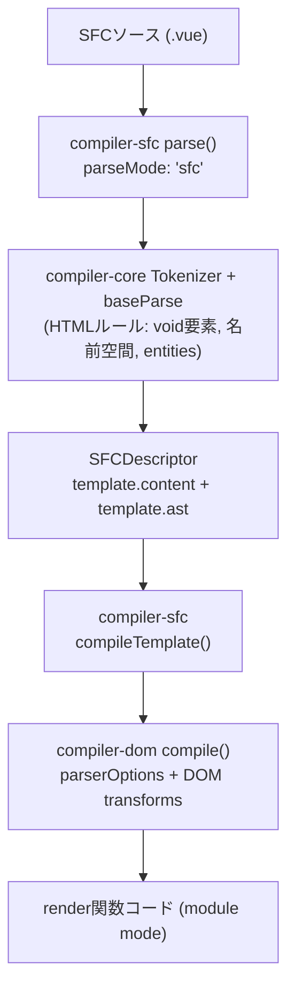

<h1 mt="12">Vue SFCから見直す<br>正しいHTMLの守り方</h1>

<div mt="5">
Vue Fes Japan 2026 | <time datetime="2026-10-24">2026-10-24</time>
</div>

<div mt="6">

[ドキュメントページ版（日本語）](https://records.yamanoku.net/vuefes-japan-2026/ja/) | [Document Page Version（English）](https://records.yamanoku.net/vuefes-japan-2026/en/)

</div>

<div class="absolute bottom-10">
  <span class="text-6 font-700">
    やまのく（yamanoku）
  </span>
</div>

---

## 発表者：やまのく（yamanoku）

- 会社員 / 一児の父
- WebアクセシビリティとHTMLが好き
- Vue Fes Japan Online 2022 / 2023 / 2025 に続き登壇

<!--
やまのくと申します。普段は会社員をしています。WebアクセシビリティとHTMLが好きで、Vue Fes Japanにはこれまでも登壇させていただきました。
-->

---

## アジェンダ

1. HTMLはフロントエンドでどう扱われているか
2. 「HTMLの正しさ」とは何か
3. Vue SFCのコンパイルパイプラインを紐解く
4. コンパイラだけでは守れない隙間
5. 静的解析エコシステムでどう守るか
6. まとめ：Vueで正しいHTMLと向き合うために

<!--
想定聴衆はVue中級者以上、コンパイラやSFCの内部、HTMLのLinterエコシステムに興味がある方です。
-->

---
layout: statement
---

# Vue開発で<br>HTMLの「正しさ」を<br>どう検証していますか？

<!--
セッション概要にも書いた問いです。みなさんは説明できますでしょうか。今日はこの問いに、仕組みから答えを出していきます。
-->

---
layout: section
---

# HTMLはフロントエンドで<br>どう扱われているか

<!--
本題の前に、普段HTMLをどこで見かけていて、フレームワークの中でどう扱われているかを整理します。
-->

---

## HTMLは生まれて37年

- Webサイト / Webアプリケーション
- SSRにおけるハイドレーション比較（正確にはDOM）
- UIライブラリのテンプレート

<!--
HTMLは誕生から今に至るまで、さまざまな形で活用されています。単なるマークアップ言語を超え、アプリのUI宣言やSSRの差分比較の対象にもなっています。
-->

---

## フレームワークごとのHTMLの扱い

| 系統 | 例 | 扱い |
| --- | --- | --- |
| HTMLをDSLとして使う | Vue / Svelte / Ripple | template等で宣言的UI |
| JSXでHTML風に書く | React / SolidJS / Preact | JSの中の式（XHTML寄り？） |
| HTMLファースト | Alpine.js / htmx | HTMLを起点に振る舞いを足す |

<!--
文脈整理として他FWにも触れますが、以降のLinter比較はVueに絞ります。VueやSvelteはHTMLをDSLとして扱います。React系はJSXでHTMLのように表現しますが、どちらかというとXHTML寄りです。一方でAlpine.jsやhtmxのように、HTMLファーストで書く世界もあります。
-->

---

## HTMLを正面から扱う動き

- OpenUI / Interop — ブラウザ実装と標準のすり合わせ
- HTML Day など、HTMLそのものを主題にするコミュニティ

<!--
HTMLは古い技術ではなく、今も標準化とコミュニティの両面で動きがあります。今日の話も、その「HTMLと正しく向き合う」流れの延長線上にあります。
-->

---
layout: statement
---

# Vueのtemplateは<br>「HTMLっぽいDSL」

<!--
VueのSFCで書いているものは、見た目はHTMLです。しかし最終的には仮想DOM生成の関数へと変換されます。このギャップが、今日の本題です。
-->

---
layout: section
---

# 「HTMLの正しさ」とは何か

<!--
そもそも「正しいHTML」とは何かを揃えておきたいと思います。
-->

---

## HTMLはよしなに書けてしまう

- Living Standardとして今も更新され続ける
- HTML構文はエラーがあっても補正され、最後までパースされる
- 意図と違う書き方でも「動いて」しまう
- [Non-conforming features](https://html.spec.whatwg.org/#non-conforming-features) という要素群が存在する

<!--
HTMLの仕様はLiving Standardです。HTML構文では構文エラーがあってもブラウザが補正して最後までパースするため、正しくなくても「動いて」しまいます。仕様上の非推奨・非適合な機能も残っています。
-->

---
layout: statement
---

# 「動くHTML」と<br>「正しいHTML」は違う

<!--
ブラウザで表示されることと、仕様に適合していること、アクセシブルなアウトプットになることは別問題です。
-->

---

## 正解はないが、誤りはある

- マークアップに唯一の正解はない
- それでも品質の良し悪しと、明確な誤りはある
- 「良いHTML」の条件例：セマンティック / アクセシブル / 誤りがない / 保守しやすい

<!--
弁護士ドットコムのHTML研修でも強調されていた論点です。表現に唯一解はない一方で、ルール違反としての誤りははっきり判定できます。まずは誤りをなくすことがスタート地点です。
-->

---

## 正しさの3つのルール

1. **字句的ルール** — タグの閉じ方、属性の書き方など
2. **語彙的ルール** — 使える要素・属性、内容モデル（入れ子）
3. **意味論的ルール** — 要素の意味と使い方、アクセシビリティ

<!--
誤りはざっくりこの3種に分類できます。以降のVueコンパイラやLinterの話も、この分類で見ると守備範囲がはっきりします。
-->

---

## 字句的ルール

- 開始タグと終了タグの対応、入れ子構造
- タグ名や属性の書き方
- 違反するとパーサがエラーを出し、DOMツリーが正しく作れない
- HTML構文では補正されて「動いて」見えることがある

<!--
もっとも基本的なルールです。XML構文なら即座に止まりますが、HTML構文では補正されるため気づきにくい。だからチェッカーが必要になります。
-->

---

## 語彙的ルール（内容モデル）

- 要素名・属性名が仕様に存在するか
- **内容モデル（content model）** — どの要素の中に何を置けるか
- 例: `label` の中に `div` / `p` は置けない、`p` の中に `div` は置けない
- 違反してもパーサは止まらず、望ましくないDOMになる

<!--
内容モデルは仕様で定義されています。タグの対応は合っていても、要素の入れ子や属性の組み合わせが誤っていると、静かに壊れたDOMができます。Vueのネスト警告が関わるのも主にここです。
-->

---

## 意味論的ルール

- 文法として正しくても、伝わる意味が違うことがある
- 例: 見た目のためだけに `h1` を使う、ボタンを `a` で作る、意味のある画像に `alt` がない
- ツールだけでは完全には検出できない領域
- 最終的にはレビューと経験が必要

<!--
意味論は、HTMLの強みであるアクセシビリティに直結します。機械チェックの限界を超える部分でもあり、だからこそ「正しさ」をレイヤーで切り分ける必要があります。
-->

---

## Vueコンパイラが見る範囲

| ルール | Vueコンパイラ |
| --- | --- |
| 字句的 | △〜○（パースできる範囲） |
| 語彙的（内容モデル） | 一部を開発時警告 |
| 意味論的 | ✕ |

<!--
Vueコンパイラが主に関与するのは字句的ルールと、一部の語彙的ルールです。意味論や細かい要素の使い方までは見てくれません。ここから先はコンパイルパイプラインと、隙間を埋める静的解析の話に入ります。
-->

---
layout: section
---

# Vue SFCの<br>コンパイルパイプライン

<!--
ここからVueの中身に入ります。templateがどう解釈されているかを仕組みから見ます。
-->

---

## コンパイルの3段階

1. **Parse** — HTML文字列 → AST
2. **Transform** — AST の変換
3. **Generate** — AST → JSコード文字列

<!--
ざっくりはこの3段階です。compiler-sfc はファイルを parse() で SFCDescriptor に分解し、compileScript と compileTemplate がそれぞれ script / template を処理します。
-->

---
layout: center
---



<!--
もう少し具体的に見ると、compiler-sfc の parse のあと、compiler-core の Tokenizer と baseParse で HTMLルール（void要素、名前空間、entities）を踏まえたASTができ、compileTemplate 経由で compiler-dom の transforms が走り、最終的に module mode の render 関数コードになります。
-->

---

## template は最終的に Hyperscript になる

```vue
<template>
  <p>
    <div>block</div>
  </p>
</template>
```

↓ コンパイル後は「関数呼び出し」として成立しうる

<!--
不正なネスト（例: p > div）でも、JavaScriptの関数としてはエラーなく通ってしまうことがあります。仮想DOM生成では要素をプログラム的に作るため、ブラウザのHTMLパーサが行うような再配置が起きないからです。
-->

---

## ネスト違反は「警告」止まり

```text
<h1> cannot be child of <p>, according to
HTML specifications. This can cause
hydration errors or potentially disrupt
future functionality.
```

- `compiler-dom` の `validateHtmlNesting`
- **開発時の警告**（`onWarn`）。コンパイルエラーではない
- 字句的ルールと一部の語彙的ルール（内容モデル）は見るが、意味論までは関与しない

<!--
Vue 3.4以降、validateHtmlNesting により不正なネストが開発時に警告されます。メッセージにもある通りハイドレーションエラーの原因になり得ますが、ビルドを止めるコンパイルエラーにはなりません。
-->

---
layout: center
---


<!--
実際のエディタではこのように警告が出ます。ありがたいDXですが、警告を無視すればそのまま動いてしまいます。
-->

---
layout: statement
---

# Vue自身はHTMLセマンティクスを<br>最終保証しない

<!--
コンパイラは優秀ですが、HTMLの正しさを最終保証する役割は担っていません。だからこそ、静的解析という防波堤が必要になります。
-->

---
layout: section
---

# コンパイラだけでは<br>守れない隙間

<!--
では実際に、どんな機構で隙間を埋めているのかを見ていきます。
-->

---

## 守るための機構たち

| レイヤー | 例 | 限界 |
| --- | --- | --- |
| 実行時 | ハイドレーションミスマッチ警告 | 正しさの保証ではない |
| 開発時Lint | ESLint / Markuplint / Biome / OxC / Vize | 設定とルール次第 |
| 型 | TypeScript（`HTMLElement` など） | DOM APIの型であり適合性ではない |
| 成果物 | 出力HTMLの静的解析 | ビルド後にしか見えない |

<!--
実行時の警告、開発時のLint、型、ビルド成果物への検証。レイヤーごとに役割が違います。
-->

---

## ハイドレーション警告の限界

- SSRとクライアントのDOM不一致を知らせる
- **HTMLの正しさを保証するものではない**（警告止まり）
- ブラウザが不正ネストを「直す」と、仮想DOMとの差分になりやすい

<!--
ハイドレーションの警告は有用ですが、あくまで差分検知です。セマンティクスや要素の正しい使い方までは見てくれません。不正なネストは、ブラウザ側の再配置と仮想DOMの期待がずれて、ハイドレーション問題として表面化することがあります。
-->

---
layout: section
---

# 静的解析エコシステムで<br>どう守るか

<!--
ここが本セッションの中心です。LinterたちがHTMLの違反をどう機械的に守っているかを紹介します。
-->

---

## なぜLinterが「防波堤」になるのか

> Vueのテンプレートは最終的に Hyperscript に変換されるため、不正なネストでも関数としては通ってしまう。コンパイラや実行時のVue自身はHTMLセマンティクスを制御・検証しない。だからブラウザが意図せぬDOM修正を起こす前に、静的解析が隙間を埋める必要がある。

<!--
ここが今日一番伝えたい構造です。Vueの優秀さと、HTML正しさの保証は別物です。
-->

---

## Vue周辺で使えるツールたち

- [eslint-plugin-vue](https://eslint.vuejs.org/) — `vue/no-parsing-error` など
- [Markuplint](https://markuplint.dev/) — HTML適合性に特化
- [Biome](https://biomejs.dev/) — HTML rules が拡充中
- [OxLint / OxC](https://oxc.rs/) — Rust製、速度とルール拡充
- [Vize](https://vizejs.dev/) — Vue向け。HTML rules を a11y と分離

<!--
本日のLinter比較はVue周辺に絞ります。ESLint（eslint-plugin-vue）、Markuplint、Biome、OxC、Vizeです。アクセシビリティLintとは起点が違います。a11yはコンテンツがアクセシブルかを起点にし、WAI-ARIAの管轄が入ります。今日はHTML適合性の側を見ます。
-->

---

## eslint-plugin-vue が見るもの

- `vue/no-parsing-error` — template内の構文エラー（HTML含む）
- WHATWG HTMLの構文エラーを多く検知
- **要素の使い方全般やセマンティクスまではカバーしない**
- Vueのセルフクローズは許容（既定で一部オフ）

<!--
essentialに入っている vue/no-parsing-error は強力です。ただしパースエラー中心で、HTMLのコンテンツモデル全体や非推奨要素までは見ません。コンパイラのネスト警告とも守備範囲が重なりつつ、役割は異なります。
-->

---

## Markuplint / Biome / OxC

| ツール | 強み | Vueとの関係 |
| --- | --- | --- |
| Markuplint | HTML仕様ベースの適合性 | `.vue` をパーサで扱える |
| Biome | 高速・統合ツールチェーン | HTML rules が増加中 |
| OxLint | Rust製で高速 | correctness系ルールが拡充中 |

<!--
MarkuplintはHTML適合性に寄せたLintです。BiomeやOxCはRustツールチェーンの流れの中でHTMLも見始めています。AIエージェント時代には、応答が速いLintも実務上の価値があります。
-->

---

## Vize の HTML Rules

- HTML適合性を Vue固有ルール / a11y から分離
- 例: `html/deprecated-element`, `html/id-duplication`
- **`html/cross-component-nesting`**
  - 単体テンプレートでは合法でも、コンポーネント合成で不正になるネストを検知
  - `vize lint --cross-file`

<!--
VizeはVueテンプレート向けに、HTML妥当性とセマンティクスをa11yルールと分けて提供しています。特に cross-component-nesting は、親が p、子コンポーネントのルートが div のような、ファイル単体では見えない問題を跨いで見つけられます。これはコンパイラ単体では守れない典型的な隙間です。
-->

---

## クロスコンポーネントネストの例

```vue
<!-- App.vue -->
<template>
  <p>Summary <InfoCard /></p>
</template>

<!-- InfoCard.vue -->
<template>
  <div class="card"><slot /></div>
</template>
```

→ 合成結果は実質 `<p><div>…</div></p>`（不正）

<!--
各ファイル単体では合法です。でも合成するとブラウザがDOMを組み替え、ハイドレーションミスマッチや非適合なDOMになります。静的解析がファイル横断で見て初めて防げる領域です。
-->

---

## Linterが見るもの / 見ないもの

| 観点 | コンパイラ | ESLint-vue | Markuplint等 | Vize |
| --- | --- | --- | --- | --- |
| 字句的 | △〜○ | ○ | ○ | ○ |
| 語彙的・ネスト（単ファイル） | 警告 | 限定的 | ○寄り | ○ |
| 語彙的・ネスト（クロスファイル） | ✕ | ✕ | 限定的 | ○ |
| 非推奨要素・属性 | ✕ | ✕寄り | ○ | ○ |
| 意味論 / a11y | ✕ | 別プラグイン | 設定次第 | 別ルール群 |

<!--
大事なのは「どれか一つに全部任せる」のではなく、守備範囲の違いを理解して組み合わせることです。
-->

---

## 見落としやすい観点

- **`<head>`** — SFCのtemplate外にあり、Vueコンパイラやeslint-plugin-vueだけでは見にくい
- **TypeScript** — `HTMLElement` 等はDOM APIの型であり、HTML適合性の検証ではない
- **出力後のHTML** — ビルド成果物への静的解析（Vize等）で初めて見える層がある

<!--
SFCのtemplateを見ていれば十分、というわけではありません。headや型、出力後の検証まで含めて、誰が何を見るかを設計します。
-->

---

## 補足：Vapor Mode / Pug

- **Vapor** — `innerHTML` 寄りになり、不正ネストが実DOM修復と衝突しうる（[vuejs/core#15256](https://github.com/vuejs/core/issues/15256)）
- **Pug**（`<template lang="pug">`）— `eslint-plugin-vue` だけでは効かない場合があり、別プラグインが必要
- どちらも結論は同じ：**正しさを誰が保証するかは、コンパイル形態やDSLを変えても別途設計が要る**

<!--
補足です。Vaporではこれまで警告止まりで動いていた不正ネストがより深刻になり得ます。Pugもeslint-plugin-vueだけでは守れないことがあります。形態が変わっても、保証の責任分界点は別途設計が必要、という点だけ押さえておきます。
-->

---
layout: section
---

# まとめ

<!--
最後に、Vueで正しいHTMLと向き合うための実践指針をまとめます。
-->

---

## Vueで正しいHTMLと向き合うために

1. **コンパイラの守備範囲を理解する**（警告≠保証）
2. **Linterで「Vueの隙間」を埋める**
   - 構文: eslint-plugin-vue
   - 適合性: Markuplint / Biome / OxC / Vize
3. **コンポーネント境界をまたぐ正しさも見る**
4. Living StandardとしてのHTMLに追随する
5. 堅牢なマークアップ → アクセシブルなアウトプットへ

<!--
おすすめは、eslint-plugin-vueで構文を押さえつつ、MarkuplintやVizeで適合性・クロスファイルを補強する組み合わせです。ツールは移り変わりますが、「誰が何を保証するか」を設計する考え方は残ります。
-->

---
layout: statement
---

# HTMLと正しく向き合いながら<br>Vueで堅牢なマークアップを

<!--
HTMLの仕様は今も更新されています。Vueのコンパイルの仕組みを理解したうえで、静的解析という防波堤を立て、堅牢なマークアップとアクセシブルなアウトプットを一緒に実現していきましょう。
-->

---

## 参考

- [Vue: validateHtmlNesting](https://github.com/vuejs/core/blob/main/packages/compiler-dom/src/transforms/validateHtmlNesting.ts)
- [eslint-plugin-vue: no-parsing-error](https://eslint.vuejs.org/rules/no-parsing-error.html)
- [Vize HTML Rules](https://vizejs.dev/rules/html/index.html)
- [WHATWG: Non-conforming features](https://html.spec.whatwg.org/#non-conforming-features)
- [弁護士ドットコム 新卒研修2025 HTML/CSS（太田良典）](https://speakerdeck.com/bengo4com/20250405-bengo4com-htmlcss)

---
