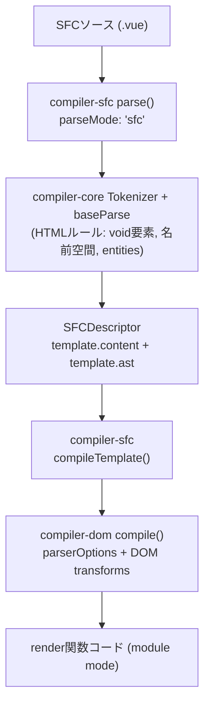

<h1 mt="12">Vue SFCから見直す<br>正しいHTMLの守り方</h1>

<div mt="5">
Vue Fes Japan 2026 | <time datetime="2026-10-24">2026-10-24</time>
</div>

<div mt="6">

[ドキュメントページ版（日本語）](https://records.yamanoku.net/vuefes-japan-2026/ja/) | [Document Page Version（English）](https://records.yamanoku.net/vuefes-japan-2026/en/)

</div>

<div class="absolute bottom-10">
  <span class="text-6 font-700">
    やまのく（yamanoku）
  </span>
</div>

<!--
サイボウズトラック 14:20 - 14:50。本日はお集まりいただきありがとうございます。
-->

---

## 発表者：やまのく（yamanoku）

- 会社員 / 一児の父
- WebアクセシビリティとHTMLが好き
- Vue Fes Japan Online 2022 / 2023 / 2025 に続き登壇

<!--
やまのくと申します。普段は会社員をしています。WebアクセシビリティとHTMLが好きで、Vue Fes Japanにはこれまでも登壇させていただきました。
-->

---

## アジェンダ（各約10分）

1. **HTMLの歴史と現在の仕様について**（厚めに丁寧に）
2. **VueでHTMLはどのように使われているのか**
3. **VueでHTMLの正しさを検証するためのツール紹介**

<!--
30分を3部で均等に配分します。聴衆にHTML仕様へ馴染みのない方も多い想定なので、第1部はスライド枚数を多めにして丁寧に進めます。第2・3部は要点を絞って同じ10分に収めます。
-->

---
layout: statement
---

# Vue開発で<br>HTMLの「正しさ」を<br>どう検証していますか？

<!--
セッション概要にも書いた問いです。みなさんは説明できますでしょうか。今日はこの問いに、3部構成で答えを出していきます。
-->

---
layout: section
---

# 1. HTMLの歴史と<br>現在の仕様について

<!--
約10分。仕様に詳しくない方も多い想定なので、ここを厚めに丁寧に進めます。Vueの話に入る前に、「正しさ」の土台を共有します。
-->

---
layout: statement
---

# 普段、HTMLを<br>どこで見かけていますか？

<!--
Webサイト、管理画面、コンポーネントライブラリ、SSRの差分比較……。気づかないうちに、フロントエンド開発のあちこちにHTMLがあります。
-->

---

## HTMLは生まれて約37年

- 1990年代前半に誕生し、**文書**のためのマークアップとして広がった
- その後、**アプリのUI**やDOMの差分比較の対象にもなった
- 「古い技術」ではなく、今も更新され続けている基盤

<!--
HTMLは誕生から今に至るまで、役割を広げてきました。単なる文書用の言語を超え、アプリケーションの土台にもなっています。
-->

---

## 文書の言語から、アプリの基盤へ

- 初期: 見出し・段落・リンクなど、文書構造を表す
- 中期: フォームやインタラクションが増え、アプリでも使われる
- 現在: SPA / SSR / デザインシステムでも、最終出力はHTMLであることが多い

<!--
Vueでtemplateを書いていても、ブラウザが受け取る最終成果物はHTMLです。だから仕様の理解は、フレームワーク以前の共通基盤になります。
-->

---

## 仕様はどう進化してきたか

| 時期 | 出来事 |
| --- | --- |
| 1997 | HTML 4 |
| 2000頃 | XHTML 1.0（XML寄りへの分岐） |
| 2004 | WHATWG 発足（互換性を重視した進化） |
| 2014 | W3C HTML5 Recommendation |
| 2019〜 | WHATWG Living Standard を単一の正とする合意 |

<!--
ざっくり押さえてほしいのは、「完成して終わった仕様」ではないということです。並走と合意を経て、今はLiving Standardとして更新され続けています。
-->

---

## XHTMLの分岐が残したもの

- XHTMLは「厳格に書いて止める」方向（XML）
- HTMLは「壊れても補正して表示する」方向（互換性）
- いま現場で主に使うのは後者のHTML構文
- その結果、**誤りがあっても画面は動いて見える**

<!--
厳格さよりも互換性が勝った歴史です。これはブラウザ利用者には良いことですが、開発者にとっては「動いている＝正しい」と錯覚しやすい土壌でもあります。
-->

---

## いまのHTMLは Living Standard

- 正本は [HTML Standard（WHATWG）](https://html.spec.whatwg.org/)
- 凍結されたバージョン名より、**継続更新される仕様本文**が基準
- 2019年以降、W3CもこのLiving Standardを前提に協調
- OpenUI / Interop / HTML Day など、実装とコミュニティも動き続ける

<!--
「HTML5を覚えれば終わり」ではなく、仕様本文と実装の変化を見続ける必要があります。学習と検証の前提がここです。
-->

---

## Living Standardで何が変わるか

- 要素や属性の扱いは、実装状況に合わせて更新されうる
- 「昔からの慣習」が、今の仕様では非推奨・非適合なことがある
- [Non-conforming features](https://html.spec.whatwg.org/#non-conforming-features) も明示されている
- だからこそ、記憶だけに頼らず**機械検証**が効く

<!--
仕様が生きているからこそ、Linterやチェッカーの価値が上がります。第3部への伏線でもあります。
-->

---
layout: statement
---

# 「動くHTML」と<br>「正しいHTML」は違う

<!--
ブラウザで表示されることと、仕様に適合していること、アクセシブルなアウトプットになることは別問題です。
-->

---

## ブラウザは誤りを「直して」くれる

```html
<p>
  <div>block</div>
</p>
```

↓ パーサが補正し、実際のDOMは意図と違う形になりうる

- HTML構文はエラーでも最後までパースする
- 画面は出るが、構造・スタイル・アクセシビリティに副作用が出る

<!--
これがHTMLの優しさであり、罠でもあります。補正後のDOMを前提にCSSやJSを書くと、後から壊れやすくなります。
-->

---

## 正解はないが、誤りはある

- マークアップに唯一の正解はない
- それでも品質の良し悪しと、明確な誤りはある
- 「良いHTML」の条件例：セマンティック / アクセシブル / 誤りがない / 保守しやすい

<!--
弁護士ドットコムのHTML研修でも強調されていた論点です。表現に唯一解はない一方で、ルール違反としての誤りははっきり判定できます。まずは誤りをなくすことがスタート地点です。
-->

---

## 正しさの3つのルール

1. **字句的ルール** — タグの閉じ方、属性の書き方など
2. **語彙的ルール** — 使える要素・属性、内容モデル（入れ子）
3. **意味論的ルール** — 要素の意味と使い方、アクセシビリティ

<!--
誤りはざっくりこの3種に分類できます。以降のVueコンパイラやLinterの話も、この分類で見ると守備範囲がはっきりします。ここが第1部の核心です。
-->

---

## 字句的ルール

- 開始タグと終了タグの対応、入れ子構造
- タグ名や属性の書き方
- 違反するとパーサがエラーを出し、DOMツリーが正しく作れない
- HTML構文では補正されて「動いて」見えることがある

<!--
もっとも基本的なルールです。XML構文なら即座に止まりますが、HTML構文では補正されるため気づきにくい。だからチェッカーが必要になります。
-->

---

## 語彙的ルール（内容モデル）

- 要素名・属性名が仕様に存在するか
- **内容モデル（content model）** — どの要素の中に何を置けるか
- 違反してもパーサは止まらず、望ましくないDOMになる

<!--
内容モデルは仕様で定義されています。タグの対応は合っていても、要素の入れ子や属性の組み合わせが誤っていると、静かに壊れたDOMができます。
-->

---

## 内容モデルの具体例

| 親 | 置けない例 | なぜまずいか |
| --- | --- | --- |
| `p` | `div`, `p`, `ul` | 段落の中にブロックを入れられない |
| `label` | `div`, `p` | ラベルの内容モデル外 |
| `a` | `a` | リンクの入れ子は不可 |
| `ul` / `ol` | 直接の `div` | 子は基本的に `li` |

<!--
Vueのネスト警告やLinterが効いてくるのも、主にこの語彙的ルールです。『見た目は同じでも、DOMの意味が違う』を意識してほしいです。
-->

---

## 意味論的ルール

- 文法として正しくても、伝わる意味が違うことがある
- 例: 見た目のためだけに `h1` を使う、ボタンを `a` で作る、意味のある画像に `alt` がない
- ツールだけでは完全には検出できない領域
- 最終的にはレビューと経験が必要

<!--
意味論は、HTMLの強みであるアクセシビリティに直結します。機械チェックの限界を超える部分でもあり、だからこそ「正しさ」をレイヤーで切り分ける必要があります。
-->

---

## 第1部のまとめ

- HTMLはLiving Standardとして今も更新されている
- 「動く」ことと「正しい」ことは一致しない
- 正しさは **字句 / 語彙 / 意味論** で切り分ける
- この土台の上で、Vueのtemplateを見直す

<!--
ここまでが仕様の土台です。次の10分で、VueがこのHTMLをどう扱い、どこまで保証するのかを見ます。
-->

---
layout: section
---

# 2. VueでHTMLは<br>どのように使われているのか

<!--
約10分。第1部の字句/語彙/意味論を前提に、VueのtemplateがどこまでHTMLを保証するかを要点重視で進めます。
-->

---

## フレームワークごとのHTMLの扱い

| 系統 | 例 | 扱い |
| --- | --- | --- |
| HTMLをDSLとして使う | Vue / Svelte / Ripple | template等で宣言的UI |
| JSXでHTML風に書く | React / SolidJS / Preact | JSの中の式（XHTML寄り？） |
| HTMLファースト | Alpine.js / htmx | HTMLを起点に振る舞いを足す |

<!--
文脈整理として他FWにも触れますが、以降はVueに絞ります。VueはHTMLをDSLとして扱い、宣言的にUIを書きます。
-->

---
layout: statement
---

# Vueのtemplateは<br>「HTMLっぽいDSL」

<!--
VueのSFCで書いているものは、見た目はHTMLです。しかし最終的には仮想DOM生成の関数へと変換されます。このギャップが、今日の本題です。
-->

---

## コンパイルの3段階

1. **Parse** — HTML文字列 → AST
2. **Transform** — AST の変換
3. **Generate** — AST → JSコード文字列

<!--
ざっくりはこの3段階です。compiler-sfc はファイルを parse() で SFCDescriptor に分解し、compileScript と compileTemplate がそれぞれ script / template を処理します。
-->

---
layout: center
---



<!--
compiler-sfc の parse のあと、compiler-core の Tokenizer と baseParse で HTMLルールを踏まえたASTができ、compileTemplate 経由で compiler-dom の transforms が走り、最終的に module mode の render 関数コードになります。
-->

---

## template は最終的に Hyperscript になる

```vue
<template>
  <p>
    <div>block</div>
  </p>
</template>
```

↓ コンパイル後は「関数呼び出し」として成立しうる

<!--
不正なネスト（例: p > div）でも、JavaScriptの関数としてはエラーなく通ってしまうことがあります。仮想DOM生成では要素をプログラム的に作るため、ブラウザのHTMLパーサが行うような再配置が起きないからです。
-->

---

## ネスト違反は「警告」止まり

```text
<h1> cannot be child of <p>, according to
HTML specifications. This can cause
hydration errors or potentially disrupt
future functionality.
```

- `compiler-dom` の `validateHtmlNesting`
- **開発時の警告**（`onWarn`）。コンパイルエラーではない
- 字句的ルールと一部の語彙的ルールは見るが、意味論までは関与しない

<!--
Vue 3.4以降、validateHtmlNesting により不正なネストが開発時に警告されます。メッセージにもある通りハイドレーションエラーの原因になり得ますが、ビルドを止めるコンパイルエラーにはなりません。
-->

---
layout: center
---


<!--
実際のエディタではこのように警告が出ます。ありがたいDXですが、警告を無視すればそのまま動いてしまいます。
-->

---

## Vueコンパイラが見る範囲

| ルール | Vueコンパイラ |
| --- | --- |
| 字句的 | △〜○（パースできる範囲） |
| 語彙的（内容モデル） | 一部を開発時警告 |
| 意味論的 | ✕ |

<!--
Vueコンパイラが主に関与するのは字句的ルールと、一部の語彙的ルールです。意味論や細かい要素の使い方までは見てくれません。
-->

---
layout: statement
---

# Vue自身はHTMLセマンティクスを<br>最終保証しない

<!--
コンパイラは優秀ですが、HTMLの正しさを最終保証する役割は担っていません。だからこそ、静的解析という防波堤が必要になります。
-->

---

## コンパイラだけでは守れない隙間

| レイヤー | 例 | 限界 |
| --- | --- | --- |
| 実行時 | ハイドレーションミスマッチ警告 | 正しさの保証ではない |
| 型 | TypeScript（`HTMLElement` など） | DOM APIの型であり適合性ではない |
| `<head>` など | template外のマークアップ | Vueコンパイラだけでは見にくい |
| 成果物 | 出力HTMLの静的解析 | ビルド後にしか見えない |

<!--
ハイドレーション警告は差分検知です。型は適合性検証ではありません。SFCのtemplateを見ていれば十分、というわけでもありません。
-->

---

## 補足：Vapor Mode / Pug

- **Vapor** — `innerHTML` 寄りになり、不正ネストが実DOM修復と衝突しうる（[vuejs/core#15256](https://github.com/vuejs/core/issues/15256)）
- **Pug**（`<template lang="pug">`）— `eslint-plugin-vue` だけでは効かない場合があり、別プラグインが必要
- どちらも結論は同じ：**正しさを誰が保証するかは、コンパイル形態やDSLを変えても別途設計が要る**

<!--
補足です。形態が変わっても、保証の責任分界点は別途設計が必要、という点だけ押さえておきます。
-->

---
layout: section
---

# 3. VueでHTMLの正しさを<br>検証するためのツール紹介

<!--
約10分。第1部の分類と第2部の隙間を踏まえ、どのツールがどのルールを埋めるかを要点で紹介します。
-->

---

## なぜLinterが「防波堤」になるのか

> Vueのテンプレートは最終的に Hyperscript に変換されるため、不正なネストでも関数としては通ってしまう。コンパイラや実行時のVue自身はHTMLセマンティクスを制御・検証しない。だからブラウザが意図せぬDOM修正を起こす前に、静的解析が隙間を埋める必要がある。

<!--
ここが今日一番伝えたい構造です。Vueの優秀さと、HTML正しさの保証は別物です。
-->

---

## Vue周辺で使えるツールたち

- [eslint-plugin-vue](https://eslint.vuejs.org/) — 字句的（構文）を中心に
- [Markuplint](https://markuplint.dev/) — **HTML仕様のマークアップルールを最も厚く継承**
- [Vize](https://vizejs.dev/) — Vue向け。HTML rules をアクセシビリティと分離
- [Biome](https://biomejs.dev/) / [OxLint（OxC）](https://oxc.rs/) — HTML対応は拡充途上（補足）

<!--
本日紹介するツールはVue周辺に絞ります。アクセシビリティLintとは起点が違います。今日はHTML適合性の側を見ます。Markuplintは他と守備範囲が違うので、eslint-plugin-vueやVizeと同じく個別に取り上げます。
-->

---

## eslint-plugin-vue が見るもの

- `vue/no-parsing-error` — template内の構文エラー（HTML含む）
- WHATWG HTMLの**字句的**な構文エラーを多く検知
- **語彙的ルール全般や意味論まではカバーしない**
- Vueのセルフクローズは許容（既定で一部オフ）

<!--
essentialに入っている vue/no-parsing-error は強力です。ただしパースエラー＝字句的ルール中心で、内容モデル全体や非推奨要素、意味論までは見ません。
-->

---

## Markuplint — HTML仕様を継承するLint

- HTML Living Standard ベースの**適合性検証に特化**
- 紹介するLinterの中で、**マークアップルールの継承が圧倒的に厚い**
- `@markuplint/vue-parser` / `@markuplint/vue-spec` で `.vue` を扱える
- 代表ルール:
  - `permitted-contents` — 内容モデル（語彙的）
  - `no-obsolete-element` — 廃止要素
  - `require-accessible-name` — アクセシブルネーム（意味論寄り）

<!--
BiomeやOxCと同列ではなく、HTML正しさの中核ツールとして見ます。字句・語彙・意味論のうち、特に語彙的ルール（内容モデル）を仕様データから検証できるのが強みです。
-->

---

## Biome / OxC — 拡充途上の補足枠

| ツール | HTMLまわりの現状 |
| --- | --- |
| Biome | HTML rules が増えつつある（重複属性、一部内容モデル、アクセシビリティなど） |
| OxLint | HTML lint は Out of Scope。Vue template lint も未対応 |

<!--
速度や統合ツールチェーンとしては有望ですが、HTMLマークアップルールの厚みではMarkuplintに及びません。今日の本線はeslint-plugin-vue / Markuplint / Vizeです。
-->

---

## Vize の HTML Rules

- HTML適合性を Vue固有ルール / アクセシビリティから分離
- 例: `html/deprecated-element`, `html/id-duplication`
- **`html/cross-component-nesting`**
  - 単体テンプレートでは合法でも、コンポーネント合成で不正になるネストを検知
  - `vize lint --cross-file`

<!--
VizeはVueテンプレート向けに、HTML妥当性をアクセシビリティルールと分けて提供しています。cross-component-nesting は、コンパイラ単体では守れない典型的な隙間です。
-->

---

## クロスコンポーネントネストの例

```vue
<!-- App.vue -->
<template>
  <p>Summary <InfoCard /></p>
</template>

<!-- InfoCard.vue -->
<template>
  <div class="card"><slot /></div>
</template>
```

→ 合成結果は実質 `<p><div>…</div></p>`（不正）

<!--
各ファイル単体では合法です。でも合成するとブラウザがDOMを組み替え、ハイドレーションミスマッチや非適合なDOMになります。
-->

---

## ツールが見るもの / 見ないもの

| 観点 | コンパイラ | ESLint-vue | Markuplint | Biome/OxC | Vize |
| --- | --- | --- | --- | --- | --- |
| 字句的 | △〜○ | ○ | ○ | △ | ○ |
| 語彙的・ネスト（単ファイル） | 警告 | 限定的 | ○ | △ | ○ |
| 語彙的・ネスト（クロスファイル） | ✕ | ✕ | Pretenders等で一部 | ✕寄り | ○ |
| 非推奨・廃止要素 | ✕ | ✕寄り | ○ | △ | ○ |
| 意味論 / アクセシビリティ | ✕ | 別プラグイン | ○寄り | △〜○ | 別ルール群 |

<!--
大事なのは「どれか一つに全部任せる」のではなく、守備範囲の違いを理解して組み合わせることです。HTML仕様の厚みではMarkuplintが突出しています。
-->

---

## 見落としやすい観点

- **`<head>`** — SFCのtemplate外にあり、Vueコンパイラやeslint-plugin-vueだけでは見にくい
- **TypeScript** — `HTMLElement` 等はDOM APIの型であり、HTML適合性の検証ではない
- **出力後のHTML** — ビルド成果物への静的解析（Vize等）で初めて見える層がある

<!--
SFCのtemplateを見ていれば十分、というわけではありません。誰が何を見るかを設計します。
-->

---
layout: section
---

# まとめ

<!--
3部を振り返り、実践指針に落とします。
-->

---

## 今日の3部をおさらい（各約10分）

1. **仕様** — Living Standardと、字句 / 語彙 / 意味論（ここを厚めに）
2. **Vueでの使い方** — templateはHTMLっぽいDSL。コンパイラは最終保証しない
3. **検証ツール** — eslint-plugin-vue / Markuplint / Vize を軸に隙間を埋める（Biome・OxCは補足）

<!--
時間は均等でも、仕様の解像度を先に上げておくと、Vueとツールの話が短くても伝わります。
-->

---

## Vueで正しいHTMLと向き合うために

1. **コンパイラの守備範囲を理解する**（警告≠保証）
2. **Linterで「Vueの隙間」を埋める**
   - 構文: eslint-plugin-vue
   - HTML適合性: Markuplint
   - クロスファイル: Vize
3. **コンポーネント境界をまたぐ正しさも見る**
4. Living StandardとしてのHTMLに追随する
5. 堅牢なマークアップ → アクセシブルなアウトプットへ

<!--
おすすめは、eslint-plugin-vueで構文を押さえつつ、Markuplintで仕様ベースの適合性を、Vizeでクロスファイルを補強する組み合わせです。Biome / OxCはこれから追う補足枠です。
-->

---
layout: statement
---

# HTMLと正しく向き合いながら<br>Vueで堅牢なマークアップを

<!--
HTMLの仕様は今も更新されています。Vueのコンパイルの仕組みを理解したうえで、静的解析という防波堤を立て、堅牢なマークアップとアクセシブルなアウトプットを一緒に実現していきましょう。
-->

---

## 参考

- [セッションページ](https://vuefes.jp/2026/speaker/yamanoku)
- [HTML Standard](https://html.spec.whatwg.org/)
- [Vue: validateHtmlNesting](https://github.com/vuejs/core/blob/main/packages/compiler-dom/src/transforms/validateHtmlNesting.ts)
- [eslint-plugin-vue: no-parsing-error](https://eslint.vuejs.org/rules/no-parsing-error.html)
- [Markuplint](https://markuplint.dev/) / [permitted-contents](https://markuplint.dev/docs/rules/permitted-contents)
- [Vize HTML Rules](https://vizejs.dev/rules/html/index.html)
- [WHATWG: Non-conforming features](https://html.spec.whatwg.org/#non-conforming-features)
- [弁護士ドットコム 新卒研修2025 HTML/CSS（太田良典）](https://speakerdeck.com/bengo4com/20250405-bengo4com-htmlcss)
- [新卒エンジニア向けHTML/CSS研修を開催しました（Creators’ blog）](https://creators.bengo4.com/entry/2025/08/01/080000)

---

## 発表者：やまのく（yamanoku）

一児の父。会社員。

---
layout: end
---

# Thank You For Listening !!
